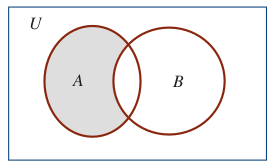

# Conceptos introductorios


## Teoría de conjuntos


```{definition}
Un **conjunto** es una colección bien definida de objetos, llamados sus elementos. Los conjuntos se simbolizan con letras minúsculas $A$, $B$, $...$ Los objetos que componen el conjunto se denominan elementos y se denotan con letras minúsculas $a, b, ...$  [Tomado de [@zill2012algebra] pág $21$]
```


```{definition, caption="Descripción por extensión y por comprensión"}
Para definir un **conjunto por extensión**, se enumeran todos sus elementos separándolos por comas y luego se encierran entre llaves. 

Para escribir un **conjunto por comprensión** se elige un elemento arbitrario $x$ y se señala que cumple la propiedad $P(x)$. Finalmente, se encierra toda la expresión entre llaves. [Tomado de [@zill2012algebra] pág $22$]
```

$$
A=\{ x | x \ \ \text{cumple la propiedad} \ \ P(x)   \}
$$

```{definition}
Diremos que dos conjutnos $A$ y $B$ son iguales si tienen los mismos elementos. Para indicar que $A$ y $B$ son iguales se escribe:[Tomado de [@zill2012algebra] pág $22$]
```

$$
A=B
$$

```{remark}
Un conjunto que posee un número finito de elementos; se llaman **conjuntos finitos**.
  
Un conjunto que no tiene un número finito de elemenos se llaman **conjunto infinito**.

[Tomado de [@zill2012algebra] pág $23$]

```


```{definition}
El número de elementos de un conjunto finito es lo que se llama la **cardinalidad** de dicho conjunto. La cardinalidad de un conjunto finito $A$ se denota por: [Tomado de [@zill2012algebra] pág $24$]

```


$$
Card(A) \ \ \ \text{ó}  \ \ \ |A|
$$

```{definition}
Dos conjuntos finitos $X$ y $Y$ se dicen ser **equipotentes** si tienen exactamente el mismo número de elementos. [Tomado de [@zill2012algebra] pág $24$]
```


```{definition}
Un conjunto se dice **vacío** si no posee elementos. El conjunto vacío se denota como:
```

$$
\{ \} \ \ \ \text{ó}  \ \ \ \Phi
$$

```{definition}
El conjunto **universal** se define como el conjunto que posee todos los elementos de todos los conjunots, y se denota como:[Tomado de [@zill2012algebra] pág $25$]
```

$$
\text{Conjunto universal:} \ \ \ U
$$

```{definition}
Si cada elemento de un conjunto $A$ es también elemento de un conjunto $B$, entonces se dice que $A$ es un subconjunto de $B$. Se dice también que $A$ está contenido en $B$ o que $B$ contiene a $A$. La relación de subconjunto se denota como: [Tomado de [@zill2012algebra] pág $25$]
```

$$
A \subset B  \ \ \ \text{ó}  \ \ \ B \supset A
$$

```{r Figconjunto1, fig.cap="Relación de subconjunto [Imagen tomada de [@zill2012algebra] pág $26$]", fig.align='center' ,echo=FALSE, message=FALSE,  warning=FALSE}
knitr::include_graphics("images/Figconjunto1.png")
```


```{definition}
La unión de dos conjuntos $A$ y $B$ consta de todos los elementos que pertenecen a $A$ o a $B$. La unión de $A$ y $B$ se denota por $A \cup B$. [Tomado de [@zill2012algebra] pág $31$]

```


$$
A \cup B = \{ x | x \in A \ \text{o} \ x \in B\}
$$

```{r FigUnionA, fig.cap="Relación de subconjunto [Imagen tomada de [@zill2012algebra] pág $32$]", fig.align='center' ,echo=FALSE, message=FALSE,  warning=FALSE}
knitr::include_graphics("images/FigUniona1.png")

knitr::include_graphics("images/FigUniona3.png")
```

## Propiedades de la Unión


```{r PropiedadesUnion, fig.cap="Propiedades de la unión [Imagen tomada de [@zill2012algebra] pág $32$]", fig.align='center' ,echo=FALSE, message=FALSE,  warning=FALSE}

```


```{definition}
La intersección de dos conjuntos $A$ y $B$ consta de todos los elementos que pertenecen a $A$ y a $B$. La intersección de $A$ y $B$ se denota por $A \cap B$. [Tomado de [@zill2012algebra] pág $30$]

```


$$
A \cap B = \{ x | x \in A \ \text{y} \ x \in B\}
$$


```{r FigInterseccion, fig.cap="Intersección de conjuntos [Imagen tomada de [@zill2012algebra] pág $30$]", fig.align='center' ,echo=FALSE, message=FALSE,  warning=FALSE}

```


## Propiedades de la Intersección


```{r PropiedadesInterseccion, fig.cap="Propiedades de la intersección [Imagen tomada de [@zill2012algebra] pág $30$]", fig.align='center' ,echo=FALSE, message=FALSE,  warning=FALSE}

```


## Propiedades de la unión y la intersección


```{r FigUI, fig.cap="Propiedades de la unión y la intersección [Imagen tomada de [@zill2012algebra] pág $33$]", fig.align='center' ,echo=FALSE, message=FALSE,  warning=FALSE}
knitr::include_graphics("images/FigUI.png")
```


## Diferencia entre dos conjuntos

```{definition}
La diferencia de dos conjuntos $A$ y $B$ consta de todos los elementos que pertenecen a $A$ y no pertenecen a $B$. La diferencia de $A$ y $B$ se denota por $A - B$. [Tomado de [@zill2012algebra] pág $34$]

```


$$
A - B = \{ x | x \in A \ \text{y} \ x \notin B\}
$$

```{r FigDif, fig.cap="Diferencia entre conjuntos [Imagen tomada de [@zill2012algebra] pág $34$]", fig.align='center' ,echo=FALSE, message=FALSE,  warning=FALSE}

```


## Complemento de un conjunto

```{definition}
El complemento de un conjunto $A$ consta de todos los elementos del universo $U$, y que no pertenecen a $A$. El complemento de $A$ se denota por $A^{c}$. [Tomado de [@zill2012algebra] pág $34$]

```


$$
A'=A^{c} = \{ x | x \notin A \}
$$


```{r FigComplemento, fig.cap="Complemento de un conjunto [Imagen tomada de [@zill2012algebra] pág $34$]", fig.align='center' ,echo=FALSE, message=FALSE,  warning=FALSE}
knitr::include_graphics("images/FigComplemento.png")
```


## Propiedades del algebra de conjuntos

```{r FigPropiedadesGeneral, fig.cap="Leyes del algebra de Conjuntos [Imagen tomada de [@zill2012algebra] pág $36$]", fig.align='center' ,echo=FALSE, message=FALSE,  warning=FALSE}

```


## Operaciones con conjuntos


Esta es una aplicación que muestra graficamente las operaciones entre tres conjuntos, el Autor:LikitMaths (https://www.geogebra.org/m/QWS4wDtE) las elaboro usando geogebra.

<!-- https://www.geogebra.org/m/QWS4wDtE -->


<meta name=viewport content="width=device-width,initial-scale=1">
<meta charset="utf-8"/>
<script src="https://www.geogebra.org/apps/deployggb.js"></script>
<div id="ggb-elementConjuntosA1"></div> 
<script>  
       var ggbAppConjuntosA1 = new GGBApplet({"material_id":"QWS4wDtE",
       "width": 800,
       "height": 400,
       "showToolBar": false,
       "showAlgebraInput": false,
       "showMenuBar": false },
       true);
       
         window.addEventListener("load", function() {  
           ggbAppConjuntosA1.inject('ggb-elementConjuntosA1');
      });
</script>


## Ejemplo1 

```{r FigEjConjunto1, fig.cap="Ejemplo 1 de conjuntos [Imagen tomada de [@zill2012algebra] pág $33$]", fig.align='center' ,echo=FALSE, message=FALSE,  warning=FALSE, out.width = "40%"}

```

A partir de la figura \@ref(fig:FigEjConjunto1), obtener la solución a los enunciados de conjuntos

* Obtener $A \cup B=?$

* Obtener $A \cup C=?$

* Obtener $C \cup B=?$

* Obtener $A \cap B=?$

* Obtener $A \cap C=?$

* Obtener $C \cap B=?$

* Obtener $A - B=?$

* Obtener $B - A=?$

* Obtener $A - C=?$

* Obtener $C - B=?$

* Obtener $B - C=?$

* Obtener $(A\cap B) - C=?$

* Obtener $(C\cap B) - A=?$


## Ejemplo2 

```{r FigEjConjunto2, fig.cap="Ejemplo 2 de conjuntos [Imagen tomada de [@zill2012algebra] pág $35$]", fig.align='center' ,echo=FALSE, message=FALSE,  warning=FALSE, out.width = "40%"}
knitr::include_graphics("images/EjemploConjuntos2.jpg")
```

A partir de la figura \@ref(fig:FigEjConjunto2), obtener la solución a los enunciados de conjuntos

* Obtener $A \cup B=?$

* Obtener $A \cap B=?$

* Obtener $A - B=?$

* Obtener $B - A=?$


## Ejemplo3 

```{r FigEjConjunto3, fig.cap="Ejemplo 3 de conjuntos [Imagen tomada de [@zill2012algebra] pág $33$]", fig.align='center' ,echo=FALSE, message=FALSE,  warning=FALSE, out.width = "40%"}
knitr::include_graphics("images/EjemploConjuntos3.jpg")
```


A partir de la figura \@ref(fig:FigEjConjunto3), obtener la solución a los enunciados de conjuntos

* Obtener ${\bigcup}_{i=1}^{2}A_{i} =?$

* Obtener ${\bigcap}_{i=2}^{3}A_{i} =?$

* Obtener ${\bigcup}_{i=1}^{3}A_{i} =?$

* Obtener ${\bigcap}_{i=1}^{2}A_{i} =?$

* Obtener ${\bigcap}_{i=2}^{3}A'_{i} =?$

* Obtener ${\bigcap}_{i=1}^{3}A_{i} =?$

* Obtener $\left({\bigcup}_{i=1}^{2}A_{i}\right) - A_3=?$

* Obtener $A_1-\left({\bigcup}_{i=2}^{3}A_{i}\right)=?$

# Conjuntos numéricos

```{r FigPinumero, fig.cap="Número Irracional [Imagen tomada de [@zill2012algebra] pág $50$]", fig.align='center' ,echo=FALSE, message=FALSE,  warning=FALSE,out.width = "50%"}
knitr::include_graphics("images/FigPinumero.png")
```


```{definition}
El conjunto de los números naturales consta de:
```


$$
N=\{ 1,2,3,4,...\}
$$


```{definition}
El conjunto de los números enteros consta de:
```


$$
Z=\{...,-3,-2,-1,0,1,2,3,4,...\}
$$

```{definition}
El conjunto de los números racionales consta de todos los números que son cociente de dos enteros, siempre que el denominador sea diferente de cero. Es decir:
```


$$
Q=\{ \dfrac{p}{q} | p \ \text{y} \ q \ \ \text{son números enteros,} \ \ q \ \neq \ 0\}
$$
```{definition}
El conjunto de los números irracionales consta de todos los números que no son el cociente de dos enteros, siempre que el denominador sea diferente de cero. Es decir:
```


$$
Q^{*}=\{x |   \ x \neq \ \dfrac{p}{q}, \ \ q \ \neq \ 0\   \}
$$
```{definition}
El conjunto de los números reales consta de la unión entre el conjunto de los racionales y los irracionales. Es decir:
```


$$
R=\{x |   \ x \in Q \ \text{o} \ x \in Q^{*} \}=Q \cup Q^{*}
$$


```{r FigConjuntoN, fig.cap="Diagrama de los conjuntos numéricos [Imagen tomada de [@swokowski1996algebra] pág $3$]", fig.align='center' ,echo=FALSE, message=FALSE,  warning=FALSE}
knitr::include_graphics("images/EsquemaConjuntosReales1.jpg")
```


## Conjuntos numéricos


## Propiedades de los números Reales


```{r FigPropiedadesReales, fig.cap="Propiedades de los números reales [Imagen tomada de [@zill2012algebra] pág $51$]", fig.align='center' ,echo=FALSE, message=FALSE,  warning=FALSE}
knitr::include_graphics("images/FigPropiedadesReales.png")
```


```{r FigPropiedadesRealesB, fig.cap="Propiedades de los números reales [Imagen tomada de [@zill2012algebra] pág $51$]", fig.align='center' ,echo=FALSE, message=FALSE,  warning=FALSE}

```


```{r FigPropiedadesRealesC, fig.cap="Propiedades de los números reales [Imagen tomada de [@zill2012algebra] pág $53$]", fig.align='center' ,echo=FALSE, message=FALSE,  warning=FALSE}

```


```{r FigPropiedadesRealesD, fig.cap="Propiedades de los números reales [Imagen tomada de [@zill2012algebra] pág $53$]", fig.align='center' ,echo=FALSE, message=FALSE,  warning=FALSE}
knitr::include_graphics("images/FigPropiedadesRealesD.png")
```


```{r FigPropiedadesRealesE, fig.cap="Propiedades de los números reales [Imagen tomada de [@zill2012algebra] pág $54$]", fig.align='center' ,echo=FALSE, message=FALSE,  warning=FALSE}

```


```{r FigPropiedadesRealesF1, fig.cap="Propiedades de los números reales [Imagen tomada de [@swokowski1996algebra] pág $8$]", fig.align='center' ,echo=FALSE, message=FALSE,  warning=FALSE}
knitr::include_graphics("images/PropiedadesFraccionarios1.jpg")
```


```{r FigPropiedadesRealesF, fig.cap="Propiedades de los números reales [Imagen tomada de [@zill2012algebra] pág $55$]", fig.align='center' ,echo=FALSE, message=FALSE,  warning=FALSE}
knitr::include_graphics("images/FigPropiedadesRealesF.png")
```


## Evaluación (Conjuntos y recta real)


```{r, echo=FALSE}
library(knitr)
knitr::include_app("https://johnshinyuces2020.shinyapps.io/parcialSIMO02A/#section-conjuntos",height = "2000px")
```


