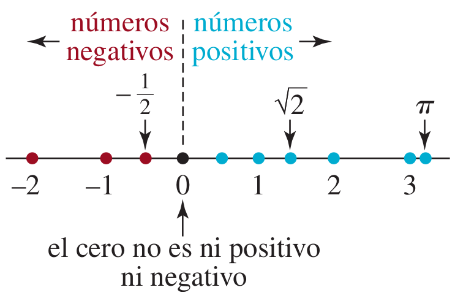

# Recta real y desigualdades

```{r FigRectaReal1A, fig.cap="Recta real [Imagen tomada de [@swokowski1996algebra] pág $9$]", fig.align='center' ,echo=FALSE, message=FALSE,  warning=FALSE}
knitr::include_graphics("images/RectaReal1.jpg")
```

```{r FigRectaRealA, fig.cap="Distancia en la recta real [Imagen tomada de [@zill2012algebra] pág $58$]", fig.align='center' ,echo=FALSE, message=FALSE,  warning=FALSE}
knitr::include_graphics("images/FigRectaRealA.png")
```


```{r FigRectaRealB, fig.cap="Signo de la recta real [Imagen tomada de [@zill2012algebra] pág $58$]", fig.align='center' ,echo=FALSE, message=FALSE,  warning=FALSE}

```


```{definition}
Se dice que el número real $a$ es menor que $b$, lo que se escribe $a<b$, si y sólo si la diferencia $b-a$ es positiva. En símbolos: [Tomado de [@zill2012algebra] pág $58$]
```


$$
a<b \ \ \ \text{si y sólo si} \ \ \ (b-a)>0
$$


```{r NotacionDesigualdades1, fig.cap="Notación de desigualdades[Imagen tomada de [@swokowski1996algebra] pág $9$]", fig.align='center' ,echo=FALSE, message=FALSE,  warning=FALSE,out.width = "50%"}
knitr::include_graphics("images/NotacionDesigualdades1.jpg")
```


```{r FigRectaReal1C, fig.cap="Propiedades de desigualdades[Imagen tomada de [@swokowski1996algebra] pág $114$]", fig.align='center' ,echo=FALSE, message=FALSE,  warning=FALSE,out.width = "70%"}

```


```{r FigRectaReal2C, fig.cap="Propiedades de desigualdades extras[Imagen tomada de [@swokowski1996algebra] pág $127$]", fig.align='center' ,echo=FALSE, message=FALSE,  warning=FALSE,out.width = "100%"}

```


## Desigualdades y conjuntos de intervalos en la recta real


Esta es una aplicación que muestra graficamente las desigualdades y los intervalos en la recta real, el Autor:Javier Cayetano Rodríguez (https://www.geogebra.org/m/ck59naqz) las elaboro usando geogebra.

<!-- https://www.geogebra.org/m/ck59naqz -->

<meta name=viewport content="width=device-width,initial-scale=1">
<meta charset="utf-8"/>
<script src="https://www.geogebra.org/apps/deployggb.js"></script>
<div id="ggb-elementConjuntosA2"></div> 
<script>  
       var ggbAppConjuntosA2 = new GGBApplet({"material_id":"ck59naqz",
       "width": 800,
       "height": 400,
       "showToolBar": false,
       "showAlgebraInput": false,
       "showMenuBar": false },
       true);
       
         window.addEventListener("load", function() {  
           ggbAppConjuntosA2.inject('ggb-elementConjuntosA2');
      });
</script>


## Ejemplos para la solución de desigualdades usando las propiedades básicas

### **Ejemplo 1**

Obtener el conjunto solución para la desigualdad $8x+4<16+5x$

**Solución**

\begin{equation}
\begin{split}
8x+4 &<& 16+5x\\
8x+4+(-4) &<& 16+5x+(-4) \\
8x & < & 5x+16-4 \\
8x & < & 5x+12 \\
8x -5x & < & 5x-5x+12 \\
8x -5x & < & 12 \\
3x & < & 12 \\
3x\left(\dfrac{1}{3}\right) & < & 12\left(\dfrac{1}{3}\right) \\
\dfrac{3x}{3} & < & \dfrac{12}{3}\\
x & < & 4
\end{split}
\end{equation}


**Respuesta**: El conjunto solución para la desigualdad es:

$$
x \in (-\infty, 4)
$$

**Verificación**: Por sustitución

Como los valores de $x$ deben ser menores que $4$, entonces se puede tomar $x=3$. Por lo tanto al sustituir en la desigualdad inicial se debe cumplir dicha desigualdad.

\begin{equation}
\begin{split}
8x+4 &<& 16+5x\\
8(3)+4 &<& 16+5(3)\\
24+4 &<& 16+15\\
28 &<& 31\\
\end{split}
\end{equation}


### **Ejemplo 2**

Obtener el conjunto solución para la desigualdad $\dfrac{1}{2}-3x \leq \dfrac{5}{2}$

**Solución**

\begin{equation}
\begin{split}
\dfrac{1}{2}-3x & \leq & \dfrac{5}{2}\\
-\dfrac{1}{2}+\dfrac{1}{2}-3x & \leq & \dfrac{5}{2}-\dfrac{1}{2}\\
-3x & \leq & \dfrac{5-1}{2} \\
-3x & \leq & \dfrac{4}{2} \\
-3x & \leq & 2 \\
-3x\left(\dfrac{1}{3}\right) & \leq & 2\left(\dfrac{1}{3}\right) \\
\dfrac{-3x}{3} & \leq & \dfrac{2}{3}\\
-x & \leq & \dfrac{2}{3}\\
x & \geq & \dfrac{-2}{3}
\end{split}
\end{equation}


**Respuesta**: El conjunto solución para la desigualdad es:

$$
x \in \left [-\dfrac{2}{3}, +\infty \right)
$$


```{r FigDesigualdad2, fig.cap="Respuesta en la recta real ejemplo 1[Imagen tomada de [@zill2012algebra] pág $146$]", fig.align='center' ,echo=FALSE, message=FALSE,  warning=FALSE,out.width = "50%"}
knitr::include_graphics("images/Desigualdades4.jpg")
```


### **Ejemplo 3**

Obtener el conjunto solución para la desigualdad $-7 \leq 2x+1 < 19$

**Solución**

\begin{equation}
\begin{split}
-7 & \leq 2x+1 <  19\\
-7-1 & \leq 2x+1-1 <  19-1\\
-8 & \leq 2x <  18\\
-8\left(\dfrac{1}{2}\right) & \leq 2x\left(\dfrac{1}{2}\right) <  18\left(\dfrac{1}{2}\right)\\
\left(\dfrac{-8}{2}\right) & \leq \left(\dfrac{2x}{2}\right) <  \left(\dfrac{18}{2}\right)\\
-4 & \leq x <  9\\
\end{split}
\end{equation}

**Respuesta**: El conjunto solución para la desigualdad es:

$$
x \in [-4,9)
$$


```{r FigDesigualdad3, fig.cap="Respuesta en la recta real ejemplo 3[Imagen tomada de [@zill2012algebra] pág $148$]", fig.align='center' ,echo=FALSE, message=FALSE,  warning=FALSE,out.width = "50%"}

```


### **Ejemplo 4**


Obtener el conjunto solución para la desigualdad

$$
2x^2-x<3
$$

**Solución**

$$
\begin{split}
2x^2-x &<& 3\\
2x^2-x -3 &<& 0\\
(x+1)(2x-3) &<& 0\\
\end{split}
$$
Los factores $(x+1)$ y $(2x-3)$ son cero en $-1$ y $\dfrac{3}{2}$, respectivamente.


```{r FigDesigualdad6, fig.cap="Respuesta en la recta real ejemplo[Imagen tomada de [@swokowski1996algebra] pág $122$]", fig.align='center' ,echo=FALSE, message=FALSE,  warning=FALSE,out.width = "65%"}

```


```{r FigDesigualdad7, fig.cap="Respuesta en la recta real ejemplo[Imagen tomada de [@swokowski1996algebra] pág $122$]", fig.align='center' ,echo=FALSE, message=FALSE,  warning=FALSE,out.width = "75%"}
knitr::include_graphics("images/ReglaSignos1.jpg")
```


**Respuesta**: El conjunto solución para la desigualdad es:

$$x\in \left(-1,\dfrac{3}{2}\right)$$


### **Ejemplo 5**

Obtener el conjunto solución para la desigualdad $x^2 \geq -2x+15$

**Solución**


Para la solución de desigualdades con expresiones cuadráticas es necesario retomar los conceptos de expresión cuadrática y fórmula del estudiante.

\begin{equation}
\begin{split}
x^2 & \geq & -2x+15\\
x^2 +2x-15 & \geq  0\\
(x+5)(x-3) & \geq  0\\
\end{split}
\end{equation}

usando la fórmula del estudiante tenemos

$A=1$; $B=2$; $C=-15$

$$
x=\dfrac{-B \pm \sqrt{B^2-4AC}}{2A}
$$

```{r FEstudiante, echo=FALSE}
A <- 1
B <- 2
C <- -15
d <- B^2-4*A*C
x1 <- (-B+{d}^(1/2))/(2*A)

x2 <-  (-B-{d}^(1/2))/(2*A)

```

<!-- \sqrt{{`r B`}^2-4 -->

$$
x=\dfrac{`r -B`  \pm \sqrt{({`r B`})^2-4({`r A`})({`r C`})}}{2({`r A`})}
$$

$$
x_1=`r x1`
$$

$$
x_2=`r x2`
$$

**Respuesta**: El conjunto solución para la desigualdad es:

$$x\in (-\infty,-5]\cup [3,+\infty)$$


### **Ejemplo 6**

 $$
 \Large \dfrac{x-3}{x+2} < 0
 $$
 
 **Proceso de solución**
 
 <span style="color:blue">**Primero:**</span> Igualar el factor de arriba a cero
 
 
 $$
 x-3=0
 $$
 Después despejar $x$
 
$$
 x=3
$$ 
 
 <span style="color:blue">**Segundo:**</span> Igualar el factor de abajo a cero
 
 $$
 x+2=0
 $$
 Despejar $x$
 
 $$
 x=-2
 $$
 
 
 **Respuesta**: El conjunto solución para la desigualdad es:
 
 $$x \in (-2,3)$$
 
 
 

### **Ejemplo 7**

 
$$
 \Large \dfrac{2x+4}{x-2} > 0
$$
 
 
 **Solución**
 
 **Procedimiento**
 
$$
 2x+4=0
$$
 Despejar $x$
 
$$
 2x=-4
$$

 
$$
 x=\dfrac{-4}{2}=-2
$$

 
$$
 x-2=0
$$
 
$$
 x=2
$$

 
 <!-- **Respuesta**: El conjunto solución para la desigualdad es: -->
 
 $$ x \in (-\infty,-2)\cup (2,+\infty)$$
 
 
 **Prueba** ó verificación del conjunto solución
 
 Sustituir en la desigualdad inical $x=-3$
 
 $$
  \Large \dfrac{2(-3)+4}{(-3)-2} > 0
 $$
 
 $$
  \Large \dfrac{2}{5} > 0
 $$
 
  Sustituir en la desigualdad inical $x=3$
 
 
 
$$
 \Large \dfrac{2(3)+4}{(3)-2} > 0
$$
 
$$
 \Large 10 > 0
$$
 
 
 
 
### **Ejemplo 8**
 
 
 $$
 \Large \dfrac{x-4}{x-3}\geq 2
 $$
 
\begin{equation}
\begin{split}
\dfrac{x-4}{x-3} & \geq & 2\\
\dfrac{x-4}{x-3} -2 & \geq & 0 \\
\dfrac{x-4}{x-3} -\dfrac{2}{1} & \geq & 0\\
\dfrac{(x-4).1-2.(x-3)}{(x-3).1} & \geq & 0\\
\dfrac{x-4-2x+6}{x-3} & \geq & 0\\
\dfrac{x-2x-4+6}{x-3} & \geq & 0\\
\dfrac{2-x}{x-3} & \geq & 0
\end{split}
\end{equation} 
 
 **Solución**
 
Igualar a cero el factor de arriba
$$
2-x=0
$$

$$
2=x
$$

Igualar a cero el factor de abajo

$$
x-3=0
$$
$$
x=3
$$
**Respuesta**: Los $x$ solución son: $x \in [2,3)$


### **Ejemplo 9**
 
$$
\Large \dfrac{2x+4}{x-3}\leq 2
$$


**Solución**

**Procedimiento**

<span style="color:red">**Primero**:</span>

Dejar el valor de cero de un lado en la desigualdad, y realizar las operaciones necesarias hasta obtener una sola fracción del lado contrario al cero de la desigualdad. Así

\begin{equation}
\begin{split}
\dfrac{2x+4}{x-3}  & \leq & 2\\
\dfrac{2x+4}{x-3} -2 & \leq 0\\
\dfrac{2x+4}{x-3} -\dfrac{2}{1} & \leq 0\\
\dfrac{(2x+4).(1)-(2)(x-3)}{(x-3).(1)} & \leq 0\\
\dfrac{2x+4-2x+6}{x-3} & \leq 0\\
\dfrac{2x-2x+4+6}{x-3} & \leq 0\\
\dfrac{4+6}{x-3} & \leq 0\\
\dfrac{10}{x-3} & \leq 0\\
\end{split}
\end{equation}


<span style="color:red">**Segundo**:</span>

$$
\boxed{\dfrac{10}{x-3} \leq 0} \ \ \ \text{Como se ve es una desigualdad  menor ó igual a cero }
$$
Por lo tanto el signo final deseado en el proceso de las cruces, debe ser <span style="color:red">**la región que arroja signo negativo**</span>.


<span style="color:red">**Tercero**:</span>

Aplicar la herramienta de la cruceta, y obtener la solución del problema.

**Respuesta**: El conjunto solución son los valores en el conjunto

$$
x \in(-\infty,3)
$$

### **Ejemplo 10**

Obtener el conjunto solución para la siguiente desigualdad


$$
3x-8<5x+5
$$
**Solución**

\begin{equation}
\begin{split}
3x-8 & < & 5x+5\\
3x-5x & < & 5+8\\
-2x & < & 13\\
x & > & \dfrac{13}{-2}\\
x & > & -\dfrac{13}{2}\\
\end{split}
\end{equation}


**Respuesta**: El conjunto solución para la desigualdad es:
$$ x \in \left(-\dfrac{13}{2},+\infty \right)$$


### **Ejemplo 11**

$$
\frac{2x+1}{8}<\frac{3x-4}{3}
$$
**Solución**

\begin{equation}
\begin{split}
\frac{2x+1}{8} & < & \frac{3x-4}{3}\\
24\left(\frac{2x+1}{8}\right) & < & 24\left(\frac{3x-4}{3}\right)\\
3\left(2x+1\right) & < & 8\left(3x-4\right)\\
6x+3 & < & 24x-32\\
3+32 & < & 24x-6x\\
35 & < & 18x\\
\dfrac{35}{18} & < & x\\
x & > & \dfrac{35}{18}\\
\end{split}
\end{equation}

**Respuesta**: El conjunto solución para la desigualdad es:

$$x \in \left(\dfrac{35}{18},+\infty\right)$$


<span style="color:red">**Algoritmo para resolver un problema**:</span>

* <span style="color:blue">Primero:</span> Leer el problema mínimo tres veces

* <span style="color:blue">Segundo:</span> Verificar si recuerdas el enunciado del problema

**sugerencia**: Repite el enunciado sin ir al texto donde esta escrito el problema.

* <span style="color:blue">Tercero:</span> Realizar un esquema (ó dibujo)  del problema donde se pueda escribir los datos conocidos y los datos por conocer del problema.

* <span style="color:blue">Cuarto:</span> Escirbir como ecuaciones, las relaciones observadas entre los datos conocidos y por conocer, expresados en el paso tres.

* <span style="color:blue">Quinto:</span> Resolver las ecuaciones planteadas en el paso cuarto.

* <span style="color:blue">Sexto:</span> Verificar la solución obtenida.


### **Ejemplo 12**

En general, se considera que una persona tiene fiebre si tiene una temperatura oral mayor que $98.6°F$.
¿Qué temperatura en la escala Celsius indica fiebre? [Pista: recuerde que $T_{F}=\frac{9}{5}T_{c}+32$, donde $T_{C}$ es grados Celsius y $T_{F}$ es
grados Fahrenheit].

**Planteo del problema**

Sea $T_{C}$ la temperatura en grados Celsius

Sea $T_{F}$ la temperatura en grados Fahrenheit

Entonces

$$
T_{F}>98.6
$$
Como deseamos saber que temperatura en grados Celsius sería registrada para tener fiebre, sustituimos $T_{F}=\frac{9}{5}T_{c}+32$ en la desigualdad anterior, así:


\begin{equation}
\begin{split}
T_{F} &>& 98.6\\
\frac{9}{5}T_{c}+32 &>& 98.6\\
\frac{9}{5}T_{c} &>& 98.6 -32\\
9T_{c} &>& (98.6 -32)(5)\\
9T_{c} &>& (66.6)(5)\\
9T_{c} &>& 333\\
T_{c} &>& \dfrac{333}{9}\\
T_{c} &>& 37\\
\end{split}
\end{equation}


**Respuesta** Para que una persona tenga fiebre en grados Celsius debe registrar una temperatura mayor a $37C$.


### **Ejemplo 13**

La temperatura en escala Fahrenheit y Celsius (centigrados) están relacionados por la fórmula $C=\frac{5}{9}(F-32)$. ¿A qué temperatura Fahrenheit corresponde una temperatura en escala centígrada que se encuentra? $40\leq C \leq 50$

**Proceso de solución**

\begin{equation}
\begin{split}
40  & \leq C \leq  50\\
40  & \leq \frac{5}{9}(F-32) \leq  50\\
(40)(9)  & \leq (9)\frac{5}{9}(F-32) \leq  (50)(9)\\
360  & \leq \frac{5}{1}(F-32) \leq  450\\
\dfrac{360}{5}  & \leq \frac{5}{5}(F-32) \leq  \dfrac{450}{5}\\
72  & \leq F-32 \leq  90\\
72+32  & \leq F-32+32 \leq  90+32\\
104  & \leq F \leq  122\\
\end{split}
\end{equation}

**Respuesta**: La temperatura equivalente en grados Fahrenheit es

$$
T_{F} \in [104,122]
$$

### **Ejemplo 14**

Un carnaval tiene dos planes de boletos.
Plan $A$: tarifa de entrada de $5$ dólares y $25$ centavos cada vuelta en los juegos.
Plan $B$: tarifa de entrada de $2$ dólares y $50$ centavos cada vuelta en los juegos.
¿Cuántas vueltas tendria que dar para que el plan $A$ resultara menos caro que el plan $B$?


**Planteo del problema**

Sea $x$ el número de vueltas en los juegos.

Entonces

Costo del plan $A$:

$$
5+0.25x
$$
Costo del plan $B$:

$$
2+0.50x
$$

Plan $A$ menos caro que el plan $B$, por lo tanto:

\begin{equation}
\boxed{5+0.25x < 2+0.50x}
\end{equation}


\begin{equation}
\begin{split}
5+0.25x & < & 2+0.50x\\
5-2 & < & 0.50x-0.25x \\
3 & < & 0.25x \\
\dfrac{3}{0.25} & < & x \\
12 & < & x\\
x & > & 12
\end{split}
\end{equation}


**Respuesta**: El conjunto solución para el problema es:

$$
x \in (12,+\infty)
$$
**Verificación**

Tomemos $x=13$ que pertenece al intervalo solución $(12,+\infty)$

Entonces sustituyendo en la desigualdad original tenemos:

\begin{equation}
\begin{split}
5+0.25(13) & < & 2+0.50(13)\\
8.25 & < & 8.5 \ \ \text{Cumple!!}
\end{split}
\end{equation}


### **Ejemplo 15A**


Obtener el conjunto solución para la desigualdad

$$
\dfrac{(x+2)(3-x)}{(x+1)(x^2+1)} \leq 0
$$


```{r FigDesigualdad8, fig.cap="Respuesta en la recta real ejemplo[Imagen tomada de [@swokowski1996algebra] pág $124$]", fig.align='center' ,echo=FALSE, message=FALSE,  warning=FALSE,out.width = "50%"}
knitr::include_graphics("images/Desigualdades7.jpg")
```


### **Ejemplo 15B**

$$
\dfrac{(2x+1)^2(x-1)}{x(x+1)(x-1)} \geq 0
$$


```{r FigDesigualdad9, fig.cap="Respuesta en la recta real ejemplo[Imagen tomada de [@swokowski1996algebra] pág $125$]", fig.align='center' ,echo=FALSE, message=FALSE,  warning=FALSE,out.width = "50%"}
knitr::include_graphics("images/Desigualdades8.jpg")
```

### **Ejemplo 16A**

Los lados de un cuadrado se extienden para formar un rectángulo. Como se muestra en la Figura \@ref(fig:Rectangulo1), un lado se extiende $2 cm$ y el otro $5 cm$. Si el área del rectángulo resultante es menor de $130 cm^2$, cuál es la posible longitud de un lado del cuadrado original?


```{r Rectangulo1, fig.cap="Rectángulo que extiende dos de sus lados [Imagen tomada de [@zill2012algebra] pág $197$]", fig.align='center' ,echo=FALSE, message=FALSE,  warning=FALSE,out.width = "20%"}
knitr::include_graphics("images/DesigualdadRectangulo.jpg")
```

**Proceso de solución**


Sea $x$ la longitud del cuadrado original

Sea $x+2$ uno de los lados del rectángulo resultante después de extender el cuadrado original.

Sea $x+5$ el otro lado del rectángulo resultante después de extender el cuadrado original.


Entonces el área del rectángulo resultante es:


$$
(x+2)(x+5)
$$

Por lo tanto esta área debe ser menor a $130 cm^2$, es decir

$$
(x+2)(x+5)< 130
$$

de donde

$$
\begin{split}
(x+2)(x+5)-130 &< 0\\
x(x+5)+2(x+5)-130 &< 0\\
x^2+5x+2x+10-130 & < 0\\
x^2+7x-120 & < 0\\
\end{split}
$$

```{r FEstudiante2, echo=FALSE}
A <- 1
B <- 7
C <- -120
d <- B^2-4*A*C
x1 <- (-B+{d}^(1/2))/(2*A)

x2 <-  (-B-{d}^(1/2))/(2*A)

```


$$
x=\dfrac{`r -B`  \pm \sqrt{({`r B`})^2-4({`r A`})({`r C`})}}{2({`r A`})}
$$

$$
x_1=`r round(x1,2)`
$$

$$
x_2=`r round(x2,2)`
$$


**Respuesta**: El conjunto solución es:

$$
x \in \left(0,8\right)
$$

### **Ejemplo 16B**


Un grupo de estudiantes decide asistir a un concierto. el costo de contratar a un autobús para que los lleve al concierto es de 450 dólares, lo cual se debe repartir en forma uniforme entre los estudiantes. Los promotores del concierto ofrecen descuentos a grupos que lleguen en autobús. Los boletos cuestan normalmente 50 dólares cada uno, pero se reducen $10$ centavos de dólar del precio del boleto por cada persona que vaya en el grupo (hasta la capacidad máxima del autobús).¿Cuántos estudiantes deben ir en el grupo para que el costo total por estudiante sea menor a 54 dólares?

**Proceso de solución**

Planteo


Sea $x$ el número de estudiantes que usará el autobús.

Sea $\dfrac{450}{x}$ el costo del pasaje para cada estudiante.

Sea $0.10x$ el descuento que se hará a los estudiantes que usaron autobús.

Costo total para cada estudiante

$$
\dfrac{450}{x}+50-0.10x
$$
Como se pide que el costo de cada estudiante no pase de $54$ dólares.

Entonces


$$
\dfrac{450}{x}+50-0.10x<54
$$

$$
\begin{split}
\dfrac{450}{x}+50-0.10x &< 54\\
\dfrac{450}{x}+50-0.10x -54 &< 0\\
\dfrac{450}{x}-0.10x -4 &< 0\\
x\left(\dfrac{450}{x}-0.10x -4\right) &<0\\
450-0.10x^2 -4x &< 0\\
-0.10x^2 -4x+450 &< 0\\
-10\left(-0.10x^2 -4x+450 \right) &> (-10)0\\
x^2+40x-4500 &>0\\
\end{split}
$$


```{r FEstudiante3, echo=FALSE}
A <- 1
B <- 40
C <- -4500
d <- B^2-4*A*C
x1 <- (-B+{d}^(1/2))/(2*A)

x2 <-  (-B-{d}^(1/2))/(2*A)

```


$$
x=\dfrac{`r -B`  \pm \sqrt{({`r B`})^2-4({`r A`})({`r C`})}}{2({`r A`})}
$$

$$
x_1=`r round(x1,2)`
$$

$$
x_2=`r round(x2,2)`
$$


**Respuesta**: El conjunto solución para la desigualdad es:


$$
x \in \left(50,\text{Capacidad máxima del autobús}\right]
$$

```{r echo=F}
A1 <- 1
B1 <- 40
C1 <- -4500
g1 <- function(x,A,B,C){
y <- A*x^2+B*x+C
return(y) 
}
D1 <- (B1)^2-4*(A1)*(C1)
r1 <- round((-B1-sqrt(D1))/(2*(A1)),digits = 3)
r2 <- round((-B1+sqrt(D1))/(2*(A1)),digits = 3)
# g1(0,A=A1,B=B1,C=C1)
# r1
# r2

xg <- seq(r1-10,r2+10,by = 0.5)
yg <-g1(x=xg,A=A1,B=B1,C=C1)
plot(xg,yg,"l",main="Gráfica de la expresión cuadrática")
par(new=T)
abline(h=0,col="red")
abline(v=0,col="red")
points(r1,0,pch = 19)
points(r2,0,pch = 19)
grid()
```


### **Ejemplo 16C**

Como se muestra en la figura \@ref(fig:Opticafisica1), si una lente convexa tiene longitud focal de $f$ centímetros y si un objeto se coloca a una distancia de $p$ centímetros de la lente con $p>f$, entonces la distancia $q$ desde la lente a la imagen está relacionada a $p$ y $f$ mediante la fórmula

$$
\dfrac{1}{p}+\dfrac{1}{q}=\dfrac{1}{f}
$$


```{r Opticafisica1, fig.cap="Rectángulo que extiende dos de sus lados [Imagen tomada de [@swokowski1996algebra] pág $117$]", fig.align='center' ,echo=FALSE, message=FALSE,  warning=FALSE,out.width = "50%"}
knitr::include_graphics("images/ProbDesigualdadOptica1.jpg")
```

Si $f=5 cm$, ¿qué tan cerca debe estar el objeto desde la lente para que la imagen esté a más de $12$ centímetros de la lente?

**Proceso de solución**:

$$
\dfrac{1}{p}+\dfrac{1}{q}=\dfrac{1}{5}
$$
Deseamos determinar los valores de $q$ tales que $q>12$

Primero se despeja $q$ como sigue:

$$
\begin{split}
\dfrac{1}{p}+\dfrac{1}{q} &=\dfrac{1}{5}\\
\dfrac{q1+1p}{pq} &=\dfrac{1}{5}\\
5q+5p &= pq\\
5q-pq &= -5p\\
q(5-p) &= -5p\\
q &= \dfrac{-5p}{(5-p)}\\
q &= \dfrac{5p}{(p-5)}\\
\end{split}
$$
Entonces

$$
q>12 \ \ \ \ \ \text{es equivalente a: }\ \ \ \ \ \ \dfrac{5p}{p-5}>12
$$

Solución de la nueva desigualdad $\frac{5p}{p-5}>12$

$$
\begin{split}
\dfrac{5p}{p-5} &>12\\
5p &>12(p-5)   \ \ \ \ \ \text{ya que } \ \ \ \ \ p>f=5 \ \ \ \ \ \text{es decir} \ \ \ \ \ p-5>0\\
5p &>12p-60\\
60 &>12p-5p\\
60 &>7p\\
\dfrac{60}{7} &>p\\
p &<\dfrac{60}{7} \ \ \ \ \text{equivalentemente}
\end{split}
$$


**Respuesta**: como $p>5$ y $p<\dfrac{60}{7}$, entonces su equivalente es

$$
5<p<\dfrac{60}{7}
$$


[Link para regla de la cruces](https://johnjairoshiny.shinyapps.io/DESIGUALDADV3/)


```{r FigRectaRealC, fig.cap="Intervalos básicos en la línea real [Imagen tomada de [@zill2012algebra] pág $147$]", fig.align='center' ,echo=FALSE, message=FALSE,  warning=FALSE,out.width = "100%"}
knitr::include_graphics("images/Desigualdades2.jpg")
```


## Evaluación (Fórmula del Estudiante, Parábola y Línea Recta)

```{r , echo=FALSE}
library(knitr)
knitr::include_app("https://johnshinyv2uces.shinyapps.io/parcialSIM003a/",height = "2000px")
```


## Concepto de valor absoluto


```{definition}
Sea $x$ un número real, se define el valor absoluto de $x$ como:
```


\[
|x|=\left\{
x , \text{si} \ \ x>0 \atop
-x , \text{si} \ \ x \leq 0 
\right. \ \ \ \ \text{equivalentemente} \ \ \ \ 
|x|=\left\{
x , \text{si} \ \ x \geq 0 \atop
-x , \text{si} \ \ x < 0 
\right.
\]

De forma equivalente

* Si $x>0$, entonces $|x|=x$

* Si $x<0$, entonces $|x|=-x$

* Si $x=0$, entonces $|0|=0$

**OBSERVACIÓN**:

El valor absoluto de un número real $x$ cualquiera (es decir arbitrario) mide la distancia de ese número $x$ al origen (ó cero real).

En otras palabras $|x|$ mide distancia entre $x$ y el cero real.


### Ejemplo 1

Obtener el valor absoluto indicado

(1) $|-3|=-(-3)=3$

(2) $|\pi|=\pi$

(3) $|\pi-3.5|=-(\pi-3.5)=3.5-\pi$

(4) $|3-\sqrt{2}|=3-\sqrt{2}$


```{theorem}
Sean $x$ y $y$ números reales. Entonces

(1) $|x| \geq 0$

(2) $|x|=|-x|$

(3) $|x|=0$ si y sólo si $x=0$
  
(4) $|xy|=|x||y|$ 
  
(5) $\left|\dfrac{x}{y}\right|=\dfrac{|x|}{|y|}$

(6) $|x+y| \leq |x|+|y|$

```


### Ejemplo 2

Usando el concepto de valor absoluto es decir su definición, obtener la respuesta para los siguientes enunciados de forma simplificada.

(1) Si $x>-3$, entonces $|x+3|=?$

(2) Si $x<3$, entonces $|3-x|=?$

**Proceso de solución para (1)**:

Como $x>-3$ es equivalente a $x+3>0$

Entonces $|x+3|=x+3$


**Proceso de solución para (2)**:

Como $x<3$ es equivalente a $0<3-x$

por lo tanto $0<3-x$ es equivalente a $3-x>0$

Entonces $|3-x|=3-x$


```{theorem ,TMAValor1}
Sea $a \in R^{+}$ y $|x| \leq a$. Entonces

$|x| \leq a$ es equivalente a:
  
(1) $-a \leq x \leq a$

  ó

(2) $x \geq -a$  y  $x \leq a$
```


### Ejemplo 3

Obtener el conjunto solución para la siguiente desigualdad usando el teorema apropiado

 $$\Large \mid x-3\mid<8$$

**Proceso de solución**:

Usando el teorema (\@ref(thm:TMAValor1)) se puede expresar la desigualdad con el valor absoluto $\mid x-3\mid<8$ como:

$$
\begin{split}
-8 & < x-3 <  8\\
-8+3 & < x-3+3 <  8+3\\
-5 & < x <  11\\
\end{split}
$$

**Respuesta**: El conjunto solución para la desigualdad es:

$$
x \in (-5,11)
$$

**Verificación**

La verificación se realiza usando uno o mas elementos del conjunto solución. Si al sustituir (ó reemplazar) en la desigualdad origianal se llega a una afirmación lógica verdadera, diremos que cumple la desigualdad.

Tomemos un elemento $x$ del conjunto $(-5,11)$, por decir $x=2$, entonces 

$$
\begin{split}
|2-3| & < & 8\\
|-1| & < & 8\\
1 & < & 8\\ \ \ \ \text{Cumple!!! el valor absoluto}
\end{split}
$$

### Ejemplo 4

Obtener el conjunto solución para la desigualdad

$$
\left|\dfrac{x+2}{3-x} \right| \leq 2  
$$
**Proceso**

Aplicando la otra forma del teorema (\@ref(thm:TMAValor1)) podemos expresar el enunciado así:

$$
\begin{split}
\left(\dfrac{x+2}{3-x}\right) \geq -2 \ \ \ \ & \text{y} & \ \ \ \ \left(\dfrac{x+2}{3-x}\right) \leq 2\\
\left(\dfrac{x+2}{3-x}\right)+2 \geq 0 \ \ \ \ & \text{y} & \ \ \ \ \left(\dfrac{x+2}{3-x}\right) -2 \leq 0\\
\left(\dfrac{x+2}{3-x}\right)+\dfrac{2}{1} \geq 0 \ \ \ \ & \text{y} & \ \ \ \ \left(\dfrac{x+2}{3-x}\right) -\dfrac{2}{1} \leq 0\\
\dfrac{(x+2).1+2(3-x)}{(3-x).1} \geq 0 \ \ \ \ & \text{y} & \ \ \ \ \dfrac{(x+2).1-2(3-x)}{(3-x).1} \leq 0\\
\dfrac{x+2+6-2x}{3-x} \geq 0 \ \ \ \ & \text{y} & \ \ \ \ \dfrac{x+2-6+2x}{3-x} \leq 0\\
\dfrac{x-2x+2+6}{3-x} \geq 0 \ \ \ \ & \text{y} & \ \ \ \ \dfrac{x+2x+2-6}{3-x} \leq 0\\
\dfrac{8-x}{3-x} \geq 0 \ \ \ \ & \text{y} & \ \ \ \ \dfrac{3x-4}{3-x} \leq 0\\
\dfrac{8-x}{3-x} \geq 0 \ \ \ \ & \text{y} & \ \ \ \ \dfrac{3x-4}{x-3} \geq 0\\
\end{split}
$$


**Respuesta** El conjunto solución para la desigualdad es:


$$
Sol_{Izq}:x \in (-\infty,3) \cup [8,+\infty)\\
Sol_{Der}:x \in \left(-\infty,\dfrac{4}{3}\right] \cup (3,+ \infty)\\
Sol_{Final}=Sol_{Izq} \cap Sol_{Der}\\
Sol_{Final}=x \in \left(-\infty,\dfrac{4}{3}\right] \cup [8,+\infty)
$$

```{theorem ,TMAValor2}
Sea $a \in R^{+}$ y $|x| \geq a$. Entonces

$|x| \geq a$ es equivalente a $x \leq -a \ \ \ \text{ó} \ \ \ x \geq a$
```

### Ejemplo 5

Obtener el conjunto solución para la siguiente desigualdad usando el teorema apropiado

$$\Large \mid x-6\mid>6$$


**Proceso de solución**:

Usando el teorema (\@ref(thm:TMAValor2)) se puede expresar la desigualdad con el valor absoluto $\mid x-6\mid>6$ como:


$$
\begin{split}
(x-6) < -6 \ \ \ &\text{ó}& \ \ \ (x-6) > 6\\
x < -6+6 \ \ \ &\text{ó}& \ \ \ x> 6+6\\
x < 0 \ \ \ &\text{ó}& \ \ \ x> 12\\
\end{split}
$$

**Respuesta**: El conjunto solución para la desigualdad es:

$$
x \in (-\infty,0) \cup (12,+\infty)
$$


### Ejemplo 6

Obtener el conjunto solución para la siguiente desigualdad usando el teorema apropiado

$$\left| \dfrac{x+1}{x-3}\right|>2$$
$$
\begin{split}
\dfrac{x+1}{x-3} < -2 \ \ \ &\text{ó}& \ \ \ \dfrac{x+1}{x-3} > 2\\
\dfrac{x+1}{x-3}+2 <0 \ \ \ &\text{ó}& \ \ \ \dfrac{x+1}{x-3}-2> 0\\
\dfrac{x+1}{x-3}+\dfrac{2}{1} < 0 \ \ \ &\text{ó}& \ \ \ \dfrac{x+1}{x-3}-\dfrac{2}{1}> 0\\
\dfrac{1(x+1)+2(x-3)}{1(x-3)} < 0 \ \ \ &\text{ó}& \ \ \ \dfrac{1(x+1)-2(x-3)}{1(x-3)} > 0\\
\dfrac{x+1+2x-6}{1(x-3)} < 0 \ \ \ &\text{ó}& \ \ \ \dfrac{x+1-2x+6}{1(x-3)} > 0\\
\dfrac{x+2x+1-6}{1(x-3)} < 0 \ \ \ &\text{ó}& \ \ \ \dfrac{x-2x+1+6}{1(x-3)} > 0\\
\dfrac{3x-5}{(x-3)} < 0 \ \ \ &\text{ó}& \ \ \ \dfrac{7-x}{(x-3)} > 0\\
\dfrac{3x-5}{(x-3)} < 0 \ \ \ &\text{ó}& \ \ \ \dfrac{x-7}{(x-3)} < 0\\
\end{split}
$$

**Respuesta** El conjunto solución para la desigualdad es:


$$
Sol_{Izq}=\left(\dfrac{5}{3},3\right)\\
Sol_{Der}= (3,7)\\
Sol_{Final}=Sol_{Izq} \cup Sol_{Der}\\
Sol_{Final}=\left(\dfrac{5}{3},3\right) \cup (3,7)
$$


```{definition}
Sean $a$ y $b$ dos números en la recta de los números reales, la distancia de $a$ a $b$ está dada por:

$$d(a,b)=|b-a|$$
```


### Ejemplo 7

Hallar la distancia entre los números reales indicados en el enunciado:

(1) $d(-2,3)=5$

(1) $d(1,4)=3$

(1) $d(-5,-1)=4$


```{r aplicacionD3,echo=FALSE}
library(knitr)
knitr::include_app("https://johnestradanclase.shinyapps.io/ValorAbsoluto1/",height = "1000px")
```


## Evaluación (Desigualdades y Valor absoluto)


```{r, echo=FALSE}
library(knitr)
knitr::include_app("https://johnshinyuces2020.shinyapps.io/parcialSIMO02B/",height = "2000px")
```


## Evaluación (Problemas con desigualdades)


```{r, echo=FALSE}
library(knitr)
knitr::include_app("https://johnshinyuces2020.shinyapps.io/parcialSIMO04ProblasConDesigualdades",height = "2000px")
```


## Potenciación y radicales.


## Ecuaciones lineales y cuadráticas.


## Ecuaciones polinomicas de grado mayor a 2.

