# Solución de Ecuaciones


```{r setup, include=FALSE}
colFmt = function(x,color,outputFormat = 'html' ){
  # Funcion para colorear texto a discrecion en Rmarkdown
  # tomada de: https://stackoverflow.com/questions/29067541/how-to-change-the-font-color
  
  # outputFormat = knitr::opts_knit$get("rmarkdown.pandoc.to")
  if(outputFormat == 'latex')
    paste("\\textcolor{",color,"}{",x,"}",sep="")
  else if(outputFormat == 'html')
    paste("<font color='",color,"'>",x,"</font>",sep="")
  else
    x
}
```


## Propiedades de las ecuaciones


(1) Cuando se `r colFmt('suma o resta','red',outputFormat = 'html')` un número a ambos lados de la igualdad, la igualdad se mantiene.

(2) Cuando se `r colFmt('multiplica o divide','red',outputFormat = 'html')` por un mismo número, distinto de cero, en ambos lados de la igualdad, la igualdad se mantiene.

(3) Cuando se `r colFmt('eleva','red',outputFormat = 'html')` a una potencia distinta de cero ambos miembros de la igualdad, la igualdad se mantiene.

(4) Cuando se `r colFmt('extrae la misma raíz','red',outputFormat = 'html')`, en ambos lados de la igualdad, la igualdad se mantiene.


## Ley distributiva


```{r LeyDist1, fig.cap="Grafica ley distributiva [Imagen tomada de [@swokowski1996algebra] pág $17$]", fig.align='center' ,echo=FALSE, message=FALSE,  warning=FALSE}
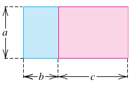
```


$$\left(b+c \right)a=ba+ca \ \ \ \ \text{la } a \text{ se distribuye a derecha del factor } \ \ (b+c)$$
$$a\left(b+c \right) =ab+ac \ \ \ \ \text{la } a \text{ se distribuye a izquierda del factor } \ \ (b+c)$$


## Factorización (Tema1)

**Definición de Factorización**

Es el arte de tomar una expresión algebraica compuesta, y llevarla a una forma equivalente de sólo productos de factores.

**Podcast**
[Definición de que es factorizar](https://soundcloud.com/john-estrada-920356121/factorizacion1)


### Ejemplo1 (F.C. letra)

Factorizar la expresión

$$
3x^2+xy
$$
\begin{equation} \label{eq14}
\begin{split}
3x^2+xy & = 3.x.x+x.y\\
 & = x(3x+y) \ \ \ \bf{\text{Respuesta esperada}}

\end{split}
\end{equation}


### Ejemplo2 (F.C. letra)

Factorizar la expresión

$$
1x^2y^3+x^3y^5
$$
\begin{equation} \label{eq15}
\begin{split}
x^2y^3+x^3y^5 & =1.x^2.y^3+x^2.x.y^3.y^2 \\
& =1.x^2.y^3+x^2.y^3.x.y^2 \\
 & = x^2y^3(1+xy^2) \ \ \ \bf{\text{Respuesta esperada}}
\end{split}
\end{equation}


### Ejemplo3 (F.C. número)

Factorizar la expresión

$$
12x^2y+4w^3z^3
$$
\begin{equation} \label{eq16}
\begin{split}
12x^2y+4w^3z^3 & = \\
(3).(4).x^2.y+(4).w^2.w.z^3 & = 4(3x^2y+w^3z^3) \ \ \ \bf{\text{Respuesta esperada}}
\end{split}
\end{equation}


### Ejemplo4 (F.C. número y letra)

Factorizar la expresión

$$
16w^2y+4w^3x^3
$$
\begin{equation} \label{eq17}
\begin{split}
16w^2y+4w^3x^3 & = \\
(4).(4).w^2.y+(4)w^2.w.x^3 & = 4w^2(4y+wx^3) \ \ \ \bf{\text{Respuesta esperada}}
\end{split}
\end{equation}


### Ejemplo5 (F.C. por agrupación)

Factorizar la expresión

$$
2uv-5wz+2uz-5wv
$$
\begin{equation} \label{eq18}
\begin{split}
2uv-5wz+2uz-5wv & = (2uv+2uz)+(-5wz-5wv) \\
& = 2u.(v+z)-5w.(z+v) \\
& = 2u.(v+z)-5w.(v+z) \\
& = (2u-5w).(v+z) \ \ \ \bf{\text{Respuesta esperada}}
\end{split}
\end{equation}


### Ejemplo6 (F.C. por agrupación)

Factorizar la expresión

$$
2p^3-p^2+2p-1
$$
\begin{equation} \label{eq19}
\begin{split}
2p^2.p-p^2+2p-1 & = (2p^3-p^2)+(2p-1) \\
& = p^2.(2p-1)+1.(2p-1) \\
& =  (p^2+1).(2p-1)  \ \ \ \bf{\text{Respuesta esperada}}
\end{split}
\end{equation}


### Factorizar $x^2+Bx+C$

$$
x^2+Bx+C=(x+a)(x+b)
$$

#### Ejemplo 1

Factorizar $x^2+7x+10$


```{r Factorizacion1, fig.cap="Factorización ejemplo 1 [Imagen tomada de [@sullivan2006algebra] pág $46$]", fig.align='center' ,echo=FALSE, message=FALSE,  warning=FALSE}
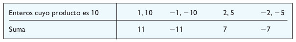
```

**Solución**:

La factorización de la expresión cuadrática $x^2+7x+10$ es:

$$
x^2+7x+10=(x+2)(x+5)
$$


#### Ejemplo 2

Factorizar $x^2-6x+8$


```{r Factorizacion2, fig.cap="Factorización ejemplo 2 [Imagen tomada de [@sullivan2006algebra] pág $46y47$]", fig.align='center' ,echo=FALSE, message=FALSE,  warning=FALSE}
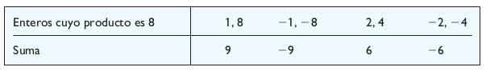
```


**Solución**:

La factorización de la expresión cuadrática $x^2-6x+8$ es:

$$
x^2-6x+8=(x-2)(x-4)
$$


### Factorizar $Ax^2+Bx+C$

$$
Ax^2+Bx+C=(ax+b)(cx+d)=acx^2+(ad+bc)x+bd
$$

#### Ejemplo 1

Factorizar la expresión cuadrática 

$$ 2x^2+5x+3 $$

```{r Factorizacion3, fig.cap="Factorización ejemplo 1 [Imagen tomada de [@sullivan2006algebra] pág $49$]", fig.align='center' ,echo=FALSE, message=FALSE,  warning=FALSE}
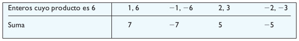
```

**Solución**:

Por agrupación se tiene:

$$
\begin{split}
2x^2+5x+3 &=& 2x^2+2x+3x+3\\
&=& 2x(x+1)+3(x+1)\\
&=& (2x+3)(x+1)
\end{split}
$$
**Respuesta**:  La factorización de la expresión cuadrática $2x^2+5x+3$ es:

$$
2x^2+5x+3=(2x+3)(x+1)
$$

#### Ejemplo 2

Factorizar la expresión cuadrática 

$$ 2x^2-x-6 $$

```{r Factorizacion4, fig.cap="Factorización ejemplo 2 [Imagen tomada de [@sullivan2006algebra] pág $49y50$]", fig.align='center' ,echo=FALSE, message=FALSE,  warning=FALSE}
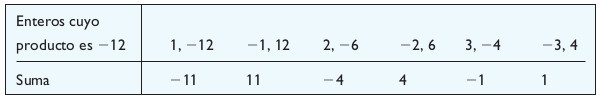
```

**Solución**:

Por agrupación

$$
\begin{split}
2x^2-x-6 &=& 2x^2-4x+3x-6\\
&=& (2x^2-4x)+(3x-6)\\
&=& 2x(x-2)+3(x-2)\\
&=& (2x+3)(x-2)
\end{split}
$$

**Respuesta**: La factorización de la expresión cuadrática $2x^2-x-6$ es:

$$
2x^2-x-6=(2x+3)(x-2)
$$


## Método de la cruceta

[link método de la cruceta](https://johnproyectos2020v1.shinyapps.io/CRUCETA/)

Deducción del método

Supongamos que la expresión cuadrática $Ax^2+Bx+C$ de puede facotorizar como:

$$Ax^2+Bx+C=\left(mx+p \right).\left(nx+q \right) $$
Realizando el producto de los factores $\left(mx+p \right).\left(nx+q \right)$ y agrupando

obtenemos:

$$Ax^2+Bx+C=mnx^2+mxq+pnx+pq$$
$$Ax^2+Bx+C=m.nx^2+(m.q+p.n)x+p.q$$
A partir de este resultado podemos afirmar que

El coeficiente $A$

puede obtenerse como el producto de dos números $m$ y $n$ es decir:

$$A=m.n$$

y el coeficiente (ó término independiente) $C$ puede obtenerse como el producto de dos números $p$ y $q$ es decir:

$$C=pq$$

Y por último el coeficiente $B$ es:

$$B=m.q+n.p$$
El esquema para la **CRUCETA** es:

$$
\begin{array}{cccc}
 A &  & C  \\ 
 m &  & p  \\
 \vdots & \searrow & \vdots  \\
 n &  & q & \Rightarrow B=mq+np
\end{array}
$$

$$ \text{entonces la factorización de: } \ \ Ax^2+Bx+C= \left(mx+p \right).\left(nx+q \right) $$

**Podcast**
[Deducción Técnica de la Cruceta](https://soundcloud.com/john-estrada-920356121/deducciontecnicadelacruceta)


## Condición para aplicar la técnica llamada **CRUCETA**


**Podcast**
[Condicción para aplicar la Técnica de la Cruceta](https://soundcloud.com/john-estrada-920356121/condiciontecnicadelacruceta)


Si la raíz del discriminante $D$ es exacta, se puede aplicar el esquema de la **CRUCETA**


### Ejemplo (Si la raíz de $D\geq 0$ es exacta)

**Ejemplo 1** Factorizar $2x^2+11x+12$ usando el esquema de la cruceta

solución: $A=2$; $B=11$; $C=12$

$$
\begin{array}{cccc}
 A &  & C  \\ 
 m:1 &  & p:4  \\
 \vdots & \searrow & \vdots  \\
 n:2 &  & q:3 & \Rightarrow \text{como }B=11=mq+np=(1)(3)+(2)(4)=3+8=11
\end{array}
$$


$$
 \text{entonces la factorización de:} \ \  2x^2+11x+12= \left(1x+4 \right).\left(2x+3 \right)
$$


**Podcast**
[Ejemplo 1 Regla de la Cruceta caso raíz exacta](https://soundcloud.com/john-estrada-920356121/ejemplo1regladelacruceta)


### Ejemplo 2 

Factorizar $2x^2+11x-6$ usando el esquema de la cruceta

solución: $A=2$; $B=11$; $C=-6$

$$
\begin{array}{cccc}
 A &  & C  \\ 
 m:2 &  & p:-1  \\
 \vdots & \searrow & \vdots  \\
 n:1 &  & q:6 & \Rightarrow \text{como }B=11=mq+np=(2)(6)+(1)(-1)=12-1=11
\end{array}
$$

$$
 \text{entonces la factorización de:} \ \  2x^2+11x-6= \left(2x-1 \right).\left(1x+6 \right)
$$


**Podcast**
[Ejemplo 2 Regla de la Cruceta caso raíz exacta](https://soundcloud.com/john-estrada-920356121/ejemplo2regladelacruceta)


### Ejemplo 3

Factorizar $x^2-6x+9$ usando el esquema de la cruceta

solución: $A=1$; $B=-6$; $C=9$

$$
\begin{array}{cccc}
 A &  & C  \\ 
 m:1 &  & p:-3  \\
 \vdots & \searrow & \vdots  \\
 n:1 &  & q:-3 & \Rightarrow \text{como }B=-6=mq+np=(1)(-3)+(1)(-3)=-3+(-3)=-6
\end{array}
$$

$$
 \text{entonces la factorización de:} \ \  x^2-6x+9= \left(1x-3 \right).\left(1x-3 \right)=\left(1x-3 \right)^2
$$


### Ejemplo 4

Factorizar $8x^2+2x-3$ usando el esquema de la cruceta

solución: $A=8$; $B=2$; $C=-3$

$$
\begin{array}{cccc}
 A &  & C  \\ 
 m:4 &  & p:3  \\
 \vdots & \searrow & \vdots  \\
 n:2 &  & q:-1 & \Rightarrow \text{como }B=2=mq+np=(4)(-1)+(2)(3)=-4+6=2
\end{array}
$$

$$
 \text{entonces la factorización de:} \ \  8x^2+2x-3= \left(4x+3 \right).\left(2x-1 \right)
$$


### Ejemplo 5

Factorizar $-3x^2-5x+12$ usando el esquema de la cruceta

solución: $A=-3$; $B=-5$; $C=12$; $D=169$; $\sqrt{D}=\sqrt{169}=13$ es exacta la raíz del discriminante

$$
\begin{array}{cccc}
 A &  & C  \\ 
 m:1 &  & p:3  \\
 \vdots & \searrow & \vdots  \\
 n:-3 &  & q:4 & \Rightarrow \text{como }B=-5=mq+np=(1)(4)+(-3)(3)=4-9=-5
\end{array}
$$


$$
 \text{entonces la factorización de:} \ \  -3x^2-5x+12= \left(1x+3 \right).\left(-3x+4 \right)
$$


## Método factorización forzada

[link método factorización forzada](https://johnproyectos2020v1.shinyapps.io/Fforzada/)


La solución para la ecuación
$$
Ax^2+Bx+C=0
$$
Está dada por

$$
x=\dfrac{-B \pm\sqrt{B^2-4AC}}{2A}
$$


En caso de que la raíz del discriminante $D$ no sea exacta, pero $D>0$ se aplica la factorización forzada que se expresa como:

$$
Ax^2+Bx+C=A\left(x- \dfrac{-B+\sqrt{B^2-4AC}}{2A} \right)\left(x- \dfrac{-B-\sqrt{B^2-4AC}}{2A} \right)
$$


### Ejemplo 1

**(Si la raíz de $D>0$ no es exacta)**

Factorizar $-3x^2+4x+12$ usando la factorización forzada

Solución: $A=-3$; $B=4$; $C=12$; $D=160$; $\sqrt{D}=\sqrt{160}\simeq 12.64911$  no es exacta la raíz del discriminante $D$

$$
-3x^2+4x+12=-3\left(x- \dfrac{-(4)+\sqrt{(4)^2-4(-3)(12)}}{2(-3)} \right)\left(x- \dfrac{-(4)-\sqrt{(4)^2-4(-3)(12)}}{2(-3)} \right)
$$
$$
-3x^2+4x+12=-3\left(x- \dfrac{-4+\sqrt{16+144}}{-6} \right)\left(x- \dfrac{-4-\sqrt{16+144}}{-6} \right)
$$
$$
-3x^2+4x+12=-3\left(x- \dfrac{-4+\sqrt{160}}{-6} \right)\left(x- \dfrac{-4-\sqrt{160}}{-6} \right)
$$


### Ejemplo 2

Factorizar $8x^2+x-6$ usando la factorización forzada

Solución: $A=8$; $B=1$; $C=-6$; $D=193$; $\sqrt{D}=\sqrt{193}\simeq 13.8924$  no es exacta la raíz del discriminante $D$

$$
8x^2+x-6=8\left(x- \dfrac{-(1)+\sqrt{(1)^2-4(8)(-6)}}{2(8)} \right)\left(x- \dfrac{-(1)-\sqrt{(1)^2-4(8)(-6)}}{2(8)} \right)
$$

$$
8x^2+x-6=8\left(x- \dfrac{-1+\sqrt{1+192}}{16} \right)\left(x-\dfrac{-1-\sqrt{1+192}}{16} \right)
$$


$$
8x^2+x-6=8\left(x- \dfrac{-1+\sqrt{193}}{16} \right)\left(x-\dfrac{-1-\sqrt{193}}{16} \right)
$$

## Ejemplo (Si $D<0$)

La expresión cuadrática $Ax^2+Bx+C$ no se puede factorizar
en el conjunto de los números reales.

Es decir no se puede aplicar la regla de la cruceta y tampoco la factorización forzada.


## Productos notables básicos


### Suma al cuadrado


```{r ProductoNotable1, fig.cap="Suma al cuadrado [Imagen tomada de [@zill2012algebra] pág $98$]", fig.align='center' ,echo=FALSE, message=FALSE,  warning=FALSE}
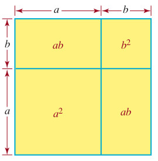
```


$$\left(a+b \right)^2=a^2+2ab+b^2$$

**Podcast**
[Suma al cuadrado](https://soundcloud.com/john-estrada-920356121/sumaalcuadrado-1)


### Diferencia al cuadrado


$$\left(a-b \right)^2=a^2-2ab+b^2$$


**Podcast**
[Diferencia al cuadrado](https://soundcloud.com/john-estrada-920356121/diferenciaalcuadrado)


### Diferencia de cuadrados

```{r ProductoNotable2, fig.cap="Diferencia de cuadrados [Imagen tomada de [@zill2012algebra] pág $98$]", fig.align='center' ,echo=FALSE, message=FALSE,  warning=FALSE}
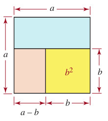
```


$$a^2-b^2=\left(a-b \right) \left(a+b \right) $$

**Podcast**
[Diferencia de cuadrados](https://soundcloud.com/john-estrada-920356121/diferenciadecuadrados)


### Suma al cúbo

$$\left( a+b\right)^3=a^3+3a^2b+3ab^2+b^3$$


**Podcast**
[Suma al cúbo](https://soundcloud.com/john-estrada-920356121/sumaalcubo)

<!-- https://www.geogebra.org/m/dbrjxhzk -->

<meta name=viewport content="width=device-width,initial-scale=1">
<meta charset="utf-8"/>
<script src="https://www.geogebra.org/apps/deployggb.js"></script>
<div id="ggb-elementFacEj1"></div> 
<script>  
       var ggbAppFacEj1 = new GGBApplet({"material_id":"dbrjxhzk",
       "width": 900,
       "height": 650,
       "showToolBar": false,
       "showAlgebraInput": false,
       "showMenuBar": false },
       true);
       
         window.addEventListener("load", function() {  
           ggbAppFacEj1.inject('ggb-elementFacEj1');
      });
</script>


### Diferencia al cúbo

$$\left( a-b\right)^3=a^3-3a^2b+3ab^2-b^3 $$

### Suma de cúbos

$$a^3+b^3=\left(a+b \right) \left(a^2-ab+b^2 \right) $$

### Diferencia de cúbos


```{r ProductoNotable3, fig.cap="Diferencia de cúbos [Imagen tomada de [@zill2012algebra] pág $98$]", fig.align='center' ,echo=FALSE, message=FALSE,  warning=FALSE}
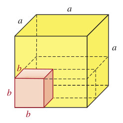
```


$$a^3-b^3=\left(a-b \right) \left(a^2+ab+b^2 \right) $$


```{r ProductosNotables1, fig.cap="Ejemplos de productos notables [Imagen tomada de [@swokowski1996algebra] pág $38$]", fig.align='center' ,echo=FALSE, message=FALSE,  warning=FALSE}
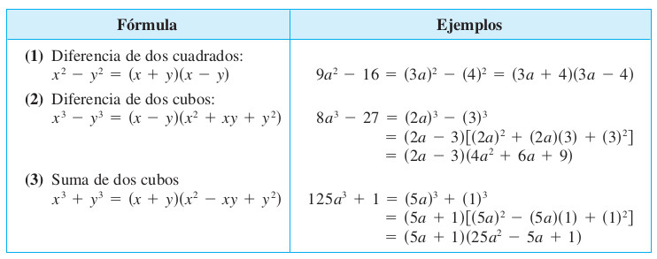
```


## Operaciones con polinomios


```{definition}
Un **Polinomio** $P(x)$ es una expresión de la forma
$$
  P(x)=a_nx^n+a_{n-1}x^{n-1}+...+a_{2}x^2+a_{1}x^1+a_{0}
$$

donde $a_n$, $a_{n-1}$,...,$a_0$ son los coeficientes del polinomio los cuales pertenecen al conjunto de los númerios reales. Diremos que el grado del polinomio es $n$, si y sólo si $a_n\neq 0$
```


```{r ClasificacionPolinomios1, fig.cap="Clasificación de Polinomios por grado [Imagen tomada de [@swokowski1996algebra] pág $33$]", fig.align='center' ,echo=FALSE, message=FALSE,  warning=FALSE}
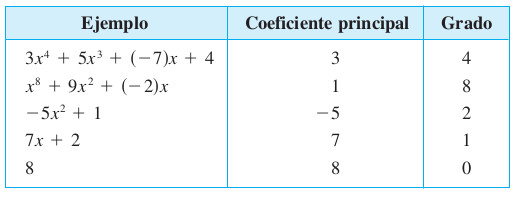
```


### **Suma de polinomios**

Halle la suma de los polinomios

$$
x^4-3x^2+7x-8 \ \ \ y \ \ \ 2x^4+x^2+3x
$$

**[Solución]**  Agrupar términos semejantes según el exponente de la variable $x$

**OBS:** Tener mucha atención en el manejo de signos para la agrupación de términos según la semejanza

\begin{equation} \label{eq1}
\begin{split}
(x^4-3x^2+7x-8) + (2x^4+x^2+3x) & = x^4 + 2x^4 -3x^2 + x^2 + 7x + 3x -8 \\
 & = (1+2)x^4 +(-3 + 1)x^2 + (7 + 3)x -8 \\
 & = 3x^4 - 2x^2 + 10x - 8 \ \ \ \bf{\text{Respuesta esperada}} 
\end{split}
\end{equation}


### **Diferencia de polinomios**

Reste $2x^3-3x-4$ de $x^3+5x^2-10x+6$

**[Solución]** Agrupar según lo indica la diferencia entre polinomios.

\begin{equation} \label{eq2}
\begin{split}
(x^3+5x^2-10x+6) - (2x^3-3x-4) & = x^3+5x^2-10x+6-2x^3+3x+4\\
& = x^3-2x^3+5x^2-10x+3x+6+4\\
 & = (1-2)x^3 +5x^2 + (3 - 10)x +(6+4) \\
 & = -1x^3 +5x^2 -7x +10 \\
 & = -x^3 +5x^2 -7x +10 \ \ \ \bf{\text{Respuesta esperada}} 
\end{split}
\end{equation}


### **Producto de dos polinomios**


Multiplique $x^3+3x-1$ y $2x^2-4x+5$


\begin{equation} \label{eq3}
\begin{split}
(x^3+3x-1)(2x^2-4x+5) & ={\bf(x^3+3x-1)}(2x^2)+{\bf(x^3+3x-1)}(-4x)+{\bf(x^3+3x-1)}(5) \\
& = 2x^5 + 6x^3-2x^2 -4x^4-12x^2+4x+5x^3+15x-5 \\
 & = 2x^5 + (-4)x^4 +(6+5)x^3 +(-2-12)x^2+ (4+15)x^1+(-5) \\
 & = 2x^5 - 4x^4 + 11x^3 - 14x^2 + 19x^1 -5 \ \ \ \bf{\text{Respuesta esperada}} 
\end{split}
\end{equation}


# `r colFmt('Simplificación','black',outputFormat = 'html')`

## Ejemplo1 (Simplificación)

Simplificar la expresión racional

$$
\dfrac{2x^2-x-1}{x^2-1}
$$


\begin{equation} \label{eq4}
\begin{split}
\dfrac{2x^2-x-1}{x^2-1} & =\dfrac{(2x+1)(x-1)}{(x-1)(x+1)} \\
 & =  \dfrac{(2x+1)}{(x+1)}\\
 \dfrac{2x^2-x-1}{x^2-1} & = \dfrac{(2x+1)}{(x+1)} \ \ \ \bf{\text{Respuesta esperada}} 
\end{split}
\end{equation}


## Ejemplo2 (Simplificación)

Simplificar la expresión racional

$$
\dfrac{4x^2+11x-3}{2-5x-12x^2}
$$


\begin{equation} \label{eq5}
\begin{split}
\dfrac{4x^2+11x-3}{2-5x-12x^2} & =\dfrac{4x^2+11x-3}{-12x^2-5x+2} \\
 & =  \dfrac{(4x-1).(x+3)}{(1-4x).(2+3x)}\\
 & = \dfrac{(4x-1).(x+3)}{-(4x-1).(3x+2)} \ \ \ \text{Recordar:} \ \ \ \ -(b-a)=a-b \\
 \dfrac{4x^2+11x-3}{2-5x-12x^2} & = \dfrac{(x+3)}{-(3x+2)} \ \ \ \text{Recordar:} \ \ \ \ -\dfrac{a}{d}=\dfrac{a}{-d} =\dfrac{-a}{d}\\
 \dfrac{4x^2+11x-3}{2-5x-12x^2} & = -\dfrac{(x+3)}{(3x+2)} \ \ \ \bf{\text{Respuesta esperada}}
\end{split}
\end{equation}


## Ejemplo3 (Simplificación)

Simplificar la expresión racional

$$
\dfrac{x}{5x^2+21x+4}.\dfrac{25x^2+10x+1}{3x^2+x}
$$


\begin{equation} \label{eq6}
\begin{split}
\dfrac{x}{5x^2+21x+4}.\dfrac{25x^2+10x+1}{3x^2+x} & =\dfrac{x(25x^2+10x+1)}{(5x^2+21x+4)(3x^2+x)} \ \ \ \text{Recordar:} \ \ \ \ \dfrac{a.b}{c.d}=\dfrac{a}{c}.\dfrac{b}{d} \\
 & =  \dfrac{x.(5x+1).(5x+1)}{(5x+1).(x+4).x.(3x+1)}\\
 & = \dfrac{(5x+1)}{(x+4).(3x+1)}\ \ \ \bf{\text{Respuesta esperada}}
\end{split}
\end{equation}


## Ejemplo4 (Simplificación)

Simplificar la expresión racional

$$
\dfrac{2x^2+9x+10}{x^2+4x+3}\div\dfrac{2x+5}{x+3}=\dfrac{\dfrac{2x^2+9x+10}{x^2+4x+3}}{\dfrac{2x+5}{x+3}}
$$


\begin{equation} \label{eq7}
\begin{split}
\dfrac{2x^2+9x+10}{x^2+4x+3}\div\dfrac{2x+5}{x+3} & =\dfrac{2x^2+9x+10}{x^2+4x+3}\times \dfrac{x+3}{2x+5} \ \ \ \text{Recordar:} \ \ \ \ \dfrac{\dfrac{a}{c}}{\dfrac{b}{d}}=\dfrac{a}{c}\times\dfrac{d}{b} \\
 & =  \dfrac{(2x+5).(x+2).(x+3)}{(x+3).(x+1).(2x+5)}\\
 & = \dfrac{x+2}{x+1}\ \ \ \bf{\text{Respuesta esperada}}
\end{split}
\end{equation}


## Ejemplo5 (Simplificación)

Simplificar la expresión racional

$$
\dfrac{\dfrac{1}{x}-\dfrac{x}{x+1}}{1+\dfrac{1}{x}}
$$

**Primero: Se realiza la resta en el numerador**

\begin{equation} \label{eq9}
\begin{split}
\dfrac{1}{x}-\dfrac{x}{x+1} & = \dfrac{1.(x+1)-x.x}{x.(x+1)} \ \ \ \text{Recordar:} \ \ \ \ \dfrac{a}{b} \pm \dfrac{c}{d} =\dfrac{ad \pm bc}{bd}\\
& = \dfrac{x+1-x^2}{x.(x+1)} \\
& = \dfrac{-x^2+x+1}{x.(x+1)} \ \ \ \text{donde se ordeno los términos del numerador} \\
\end{split}
\end{equation}


**Segundo: Se realiza la suma en el denominador**

\begin{equation} \label{eq10}
\begin{split}

1+\dfrac{1}{x} & = \dfrac{1}{1}+\dfrac{1}{x} \\
& = \dfrac{1.x+1.1}{1.x} \ \ \ \text{Recordar:} \ \ \ \ \dfrac{a}{b} \pm \dfrac{c}{d} =\dfrac{ad \pm bc}{bd}\\
& = \dfrac{x+1}{x} \\
\end{split}
\end{equation}


**Tercero: Se sustituyen el nuevo numerador y el nuevo denominador**


\begin{equation} \label{eq11}
\begin{split}
\dfrac{\dfrac{-x^2+x+1}{x.(x+1)}}{\dfrac{x+1}{x}} & =\dfrac{-x^2+x+1}{x.(x+1)}\times \dfrac{x}{x+1} \ \ \ \text{Recordar:} \ \ \ \ \dfrac{\dfrac{a}{c}}{\dfrac{b}{d}}=\dfrac{a}{c}\times\dfrac{d}{b} \\
 & =  \dfrac{(-x^2+x+1).x}{x.(x+1).(x+1)}\\
 & =  \dfrac{(-x^2+x+1)}{(x+1).(x+1)}\\
 & = \dfrac{-x^2+x+1}{(x+1)^2}\ \ \ \bf{\text{Respuesta esperada}}
\end{split}
\end{equation}


## Ejemplo6 (Simplificación)

Simplificar la expresión

$$
(a^{-1}+b^{-1})^{-1}=\dfrac{1}{a^{-1}+b^{-1}}
$$

\begin{equation} \label{eq12}
\begin{split}

\dfrac{1}{a^{-1}+b^{-1}} & = \dfrac{1}{\dfrac{1}{a}+\dfrac{1}{b}} \\
& = \dfrac{\dfrac{1}{1}}{\dfrac{1.b+1.a}{a.b}} \ \ \ \text{Recordar:} \ \ \ \ \dfrac{a}{b} \pm \dfrac{c}{d} =\dfrac{ad \pm bc}{bd}\\
& = \dfrac{1}{1} \times \dfrac{ab}{b+a} \ \ \ \text{Recordar:} \ \ \ \ \dfrac{\dfrac{a}{c}}{\dfrac{b}{d}}=\dfrac{a}{c}\times\dfrac{d}{b} \\
& = \dfrac{ab}{b+a}\ \ \ \bf{\text{Respuesta esperada}}
\end{split}
\end{equation}


## Ejemplo7 (Simplificación)

Simplificar la expresión

$$
\dfrac{x}{\sqrt{y}}+\dfrac{y}{\sqrt{x}}
$$


\begin{equation} \label{eq13}
\begin{split}
\dfrac{x}{\sqrt{y}}+\dfrac{y}{\sqrt{x}} & =\dfrac{x.\sqrt{x}+y.\sqrt{y}}{\sqrt{x}.\sqrt{y}} \\
 & =  \dfrac{x.\sqrt{x}+y.\sqrt{y}}{\sqrt{x.y}} \\
 & =  \dfrac{(x.\sqrt{x}+y.\sqrt{y}).\sqrt{x.y}}{\sqrt{x.y}.\sqrt{x.y}} \\
 & =  \dfrac{(x.\sqrt{x}+y.\sqrt{y}).\sqrt{x}.\sqrt{y}}{(\sqrt{x.y})^2} \\
 & =  \dfrac{x.(\sqrt{x})^2\sqrt{y}+y.(\sqrt{y})^2\sqrt{x}}{(\sqrt{x.y})^2} \\
 & =  \dfrac{(x^2.\sqrt{y}+y^2.\sqrt{x})}{(\sqrt{x.y})^2} \\
 \dfrac{x}{\sqrt{y}}+\dfrac{y}{\sqrt{x}} & = \dfrac{x^2.\sqrt{y}+y^2.\sqrt{x}}{x.y} \ \ \ \bf{\text{Respuesta esperada}} 
\end{split}
\end{equation}


## Despeje de variable (Tema1)

### Ejemplo1 (Despeje de variable)

Despejar la letra $r$ en la ecuación
$$
C=2\pi r
$$
\begin{equation} \label{eq20}
\begin{split}
\text{lado Izquierdo}& = \text{lado Derecho}\\
C & = 2\pi r  \\
\dfrac{C}{2\pi}& =r  \ \ \ \bf{\text{Respuesta esperada}}
\end{split}
\end{equation}


### Ejemplo2 (Despeje de variable)

Despejar la letra $x$ en la ecuación
$$
3x+5=0
$$
\begin{equation} \label{eq21}
\begin{split}
\text{lado Izquierdo}& = \text{lado Derecho}\\
3x+5 & = 0  \\
3x & =-5  \\
x& =  \dfrac{-5}{3}\ \ \ \bf{\text{Respuesta esperada}}\\
\dfrac{1x^1}{1}& = x\ \ \ \text{El significado de que}\ \ \ x \ \ \ \text{esta despejada}
\end{split}
\end{equation}

\begin{equation} \label{eq25}
\boxed{x =  \dfrac{-5}{3}}
\end{equation}

### Ejemplo3 (Despeje de variable)

Despejar la letra $l$ en la ecuación
$$
P=2w+2l
$$
\begin{equation} \label{eq22}
\begin{split}
\text{lado Izquierdo}& = \text{lado Derecho}\\
P & = 2w+2l  \\
P-2w & =2l  \\
\dfrac{P-2w}{2}& = l  \ \ \ \bf{\text{Respuesta esperada}}\\
\dfrac{1l^1}{1}& =l \ \ \  \text{El significado de que}\ \ \ l \ \ \ \text{esta despejada}
\end{split}
\end{equation}

\begin{equation} \label{eq26}
\boxed{\dfrac{P-2w}{2} = l }
\end{equation}


### Ejemplo4 (Despeje de variable)

Despejar la letra $t$ en la ecuación
$$
l=Prt
$$
\begin{equation} \label{eq23}
\begin{split}
\text{lado Izquierdo}& = \text{lado Derecho}\\
l & = Prt  \\
\dfrac{l}{Pr}& = t  \ \ \ \bf{\text{Respuesta esperada}}\\
\dfrac{1t^1}{1}& =t \ \ \  \text{El significado de que}\ \ \ t \ \ \ \text{esta despejada}
\end{split}
\end{equation}

\begin{equation} \label{eq27}
\boxed{\dfrac{l}{Pr} = t}
\end{equation}


### Ejemplo5 (Despeje de variable)

Despejar la letra $h$ en la ecuación
$$
S=2\pi rh
$$
\begin{equation} \label{eq24}
\begin{split}
\text{lado Izquierdo}& = \text{lado Derecho}\\
S & = 2\pi rh  \\
\dfrac{S}{2\pi r}& = h  \ \ \ \bf{\text{Respuesta esperada}}\\
\dfrac{1h^1}{1}& =h \ \ \  \text{El significado de que}\ \ \ h \ \ \ \text{esta despejada}
\end{split}
\end{equation}

\begin{equation} \label{eq28}
\boxed{\dfrac{S}{2\pi r} = h}
\end{equation}


### Ejemplo6 (Despeje de variable)

Despejar la letra $r$ en la ecuación
$$
V=\dfrac{1}{3}\pi r^2h
$$
\begin{equation} \label{eq29}
\begin{split}
\text{lado Izquierdo}& = \text{lado Derecho}\\
V & = \dfrac{1}{3}\pi r^2h  \\
3V& = \pi r^2h \\
\dfrac{3V}{\pi h} & = r^2 \\
\pm \sqrt{\dfrac{3V}{\pi h}} & = r \ \ \ \bf{\text{Recordar}} \sqrt{r^2}=r\\
\sqrt{\dfrac{3V}{\pi h}} & = r  \ \ \ \bf{\text{Respuesta esperada ya que }} r>0 \\
\dfrac{1r^1}{1}& =r \ \ \  \text{El significado de que}\ \ \ r \ \ \ \text{esta despejada}
\end{split}
\end{equation}

\begin{equation} \label{eq30}
\boxed{\sqrt{\dfrac{3V}{\pi h}} = r}
\end{equation}


### Ejemplo7 (Despeje de variable)

Despejar la letra $m$ en la ecuación
$$
F=g\dfrac{mM}{d^2}
$$
\begin{equation} \label{eq31}
\begin{split}
\text{lado Izquierdo}& = \text{lado Derecho}\\
F & = g\dfrac{mM}{d^2}  \\
F & = \dfrac{g}{1}.\dfrac{mM}{d^2}  \\
F & = \dfrac{gmM}{d^2}  \\
Fd^2 & = gmM  \\
\dfrac{d^2F}{gM} & = m \ \ \ \bf{\text{Respuesta esperada}}\\
\dfrac{1m^1}{1}& =m \ \ \  \text{El significado de que}\ \ \ m \ \ \ \text{esta despejada}\\
\end{split}
\end{equation}

\begin{equation} \label{eq32}
\boxed{\dfrac{d^2F}{gM} = m}
\end{equation}

### Ejemplo8 (Despeje de variable)

Despejar la letra $t$ en la ecuación
$$
s=\dfrac{1}{2}gt^2+v_0t
$$
\begin{equation} \label{eq33}
\begin{split}
\text{lado Izquierdo}& = \text{lado Derecho}\\
s & = \dfrac{1}{2}gt^2+v_0t  \\
2s & = gt^2+2v_0t  \\ 
0 & = gt^2+2v_0t-2s  \\
0 & = At^2+Bt+C  \ \ \  \text{donde}\ \ \   A=g \ \ B=2v_0 \ \ C=-2s \\
  & = \ \ \text{Ahora aplicamos la fórmula del estudiante}\\
t & = \dfrac{-B \pm \sqrt{B^2-4AC}}{2A}  \ \ \ \text{Recordar: Fórmula del estudiante} \\
t & = \dfrac{-2v_0 \pm \sqrt{(2v_0)^2-4g(-2s)}}{2g} \\
t & = \dfrac{-2v_0 \pm \sqrt{4(v_0)^2+8gs}}{2g} \\
t & = \dfrac{-2v_0 \pm \sqrt{4\left((v_0)^2+2gs\right)}}{2g} \\
t & = \dfrac{-2v_0 \pm \sqrt{4}\sqrt{(v_0)^2+2gs}}{2g} \\
t & = \dfrac{-2v_0 \pm 2\sqrt{(v_0)^2+2gs}}{2g} \\
t & = \dfrac{2(-v_0 \pm \sqrt{(v_0)^2+2gs})}{2g} \\
t & = \dfrac{-v_0 \pm \sqrt{(v_0)^2+2gs}}{g} \ \ \ \bf{\text{Respuesta esperada}}\\
\dfrac{1t^1}{1}& = t \ \ \  \text{El significado de que}\ \ \ t \ \ \ \text{esta despejada}
\end{split}
\end{equation}

\begin{equation} \label{eq34}
\boxed{t = \dfrac{-v_0 \pm \sqrt{(v_0)^2+2gs}}{g}}
\end{equation}


### Ejemplo9 (Despeje de variable)


Despejar la letra $C$ en la ecuación
$$
A=B\sqrt[3]{\dfrac{C}{D}}-E
$$


\begin{equation} \label{eq35}
\begin{split}
\text{lado Izquierdo}& = \text{lado Derecho}\\

A & = B\sqrt[3]{\dfrac{C}{D}}-E \\
A + E & = B\sqrt[3]{\dfrac{C}{D}} \\
\dfrac{A + E}{B} & = \sqrt[3]{\dfrac{C}{D}} \\
\left(\dfrac{A + E}{B}\right)^3 & = \left(\sqrt[3]{\dfrac{C}{D}}\right)^3 \\
\left(\dfrac{A + E}{B}\right)^3 & = \dfrac{C}{D} \\
D\left(\dfrac{A + E}{B}\right)^3 & = C \ \ \ \bf{\text{Respuesta esperada}}
\end{split}
\end{equation}


\begin{equation} \label{eq36}
\boxed{D\left(\dfrac{A + E}{B}\right)^3 = C}
\end{equation}


### Ejemplo10 (Despeje de variable)


Despejar la letra $B$ en la ecuación
$$
A=B\sqrt[3]{\dfrac{C}{D}}-E
$$

\begin{equation} \label{eq37}
\begin{split}
\text{lado Izquierdo}& = \text{lado Derecho}\\

A & = B\sqrt[3]{\dfrac{C}{D}}-E \\

A + E & = B\sqrt[3]{\dfrac{C}{D}} \\

\dfrac{A + E}{\sqrt[3]{\dfrac{C}{D}}} & = B \ \ \ \bf{\text{Respuesta esperada}}

\end{split}
\end{equation}


\begin{equation} \label{eq38}
\boxed{\dfrac{A + E}{\sqrt[3]{\dfrac{C}{D}}} = B}
\end{equation}


## Resolución de ecuaciones

### Ceros de una ecuación

**Ceros (ó corte) con el eje $X$ de función (ó ecuación)**


```{r CerosDeEcu1, fig.cap="Ceros (ó corte) de una función con el eje $X$ [Imagen tomada de [@swokowski1996algebra] pág $169$]", fig.align='center' ,echo=FALSE, message=FALSE,  warning=FALSE,out.width="50%"}
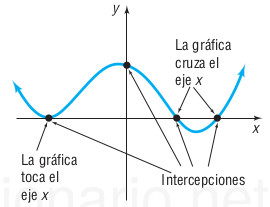
```

```{definition}
Se define $x=r$ como un cero (ó raíz) de una función $f(x)=0$, si y sólo si $f(r)=0$. Además el cero (ó raíz) de una función es la intersección entre el eje $X$ y la gráfica de $f(x)$.
```


### Link Shiny para graficar ecuaciones y aproximar raíces irracionales


[Gráficas y raíces apróximadas](https://septiembreestradajohnjairo2021uces.shinyapps.io/EjemploCEROSDEUNAECUACIONmateUnoA/)


### Fórmula del estudiante

La solución para la ecuación
$$
Ax^2+Bx+C=0
$$


Está dada por

$$
x=\dfrac{-B \pm\sqrt{B^2-4AC}}{2A}
$$

[Link para la solución cuadrática](https://procesouces2020.shinyapps.io/FormulaEstudianteV2/)

#### Ejemplo 1

Obtener la solución para la ecuación cuadrática

$$
3x^2+x-10=0
$$
**Solución**:

Reemplazar en la fórmula del estudiante $A=3$, $B=1$, y $C=-10$

```{r Ejemplo11, echo = F, fig.align='center', fig.width=4.5, fig.height=4.5}
A1 <- 3
B1 <- 1
C1 <- -10

g1 <- function(x,A,B,C){
  y <- A*x^2+B*x+C
return(y) 
}
D1 <- (B1)^2-4*(A1)*(C1)
r1 <- round((-B1-sqrt(D1))/(2*(A1)),digits = 3)
r2 <- round((-B1+sqrt(D1))/(2*(A1)),digits = 3)
# g1(0,A=A1,B=B1,C=C1)
# r1
# r2

xg <- seq(r2-10,r1+10,by = 0.5)
yg <-g1(x=xg,A=A1,B=B1,C=C1)
plot(xg,yg,"l",xlab="",ylab="")
par(new=T)
points(r1,0,col="black",pch=19)
text(r1,15,round(r1,2))
points(r2,0,col="black",pch=19)
text(r2,15,round(r2,2))
abline(h=0,col="red")
abline(v=0,col="red")
grid()
```


#### Ejemplo 2

Obtener la solución para la ecuación cuadrática

$$
x^2-5x+3=0
$$
**Solución**:

Reemplazar en la fórmula del estudiante $A=1$, $B=-5$, y $C=3$

```{r Ejemplo12, echo = F, fig.align='center', fig.width=4.5, fig.height=4.5}
A1 <- 1
B1 <- -5
C1 <- 3

g1 <- function(x,A,B,C){
  y <- A*x^2+B*x+C
return(y) 
}
D1 <- (B1)^2-4*(A1)*(C1)
r1 <- round((-B1-sqrt(D1))/(2*(A1)),digits = 3)
r2 <- round((-B1+sqrt(D1))/(2*(A1)),digits = 3)

xg <- seq(r2-10,r1+10,by = 0.5)
yg <-g1(x=xg,A=A1,B=B1,C=C1)
plot(xg,yg,"l",xlab="",ylab="")
par(new=T)
points(r1,0,col="black",pch=19)
text(r1,7,round(r1,2))
points(r2,0,col="black",pch=19)
text(r2,7,round(r2,2))
abline(h=0,col="red")
abline(v=0,col="red")
grid()
```


### Ejemplo1 (Solución de Ec)


Resolver para $x$ en la ecuación
$$
2x-7=5x+6
$$

Primero ver la solución usando el concepto de cero (ó raíz) de una función. Para lograr esto igualamos todo a cero.

$$
\begin{split}
0 &=&-2x+7+5x+6\\
0 &=& (5x-2x)+(7+6)\\
0 &=& 3x+13\\
0 &=& f(x)
\end{split}
$$

En este caso $f(x)=3x+13$ es una recta y buscamos donde la recta se vuelve cero ó equivalentemente donde la recta corta al eje de las $X$. Ese valor de corte es la solución de la ecuación planteada.

Graficando tenemos:


```{r Ejemplo13, echo = F, fig.align='center', fig.width=4.5, fig.height=4.5}
A1 <- 3
B1 <- 13


g1 <- function(x,A,B){
  y <- A*x+B
return(y) 
}

r1 <- round(-B1/A1,digits = 3)

xg <- seq(r1-5,r1+5,by = 0.5)
yg <-g1(x=xg,A=A1,B=B1)
plot(xg,yg,"l",xlab="",ylab="")
par(new=T)
points(r1,0,col="black",pch=19)
texj <- paste0(round(r1,2)," = -13/3")
text(r1+1,-2,texj)
abline(h=0,col="red")
abline(v=0,col="red")
grid()
```


\begin{equation} \label{eq39}
\begin{split}
\text{lado Izquierdo} & = \text{lado Derecho}\\
2x-5x & = 6 + 7\\
-3x & = 6 + 7 \\
-3x & = 13 \\
x &=\dfrac{13}{-3}\\
x &=-\dfrac{13}{3}\ \ \ \text{Recordar:} \ \ \ \ -\dfrac{a}{d}=\dfrac{a}{-d} =\dfrac{-a}{d}\\
\end{split}
\end{equation}

\begin{equation} \label{eq40}
\boxed{x =-\dfrac{13}{3}} \ \ \ \bf{\text{Respuesta esperada}}
\end{equation}


 <span style="color:blue">**Verificar la respuesta**</span>

\begin{equation} \label{eq41}
\begin{split}
&= \ \ \ \text{Recordar:} \ \ \ \ \dfrac{a}{b} \pm \dfrac{c}{d} =\dfrac{ad \pm bc}{bd}\\
&=\ \ \ \text{Recordar:} \ \ \ \ \dfrac{a.b}{c.d}=\dfrac{a}{c}.\dfrac{b}{d} \\
\text{lado Izquierdo}& = \text{lado Derecho}\\
2\left(\dfrac{-13}{3}\right)- 7 & = 5\left(\dfrac{-13}{3}\right)+ 6\\
\dfrac{2}{1}\left(\dfrac{-13}{3}\right)-\dfrac{7}{1}& =  \dfrac{5}{1}\left(\dfrac{-13}{3}\right) + \dfrac{6}{1}\\
\left(\dfrac{-26}{3}\right)-\dfrac{7}{1}& =  \left(\dfrac{-65}{3}\right) + \dfrac{6}{1}\\
\dfrac{-26-(3)(7)}{3}& =  \dfrac{-65+(3)(6)}{3}\\
\dfrac{-26-21}{3}& =  \dfrac{-65+18}{3}\\
\dfrac{-47}{3}& =  \dfrac{-47}{3}\\
\end{split}
\end{equation}

**NOTA**: En general cuando se realiza la **verificación** de la respuesta obtenida en una ecuación, 
el **resultado de la derecha`** es equivalente al **resultado de la izquierda**, esto muestra que  se obtuvo el resultado apropiado para la ecuación.


### Ejemplo2 (Solución de Ec)


Resolver para $z$ en la ecuación
$$
2- \dfrac{1}{z+1}=\dfrac{z}{z+1}
$$

\begin{equation} \label{eq42}
\begin{split}
\text{lado Izquierdo} & = \text{lado Derecho}\\
(z+1)\left( 2 - \dfrac{1}{z+1}\right) & = (z+1)\left(\dfrac{z}{z+1}\right) \\
(z+1).(2)-(z+1).\left(\dfrac{1}{z+1}\right) & = (z+1)\left(\dfrac{z}{z+1}\right) \\
(z+1).(2)- 1 & =  z \\
2z + 2 - 1 & =  z \\
2z + 1 & =  z \\
2z - z & =  -1 \\
z & =  -1 \ \ \ \bf{\text{Respuesta esperada}}
\end{split}
\end{equation}


\begin{equation} \label{eq43}
\boxed{z  =  -1} \ \ \ \bf{\text{Respuesta esperada}}
\end{equation}


<span style="color:blue">**Verificar la respuesta**</span>

\begin{equation} \label{eq44}
\begin{split}
\text{lado Izquierdo} & = \text{lado Derecho}\\
2 - \dfrac{1}{-1+1} & = \dfrac{-1}{-1+1} \\
2 - \dfrac{1}{0} & = \dfrac{-1}{0} \\
IND & =  IND \ \ \ \bf{\text{Respuesta la ec no tiene solución}}
\end{split}
\end{equation}


### Ejemplo3 (Solución de Ec)


Resolver para $x$ en la ecuación
$$
\dfrac{1}{x} + \dfrac{1}{x-4}=\dfrac{2}{x^2-4x}
$$

\begin{equation} \label{eq45}
\begin{split}
\text{lado Izquierdo} & = \text{lado Derecho}\\
\dfrac{1}{x} + \dfrac{1}{x-4} & = \dfrac{2}{x^2-4x} \\
x.(x-4)\left(\dfrac{1}{x} + \dfrac{1}{x-4}\right) & = x.(x-4)\left(\dfrac{2}{x(x-4)}\right) \\
x.(x-4).\dfrac{1}{x} + x.(x-4).\dfrac{1}{x-4} & = x.(x-4).\dfrac{2}{x(x-4)} \\
(x-4) + x.1 & = 2 \\
x+x-4 & = 2 \\
2x-4 & = 2 \\
2x & = 4+2 \\
2x & = 6 \\
x & = \dfrac{6}{2}\\
x & =  3 \ \ \ \bf{\text{Respuesta esperada}}
\end{split}
\end{equation}


\begin{equation} \label{eq46}
\boxed{x  =  3} 
\end{equation}


<span style="color:blue">**Verificar la respuesta**</span>

\begin{equation} \label{eq47}
\begin{split}
\text{lado Izquierdo} & = \text{lado Derecho}\\
\dfrac{1}{x} + \dfrac{1}{x-4} & =\dfrac{2}{x^2-4x} \\
           \text{Sustituir }x=3                   &\\
\dfrac{1}{3} + \dfrac{1}{3-4} & = \dfrac{2}{(3)^2-4(3)} \\
\dfrac{1}{3} + \dfrac{1}{-1} & = \dfrac{2}{9-12} \\
\dfrac{1}{3} - \dfrac{1}{1} & = \dfrac{2}{-3} \\
\dfrac{1}{3} - \dfrac{3}{3} & = -\dfrac{2}{3} \\
\dfrac{1-3}{3} & = -\dfrac{2}{3} \\
\dfrac{-2}{3} & = -\dfrac{2}{3} \\
-\dfrac{2}{3} & = -\dfrac{2}{3} \\
\end{split}
\end{equation}


### Ejemplo4 (Solución de Ec)


Resolver para $x \neq 0$ en la ecuación
$$
\dfrac{1}{2\sqrt{x}} - \dfrac{2}{\sqrt{x}}=\dfrac{5}{\sqrt{x}}
$$

\begin{equation} \label{eq48}
\begin{split}
\text{lado Izquierdo} & = \text{lado Derecho}\\
\dfrac{1}{2\sqrt{x}} - \dfrac{2}{\sqrt{x}} & =\dfrac{5}{\sqrt{x}}\\
\sqrt{x}.\left( \dfrac{1}{2\sqrt{x}} - \dfrac{2}{\sqrt{x}} \right) & = \sqrt{x}.\left( \dfrac{5}{\sqrt{x}} \right)\\
\sqrt{x}.\dfrac{1}{2\sqrt{x}} - \sqrt{x}.\dfrac{2}{\sqrt{x}} & =\sqrt{x}.\dfrac{5}{\sqrt{x}}\\
\dfrac{1}{2} - \dfrac{2}{1} & =\dfrac{5}{1}\\
\dfrac{1}{2} - \dfrac{4}{2} & = 5\\
\dfrac{1-4}{2} & = 5\\
\dfrac{-3}{2} & = 5\\
\text{Absurdo!} & \\
\text{La ecuación no tiene solución} & \ \ \ \bf{\text{Respuesta esperada}}
\end{split}
\end{equation}


# Sistemas de ecuaciones lineales.


## Teorema de los sistema lineales

Todo sistema de ecuaciones lineales sólo tiene una de las siguientes
afirmaciones:

(a) El sistema sólo tiene única solución

(b) El sistema tiene infinitas soluciones.

(c) El sistema no tiene solución.

## Sistemas $2$ por $2$


## Gráfica sistemas de ecuaciones

[Link para gráficar el sistema L ó NL](https://johnestradamarzoshiny2020.shinyapps.io/SistemasNoLinealesV3/)


Un sistema $2\times 2$ es un conjunto de dos ecuaciones
con dos variables (ó incógnitas) por conocer en cada una de sus ecuaciones.
$$
\left.
(1) \ \ a_{11}x + a_{12}y  = b_1 \atop
(2) \ \ a_{21}x + a_{22}y  = b_2 
\right\} \text{Sistema } 2\times 2 \ \ ordenado
$$

$$
\left.
(1) \ \ a_{11}y + a_{12}x  = b_1 \atop
(2) \ \ a_{21}y + a_{22}x  = b_2 
\right\} \text{Sistema } 2\times 2 \ \ ordenado
$$

### Técnica de sustitución

Como su nombre lo dice se despeja una de las dos variables en la
primera ecuación y se sustituye en la segunda ecuación. Esto
reduce el sistema $2$ por $2$ a una ecuación con una incógnita.

También se puede en el sentido contrario, es decir:

Se despeja una de las dos variables en la
segunda ecuación y se sustituye en la primera. Esto
reduce el sistema $2$ por $2$ a una ecuación con una incógnita.

#### Ejemplo1 (Sistema $2\times 2$)

Obtener los valores para $x$, y $y$ en el sistema $2\times 2$, y verificar la solución obtenida, si existe.

$$
\left.
(1) 2x + y  = 1 \atop
(2) \ \ x + y = 4 
\right\}
$$


Proceso de solución

Primero: Se despeja $x$ en la segunda ecuación

\begin{equation} \label{eq50}
\begin{split}
(2) x + y & = 4 \\
(3) \ x & = 4-y \ \ \ \bf{\text{Valor de}}   \  x  \ \bf{\text{a sustituir en la Ec(1)}}
\end{split}
\end{equation}

\begin{equation} \label{eq51}
\begin{split}
\boxed{(3) \ x = 4-y} 
\end{split}
\end{equation}

Segundo: Se realiza la sustitución en la Ec(1)

\begin{equation} \label{eq52}
\begin{split}
(1) \ 2x + y  & = 1 \\
 2(\bf{4-y}) + y & = 1 \\
 8- 2y + y &= 1\\
 -2y+y & = 1-8 \\
 -y & = -7 \\
 y & = 7 \ \ \ \bf{\text{Valor de}}   \  y  \ \bf{\text{obtenido depués de sustituir la Ec(3)}}
\end{split}
\end{equation}


\begin{equation} \label{eq53}
\begin{split}
\boxed{(4) \ y = 7} 
\end{split}
\end{equation}


Tercero: Nuevamente se realiza la sustitución de la Ec(4)
en la Ec(3) para obtener el valor de la $x$.


\begin{equation} \label{eq54}
\begin{split}
(3) \ x & = 4 - (7)\\
(5) \ x & = -3
\end{split}
\end{equation}


Cuarto: Verificar la respuesta en el sistema.


$$
\left.
(1) 2(-3) + (7)  = 1 \atop
(2) \ \ (-3) + (7) = 4 
\right\} \text{Se observa que ambas ecuaciones cumplen}
$$


### Técnica de eliminación


La técnica de eliminación trata de usar ambas ecuaciones del sistema para eliminar una de las variables seleccionada en el sistema.
La clave del método esta en el buen uso de los coeficientes en cada ecuación.

NOTA: Si se elige eliminar la $x$, entonces los coeficientes de $x$ en ambas ecuaciones se usaran para eliminar la letra $x$. Así:

El coeficiente $x$ de la primera ecuación multiplicará toda la segunda ecuación, y el coeficiente $x$ de la segunda ecuación multiplicará la primera ecuación.

Si ambas ecuaciones resultan después de ser multiplicadas con coeficientes iguales en signo y número, entonces es necesario
multiplicar una de ambas por menos uno y sumar posteriormente para obtener la eliminación de la letra $x$.


#### Ejemplo2 (Sistema $2\times 2$)

Obtener los valores para $x$, y $y$ en el sistema $2\times 2$.

$$
\left.
(1) 2x + y  = 1 \atop
(2) \ \ x + y = 4 
\right\}
$$


Proceso de solución

Primero: Se selecciona la variable (ó letra) a eliminar
para este caso se elige la letra $x$

\begin{equation}
\begin{array}{llllll}
(1) \ & 2x & + & y & = & 1 \\
+ \\
(2) \ -2(& x & + & y & = & 4)\\
(2) \ & -2x & - & 2y & = & -8\\
\hline
& 0 & - & y & = & -7 \\
&  &  & y & = & 7 
\end{array}
\end{equation}


Segundo: Se selecciona la variable $y$ (ó letra) a eliminar.

\begin{equation}
\begin{array}{llllll}
(1) \ & 2x & + & y & = & 1 \\
+ \\
(2) \ -1(& x & + & y & = & 4)\\
(2) \ & -x & - & y & = & -4\\
\hline
& x & + & 0 & = & -3 \\
&  &  & x & = & -3 
\end{array}
\end{equation}


Tercero: Verificar la respuesta en el sistema.


$$
\left.
(1) 2(-3) + (7)  = 1 \atop
(2) \ \ (-3) + (7) = 4 
\right\} \text{Se observa que ambas ecuaciones cumplen}
$$

### Herramienta shiny para resolver sistemas 2por2

[Link Operaciones entre filas](https://nuevoucesjohnestradaalvarez.shinyapps.io/Sistema2por2NN/)


### Técnica de los determinantes

Para aplicar la regla de los determinantes (ó regla de Cramer) son necesarios los conceptos de matriz y determinante en sistemas $2\times 2$ y sistemas $3\times 3$.


#### Matriz $2\times 2$

Una matriz $A$ $2\times 2$ es un arreglo de números reales (ó complejos)
por filas y columnas. Los cuales se encierran entre corchetes o paréntesis. Así:

\begin{equation}
A_{2\times 2}=\begin{pmatrix}
2 & 5 \\
7 & 3 
\end{pmatrix}  \ ó \
\
A_{2\times 2}=\begin{bmatrix}
2 & 5 \\
7 & 3 
\end{bmatrix}

\end{equation}


#### Determinantes $2\times 2$

Una determinante $A$ $2\times 2$ es un arreglo de números reales (ó complejos)
por filas y columnas los cuales se encierran entre barras. El determinante es una función (ó aplicación), la cual asociado a toda matriz $2\times 2$ un número real.
 Así:

\begin{equation}
|A_{2\times 2}|=\begin{vmatrix}
a & b \\
c & d 
\end{vmatrix}=(a)(d)-(c)(b)
\end{equation}

\begin{equation}
|A_{2\times 2}|=\begin{vmatrix}
2 & 5 \\
7 & 3 
\end{vmatrix}=(2)(3)-(7)(5)=6-35=-29
\end{equation}

<span style="color:red">**Teorema de Cramer $2\times 2$**</span>

Dado un sistema de ecuaciones lineales $2\times 2$

$$
\left.
(1) \ \ a_{11}x + a_{12}y  = b_1 \atop
(2) \ \ a_{21}x + a_{22}y  = b_2 
\right\} \text{Sistema } 2\times 2 \ \ ordenado
$$
El cual se puede expresar de forma equivalente en términos de matrices como:

$$
\left.
\begin{bmatrix}
a_{11} & a_{12} \\
a_{21} & a_{22} 
\end{bmatrix}
\begin{bmatrix}
x  \\
y  
\end{bmatrix}=\begin{bmatrix}
b_1 \\
b_2  
\end{bmatrix}
\right\} \text{Sistema } 2\times 2 \ \ ordenado
$$
Si el determinante $2\times 2$ llamado determinante de coeficientes en el sistema,

$$
\begin{vmatrix}
a_{11} & a_{12} \\
a_{21} & a_{22} 
\end{vmatrix} \neq 0
$$
es diferente de cero, Entonces el sistema $2\times 2$ tiene solución única y esta dada por:

\begin{equation}
x=\dfrac{\begin{vmatrix}
b_{1} & a_{12} \\
b_{2} & a_{22} 
\end{vmatrix}}{\begin{vmatrix}
a_{11} & a_{12} \\
a_{21} & a_{22} 
\end{vmatrix}};\ \ \ \ \

y=\dfrac{\begin{vmatrix}
a_{11} & b_{1} \\
a_{21} & b_{2} 
\end{vmatrix}}{\begin{vmatrix}
a_{11} & a_{12} \\
a_{21} & a_{22} 
\end{vmatrix}}\ \ \ \ \
\end{equation}


#### Ejemplo3 (Sistema $2\times 2$)

Obtener los valores para $x$, y $y$ en el sistema $2\times 2$. Usando la regla de los determinantes (ò regla de Cramer)

$$
\left.
(1) 2x + y  = 1 \atop
(2) \ \ x + y = 4 
\right\}
$$

Proceso de solución

El sistema se puede expresar de forma equivalente en términos de matrices como:

$$
\left.
\begin{bmatrix}
2 & 1 \\
1 & 1 
\end{bmatrix}
\begin{bmatrix}
x  \\
y  
\end{bmatrix}=\begin{bmatrix}
1 \\
4  
\end{bmatrix}
\right\}
$$


<span style="color:blue">**Regla de Cramer**</span>

Como


$$
\begin{vmatrix}
2 & 1 \\
1 & 1 
\end{vmatrix}=(2)(1) - (1)(1)=1 \neq 0
$$
Entonces Cramer afirma que existe única solución y esta dada por:

\begin{equation}
x=\dfrac{\begin{vmatrix}
1 & 1 \\
4 & 1 
\end{vmatrix}}{1}=\dfrac{(1)(1)-(4)(1)}{1}=\dfrac{1-4}{1}=\dfrac{-3}{1}=-3;\ \ 

y=\dfrac{\begin{vmatrix}
2 & 1 \\
1 & 4 
\end{vmatrix}}{1}=\dfrac{(2)(4)-(1)(1)}{1}=\dfrac{8-1}{1}=\dfrac{7}{1}=7\ 
\end{equation}


## Sistemas $3$ por $3$


Un sistema $3\times 3$ es un conjunto de tres ecuaciones
con tres variables (ó incógnitas) por conocer en cada una de las ecuaciones del sistema.
$$
\left.
(1) \ \ a_{11}x + a_{12}y  + a_{13}z= b_1 \\
(2) \ \ a_{21}x + a_{22}y  + a_{23}z= b_2 \\
(3) \ \ a_{31}x + a_{32}y  + a_{33}z= b_3 \atop
\right\} \text{Sistema } 3\times 3 \ \ ordenado
$$


$$
\left.
(1) \ \ a_{11}y + a_{12}x  + a_{13}z= b_1 \\
(2) \ \ a_{21}y + a_{22}x  + a_{23}z= b_2 \\
(3) \ \ a_{31}y + a_{32}x  + a_{33}z= b_3 \atop
\right\} \text{Sistema } 3\times 3 \ \ ordenado
$$


### Técnica de sustitución

#### Ejemplo4 (Sistena $3\times 3$)

Resolver el sistema $3 \times 3$ por sustitución

$$
\left.
\begin{array}{rcl}
(1) \  x + 2y+z & = & 9 \\
(2) \ \ \  x -y -z & = & -10 \\
(3) \   2x-y+z & = & 5 
\end{array}
\right\}
$$

Proceso de solución

Primero: Se despeja $x$ en la segunda ecuación, así


\begin{equation} \label{eq60}
\begin{split}
x -y -z & = & -10 \\
x & = & y + z -10 \\
\boxed{(4) \ x = y + z -10 } 
\end{split}
\end{equation}

Segundo: Se sustituye $x$ en la primera ecuación y en la tercera ecuación, así

\begin{equation} \label{eq59}
\begin{split}
(1) \ \ x + 2y+z & = & 9 \\
(y + z -10) + 2y+z & = & 9 \\
(y+2y)+(z+z)& = & 9+10\\

\boxed{(5) \ 3y +2z = 19 } \\

(3) \   2x-y+z & = & 5\\
2(y + z -10)-y+z & = & 5\\
2y + 2z -20-y+z & = & 5\\
(2y -y)+(2z+z) & = & 5+20\\


\boxed{(6) \ y + 3z  = 25 } \\


\end{split}
\end{equation}


Tercero: Se despeja $y$ en la sexta ecuación, así


\begin{equation} \label{eq61}
\begin{split}

(6) \   y+ 3z & = & 25\\
y & = & 25-3z\\

\boxed{(7) \ y = 25-3z } \\


\end{split}
\end{equation}


Cuarto: Se sutituye $y$ en la quinta ecuación, así


\begin{equation} \label{eq62}
\begin{split}

(5) \   3y +2z & = & 19 \\
3(25-3z)+2z & = & 19\\
3(25)-3(3z)+2z & = & 19\\
75+(2z-9z) & = & 19\\
75-7z & = & 19\\
75-19 & = & 7z\\

56 & = & 7z\\
\dfrac{56}{7} & = & z\\


\boxed{(8) \ z = 8 } \\


\end{split}
\end{equation}


Quinto: Se sutituye el valor de $z$ en la séptima ecuación, así


\begin{equation} \label{eq63}
\begin{split}

(7) \   y & = & 25-3z \\
y & = & 25-3(8) \\
y & = & 25-24 \\
y & = & 1 \\


\boxed{(9) \ y = 1 } \\


\end{split}
\end{equation}


Sexto: Se sutituye el valor de $y$ y $z$ en la cuarta ecuación, así


\begin{equation} \label{eq64}
\begin{split}

(4) \   x & = & y+z-10 \\
x & = & 1+8-10 \\
x & = & 9-10\\

x & = & -1 \\


\boxed{(10) \ x = -1 } \\


\end{split}
\end{equation}


Séptimo: Se verifica la respuesta $x=-1$, $y=1$, y $z=8$ en el sistema de ecuaciones inicial, así


$$
\left.
\begin{array}{rcl}
(1) \  (-1) + 2(1)+(8) & = & 9 \\
(2) \ \ \  (-1) -(1) -(8) & = & -10 \\
(3) \   2(-1)-(1)+(8) & = & 5 
\end{array}
\right\}
$$


<meta name=viewport content="width=device-width,initial-scale=1">
<meta charset="utf-8"/>
<script src="https://www.geogebra.org/apps/deployggb.js"></script>
<div id="ggb-element"></div>

<script>
       var ggbApp = new GGBApplet({"material_id":"hgdybywb", "width": 800, "height": 600, "showToolBar": true, "showAlgebraInput": true, "showMenuBar": true }, true);
         window.addEventListener("load", function() {
           ggbApp.inject('ggb-element');
      });
</script>


### Técnica de eliminación


#### Ejemplo5 (Sistena $3\times 3$)


Resolver el sistema $3 \times 3$ por eliminación de variables en el sistema de ecuaciones


$$
\left.
\begin{array}{rcl}
(1) \  x + 2y+z & = & 9 \\
(2) \ \ \  x -y -z & = & -10 \\
(3) \   2x-y+z & = & 5 
\end{array}
\right\}
$$


$$
\left.
\begin{array}{rcl}
(1) \  1x + 2y+z & = & 9 \\
(2) \ \ \  1x -y -z & = & -10 \\
(3) \   2x-y+z & = & 5 
\end{array}
\right\}
$$


<meta name=viewport content="width=device-width,initial-scale=1">
<meta charset="utf-8"/>
<script src="https://www.geogebra.org/apps/deployggb.js"></script>
<div id="ggb-element"></div>

<script>
       var ggbApp = new GGBApplet({"material_id":"mc69mecz", "width": 800, "height": 600, "showToolBar": true, "showAlgebraInput": true, "showMenuBar": true }, true);
         window.addEventListener("load", function() {
           ggbApp.inject('ggb-element');
      });
</script>


<!-- ```{r, echo=FALSE} -->
<!-- library(knitr) -->
<!-- knitr::include_app("https://www.geogebra.org/classic/mc69mecz",height = "600px") -->
<!-- ``` -->


**Proceso de solución**


Primero: Se elige la variable a eliminar, en nuestro caso se desea eliminar la variable $x$

Segunto: Se elimina la variable seleccionada usando de manera estratégica las ecuaciones del sistema. Así. A la ecuación (1) se le resta la ecuación (2).


\begin{equation}
\begin{array}{llllll}
(1) \ \ \  \ \ \ \ 1(x &+& 2y &+& z & = & 9) \\

 
(2) \ \ \ -1(x &-& y &-& z  & = & -10) \\
\hline
 &  0x &+& 3y &+& 2z & = & 19 \\
\\
\ \   && 3y &+& 2z & = & 19 
\end{array}
\end{equation}

\begin{equation}
\boxed{(4)\ \ 3y + 2z  =  19 } \\
\end{equation}


Tercero: Se elimina la variable seleccionada usando de manera estratégica las ecuaciones del sistema. Así. A la ecuación (3) se le resta la ecuación (2).


\begin{equation}
\begin{array}{llllll}
(3) \ \ \  \ \ \ \ 1(2x &-& y &+& z & = & 5 ) \\

 
(2) \ \ \ -2(x &-& y &-& z  & = & -10) \\
\hline
 &  0x &+& 1y &+& 3z & = & 25 \\
\\
\ \   && y &+& 3z & = & 25 
\end{array}
\end{equation}

\begin{equation}
\boxed{(5)\ \ y + 3z  =  25 } \\
\end{equation}


Cuarto: Se elimina la variable $y$ seleccionada para el sistema $2\times 2$, usando de manera estratégica las ecuaciones del sistema formado por (4) y (5). Así. A la ecuación (4) se le resta la ecuación (5) múltiplicada por $-3$.


\begin{equation}
\boxed{(4)\ \ 3y + 2z  =  19 } \\
\boxed{(5)\ \ y + 3z  =  25 } \\
\end{equation}


\begin{equation}
\begin{split}

(4) \ \  \ \ \ \ 1(3y &+& 2z  & = &  19 ) \\

 
(5) \ \ \ -3(y &+& 3z &  = &  25) \\
\hline
 &  && 0y &-& 7z & = & -56 \\
\ \    -7z & = & -56 \\
\ \   z & = & \dfrac{-56}{-7} \\
\ \    z & = & \dfrac{56}{7} \\
\ \   z & = & 8 \\

\end{split}
\end{equation}


\begin{equation}
\boxed{(6)\ \ z = 8} 
\end{equation}


Quinto: Se elimina la variable $z$ seleccionada para el sistema $2\times 2$, usando de manera estratégica las ecuaciones del sistema formado por (4) y (5). Así. A la ecuación le (4) múltiplicamos por $3$, y se le resta la ecuación (5) múltiplicada por $-2$.


\begin{equation}
\boxed{(4)\ \ 3y + 2z  =  19 } \\
\boxed{(5)\ \ y + 3z  =  25 } \\
\end{equation}


\begin{equation}
\begin{split}

(4)\ \ \ \ \ \ 3(3y &+& 2z  & = &  19 ) \\

 
(5) \ \ \ -2(y &+& 3z &  = &  25) \\
\hline
 &  && 7y &+& 0z & = & 7 \\
\ \    7y & = & 7 \\
\ \   y & = & \dfrac{7}{7} \\
\ \    y & = & 1 \\
\end{split}
\end{equation}


\begin{equation}
\boxed{(7)\ \ y = 1} 
\end{equation}


Sexto: Por sustitución de las ecuaciones (6) y (7) en la ecuación (2), se puede
obtener el valor de la variable $x$, así:


\begin{equation}
\begin{split}

(2) \ \ \  x -y -z & = & -10 \\
\ \ \  x-(8)-(1) & = & -10 \\
\ \ \  x-9 & = & -10 \\
\ \ \  x & = & -10+9 \\
\ \ \  x & = & -1 \\
\end{split}
\end{equation}

\begin{equation}
\boxed{(8)\ \ x = -1} 
\end{equation}


Séptimo: Verificar la respuesta $x=-1,\ y=1, \ z=8$ en el sistema original


$$
\left.
\begin{array}{rcl}
(1) \  (-1) + 2(1)+(8) & = & 9 \\
(2) \ \ \  (-1) -(1) -(8) & = & -10 \\
(3) \   2(-1)-(1)+(8) & = & 5 
\end{array}
\right\}
$$

### Herramienta shiny para resolver sistemas 3por3


[Link Operaciones entre filas](https://nuevoucesjohnestradaalvarez.shinyapps.io/Sistema3por3NN/)


### Técnica de los determinantes

#### Matriz $3\times 3$

Una matriz $A$ $3\times 3$ es un arreglo de números reales (ó complejos)
por filas y columnas, los cuales se encierran entre corchetes o paréntesis. Así:

\begin{equation}
A_{3\times 3}=\begin{pmatrix}
2 & 5 & 4\\
7 & 3 & -1\\
3 & 2 & 1
\end{pmatrix}  \ ó \
\
A_{3\times 3}=\begin{bmatrix}
2 & 5 & 4\\
7 & 3 & -1\\
3 & 2 & 1
\end{bmatrix}

\end{equation}


#### Determinantes $3\times 3$


Una determinante $A$ $3\times 3$ es un arreglo de números reales (ó complejos)
por filas y columnas los cuales se encierran entre barras. El determinante es una función (ó aplicación), la cual asociado a toda matriz $3\times 3$ un número real. Así:

\begin{equation}
|A_{3\times 3}|=\begin{vmatrix}
a & b & c\\
d & e & f\\
g & h & i
\end{vmatrix}=(a)\begin{vmatrix}
e & f \\
h & i 
\end{vmatrix}-

(b)\begin{vmatrix}
d & f \\
g & i 
\end{vmatrix}+


(c)\begin{vmatrix}
d & e \\
g & h 
\end{vmatrix}

\end{equation}

\begin{equation} \label{eq55}
\begin{split}
|A_{3\times 3}|=\begin{vmatrix}
2 & 5 & 4\\
7 & 3 & -1\\
3 & 2 & 1
\end{vmatrix} & =(2)\begin{vmatrix}
3 & -1 \\
2 & 1 
\end{vmatrix}-

(5)\begin{vmatrix}
7 & -1 \\
3 & 1 
\end{vmatrix}+

(4)\begin{vmatrix}
7 & 3 \\
3 & 2 
\end{vmatrix}\\
& =(2)(3+2)-(5)(7+3)+(4)(14-9) \\
& =10-50+20=-20
\end{split}
\end{equation}


#### Regla de Sarrus para un determinante $3\times 3$

[Link Regla de Sarrus](https://johneaces2020.shinyapps.io/REGLASARRUSV1/)

\begin{equation}
|A_{3\times 3}|=\begin{vmatrix}
a & b & c\\
d & e & f\\
g & h & i
\end{vmatrix}=\begin{vmatrix}
a & b & c\\
d & e & f\\
g & h & i\\
a & b & c\\
d & e & f
\end{vmatrix}=aei+dhc+gbf-ceg-fha-ibd
\end{equation}


\begin{equation} \label{eq56}
\begin{split}
|A_{3\times 3}|=\begin{vmatrix}
2 & 5 & 4\\
7 & 3 & -1\\
3 & 2 & 1
\end{vmatrix} & =
\begin{vmatrix}
2 & 5 & 4\\
7 & 3 & -1\\
3 & 2 & 1\\
2 & 5 & 4\\
7 & 3 & -1
\end{vmatrix}\\
& = (2)(3)(1)+(7)(2)(4)+(3)(5)(-1)-(4)(3)(3)-(-1)(2)(2)-(1)(5)(7)\\
& = 6+56-15-36+4-35\\
& = 6+56+4-15-36-35\\
& = 66-86\\
& = -20
\end{split}
\end{equation}


<span style="color:red">**Teorema de Cramer $3\times 3$**</span>


Dado un sistema de ecuaciones lineales $3\times 3$


$$
\left.
(1) \ \ a_{11}x + a_{12}y  + a_{13}z= b_1 \\
(2) \ \ a_{21}x + a_{22}y  + a_{23}z= b_2 \\
(3) \ \ a_{31}x + a_{32}y  + a_{33}z= b_3 \atop
\right\} \text{Sistema } 3\times 3 \ \ ordenado
$$

El cual se puede expresar de forma equivalente en términos de matrices como:

$$
\left.
\begin{bmatrix}
a_{11} &  a_{12}  & a_{13} \\
a_{21} &  a_{22}  & a_{23}\\
a_{31} &  a_{32}  & a_{33}
\end{bmatrix}
\begin{bmatrix}
x  \\
y  \\
z  \\
\end{bmatrix}=\begin{bmatrix}
b_1 \\
b_2 \\  
b_3 \\ 
\end{bmatrix}
\right\} \text{Sistema } 3\times 3 \ \ ordenado
$$

Si el determinante $3\times 3$ llamado determinante de coeficientes en el sistema,

$$
\begin{vmatrix}
a_{11} & a_{12} & a_{13}\\
a_{21} & a_{22} & a_{23}\\
a_{31} & a_{32} & a_{33}
\end{vmatrix} \neq 0
$$

es diferente de cero, Entonces el sistema $3\times 3$ tiene solución única y esta dada por:

\begin{equation}
x=\dfrac{\begin{vmatrix}
b_{1} & a_{12} & a_{13}\\
b_{2} & a_{22} & a_{23}\\
b_{3} & a_{32} & a_{33}
\end{vmatrix}}{\begin{vmatrix}
a_{11} & a_{12} & a_{13}\\
a_{21} & a_{22} & a_{23}\\
a_{31} & a_{32} & a_{33} 
\end{vmatrix}};\ \ \ \ \

y=\dfrac{\begin{vmatrix}
a_{11} & b_{1} & a_{13}\\
a_{21} & b_{2} & a_{23}\\
a_{31} & b_{3} & a_{33} 
\end{vmatrix}}{\begin{vmatrix}
a_{11} & a_{12} & a_{13}\\
a_{21} & a_{22} & a_{23}\\
a_{31} & a_{32} & a_{33} 
\end{vmatrix}};\ \ \ \ \

z=\dfrac{\begin{vmatrix}
a_{11} & a_{12} & b_{1}\\
a_{21} & a_{22} & b_{2}\\
a_{31} & a_{32} & b_{3} 
\end{vmatrix}}{\begin{vmatrix}
a_{11} & a_{12} & a_{13}\\
a_{21} & a_{22} & a_{23}\\
a_{31} & a_{32} & a_{33} 
\end{vmatrix}}
\end{equation}


#### Ejemplo5 (Sistena $3\times 3$)


Resolver el sistema $3 \times 3$ usando la regla de Cramer


$$
\left.
\begin{array}{rcl}
  x + 2y+z & = & 9 
  \\ x -y -z & = & -10
  \\ 2x-y+z & = & 5 
\end{array}
\right\}
$$

El sistema se puede expresar de forma equivalente en términos de matrices como:

$$
\left.
\begin{bmatrix}
1 &  2  & 1 \\
1 &  -1  & -1\\
2 &  -1  & 1
\end{bmatrix}
\begin{bmatrix}
x  \\
y  \\
z  \\
\end{bmatrix}=\begin{bmatrix}
9 \\
-10 \\  
5 \\ 
\end{bmatrix}
\right\} \text{Sistema } 3\times 3 \ \ ordenado
$$

El sistema tiene única solución ya que determinante para la matriz de coeficientes en el sistema es diferente de cero.

\begin{equation} \label{eq57}
\begin{split}
\begin{vmatrix}
1 & 2 & 1\\
1 & -1 & -1\\
2 & -1 & 1
\end{vmatrix} & = \begin{vmatrix}
1 & 2 & 1\\
1 & -1 & -1\\
2 & -1 & 1\\
1 & 2 & 1\\
1 & -1 & -1
\end{vmatrix} \\
& =(1)(-1)(1)+(1)(-1)(1)+(2)(2)(-1)-(1)(-1)(2)-(-1)(-1)(1)-(1)(2)(1)\\
& = -1-1-4+2-1-2\\
& = -7 \neq 0
\end{split}
\end{equation}

Por lo tanto la solución para $x$, $y$, y $z$ es:

\begin{equation}
x=\dfrac{\begin{vmatrix}
9 & 2 & 1\\
-10 & -1 & -1\\
5 & -1 & 1
\end{vmatrix}}{-7};\ \ \ \ \

y=\dfrac{\begin{vmatrix}
1 & 9 & 1\\
1 & -10 & -1\\
2 & 5 & 1 
\end{vmatrix}}{-7};\ \ \ \ \

z=\dfrac{\begin{vmatrix}
1 & 2 & 9\\
1 & -1 & -10\\
2 & -1 & 5 
\end{vmatrix}}{-7}
\end{equation}


Por lo tanto la solución del sistema $3\times 3$ es: $(x=-1,y=1,z=8)$


# Sistemas de ecuaciones no lineales.


Recordemos que una ecuación de la forma $ax+by+c=0$ se dice ecuación lineal con dos variables $x$ y $y$.
Una ecuación que no tenga esta forma se dice no lineal.

**Definición de Sistema No Lineal**: Es un conjunto (ó sistema) de ecuaciones, el cual se dice no lineal (NL), si por lo menos una de sus ecuaciones es no lineal. 

### Ejemplos de sistemas no lineales

\begin{equation}
\left\{
\begin{array}{lcr}
     x^2-4x & =  y \\
  -x^2+8  & = y   \\
\end{array}
\right.


\ \ \ \ ;
\left\{
\begin{array}{lcr}
     xy & =  16 \\
  20-x^2  & = y   \\
\end{array}
\right.

\ \ \ \ ;

\left\{
\begin{array}{lcr}
     3x & =  y \\
  x^2+y^2  & = 4   \\
\end{array}
\right.


\ \ \ \ ;

\left\{
\begin{array}{lcr}
     x & =  5 \\
  y^2  & = x   \\
\end{array}
\right.
\end{equation}


### Técnica de sustitución

**Ejemplo**: Resolver el sistema no lineal usando sustitución.

$$
\left\{
\begin{array}{lcr}
(1) \     x & =  5 \\
(2) \  y^2  & = x   \\
\end{array}
\right.
$$


**Proceso de solución**

Sustituir la ec(1) en la ec(2)


\begin{equation}
\begin{split}
y^2 & =5\\
\sqrt{y^2} & =\pm \sqrt{5}\\
y & = \pm \sqrt{5}
\end{split}
\end{equation}


Por lo tanto las soluciones son:

$$ (x=5,y= \sqrt{5}), \ \ \ \ (x=5, y=-\sqrt{5}) $$

proceso de verificación

Verificación para $(x=5,y= \sqrt{5})$

\begin{equation}
(1) \ 5=5\\
(2) \ (\sqrt{5})^2=5\\
(2) \ 5=5
\end{equation}

Verificación para $(x=5,y= -\sqrt{5})$

\begin{equation}
(1) \ 5=5\\
(2) \ (-\sqrt{5})^2=5\\
(2) \ \left((-1)(\sqrt{5})\right)^2=5\\
(2) \ (-1)^2.(\sqrt{5})^2=5\\
(2) \ 5=5
\end{equation}


### Técnica de eliminación


**Ejemplo**: Resolver el sistema no lineal usando eliminación.

$$
\left\{
\begin{array}{lcr}
(1) \     x & =  5 \\
(2) \   x & = y^2   \\
\end{array}
\right.
$$


**Proceso de solución**

Restarle a la ec(2) la ec(1)


\begin{equation}
\begin{array}{llllll}
(2) & x &&& = & y^2 \\
- \\
(1) & x &&& = & 5\\
\hline
& 0x &&& = & y^2-5
\end{array}
\end{equation}


\begin{equation}
\begin{split}
0 & = y^2-5\\
5 & =y^2\\
\pm \sqrt{5} & =\sqrt{y^2}\\
\pm \sqrt{5} & = y 
\end{split}
\end{equation}

Por lo tanto las soluciones son:

$$ (5, \sqrt{5}), \ \ \ \ (5, -\sqrt{5}) $$


<!-- ## **OBSERVACIONES** -->


<!-- ### Ejercicio del taller -->

<!-- $$ -->
<!-- \dfrac{1}{y^4.x^2}=y^{-4}x^{-2} -->
<!-- $$ -->


<!-- ### Ejercicio del taller -->


<!-- \begin{equation} \label{eq103} -->
<!-- \begin{split} -->
<!-- \left({x+y+1}\right)^2 & = \left({x+(y+1)}\right)^2 \\ -->
<!-- & = x^2+2.x.(y+1)+(y+1)^2 \\ -->
<!-- & = x^2+2xy+2x+y^2+2y+1 \\ -->
<!-- \end{split} -->
<!-- \end{equation} -->


<!-- ### Ejercicio del taller -->


<!-- \begin{equation} \label{eq104} -->
<!-- \begin{split} -->
<!-- 4x^2+11x-3 & = (-4x+1).(-x-3) \\ -->
<!-- & =(-1).(4x-1).(-1).(x+3) \\ -->
<!-- & =(-1)^2(4x-1).(x+3) \\ -->
<!-- & = (4x-1)(x+3) \\ -->
<!-- \end{split} -->
<!-- \end{equation} -->


<!-- ### Ejercicio del parcial -->

<!-- $$9a^{2n}-16b^{10m}$$ -->

<!-- \begin{equation} \label{eq102} -->
<!-- \begin{split} -->
<!-- 9a^{2n}-16b^{10m} & = \left(3a^n\right)^2-\left(4b^{5m}\right)^2\\ -->
<!-- &= \left(3a^n-4b^{5m}\right).\left(3a^n+4b^{5m}\right)\ \ \ \bf{\text{Respuesta esperada}} -->
<!-- \end{split} -->
<!-- \end{equation} -->


<!-- ### Ejercicio del parcial -->

<!-- $$z^{4}+5z^2+6$$ -->

<!-- \begin{equation} \label{eq101} -->
<!-- \begin{split} -->
<!-- z^4+5z^2+6 & = \left(z^2+3 \right).\left(z^2+2 \right) \ \ \ \bf{\text{Respuesta esperada}} -->
<!-- \end{split} -->
<!-- \end{equation} -->


<!-- ### Ejercicio del parcial -->

<!-- $$3ax+6ay+bx+2by$$ -->

<!-- \begin{equation} \label{eq100} -->
<!-- \begin{split} -->
<!-- 3ax+6ay+bx+2by  & = (3ax+bx)+(6ay+2by) \\ -->
<!-- & = (3.a.x+b.x)+((2).(3).a.y+2.b.y) \\ -->
<!-- & = (3a+b)x+(3a+b).2y \\ -->
<!-- & = \left(3a+b \right).\left(x+2y \right) \ \ \ \bf{\text{Respuesta esperada}} -->
<!-- \end{split} -->
<!-- \end{equation} -->

<!-- ## Ejemplo1 -->
<!-- simplificación por el número $3$ -->

<!-- $$ -->
<!-- 3.\dfrac{1}{3}=\dfrac{3}{1}.\dfrac{1}{3}=\dfrac{3.1}{1.3}=\dfrac{3}{3}=1 -->
<!-- $$ -->


<!-- ### Ejemplo2 -->

<!-- \begin{equation} -->
<!-- (1) 2x + y  = 1 \\ -->
<!-- y=1-2x\\ -->
<!-- y=-2x+1\\ -->
<!-- m=-2, b=1\\ -->
<!-- (2) \ \ x + y = 4 \\ -->
<!-- y=4-x\\ -->
<!-- y=-x+4\\ -->
<!-- m=-1, b=4 -->
<!-- \end{equation} -->


<!-- ### Ejemplo3 -->

<!-- \begin{equation} -->
<!-- (1) x - 4y +1 = 0 \\ -->
<!-- x+1=4y\\ -->
<!-- \dfrac{1}{4}x+\dfrac{1}{4}=y\\ -->
<!-- m=\dfrac{1}{4}, b=\dfrac{1}{4}\\ -->

<!-- (2) 3x + 2y-1 = 0 \\ -->
<!-- 2y=-3x+1\\ -->
<!-- y=\dfrac{-3}{2}x+\dfrac{1}{2}\\ -->
<!-- m=\dfrac{-3}{2}, b=\dfrac{1}{2} -->
<!-- \end{equation} -->


<!-- ### Ejercicio4(Taller) -->

<!-- \begin{equation} -->
<!-- (1) \ x-y=2\\ -->
<!-- (2) \ x+y=1\\ -->

<!-- \text{Despeje de la y en cada ecuación}\\ -->
<!-- (1) \ x=2+y\\ -->
<!-- (1) \ 1x-2=y\\ -->
<!-- m=1; \ b=-2\\ -->

<!-- (2) \ x+y=1\\ -->
<!-- (2) \ y=1-x\\ -->
<!-- (2) \ y=-x+1\\ -->
<!-- m=-1; \ b=1\\ -->

<!-- \text{Verificar la solución} -->
<!-- (1)\ \ (\dfrac{3}{2})-(\dfrac{-1}{2})=\dfrac{3}{2}+\dfrac{1}{2}=\dfrac{4}{2}=2\\ -->
<!-- (2)\ \ (\dfrac{3}{2})+(\dfrac{-1}{2})=(\dfrac{3}{2})-(\dfrac{1}{2})=\dfrac{3-1}{2}=\dfrac{2}{2}=1\\ -->
<!-- \end{equation} -->


<!-- \begin{equation} -->
<!-- (1) \ \ -x-2y=-4\\ -->
<!-- (2) \ \ 5x+10y=20\\ -->

<!-- \text{Despejar en ambas ec la letra y}\\ -->

<!-- (1) \ \ -x=-4+2y\\ -->
<!-- (1) \ \ -x+4=2y\\ -->
<!-- (1) \ \ \dfrac{-1}{2}x+\dfrac{4}{2}=y\\ -->
<!-- (1) \ \ \dfrac{-1}{2}x+2=y\\ -->
<!-- m=-0.5; \ b=2\\ -->

<!-- (2) \ \ 5x+10y=20\\ -->
<!-- (2) \ \ 10y=20-5x\\ -->
<!-- (2) \ \ y=\dfrac{-5}{10}x+\dfrac{20}{10}\\ -->
<!-- (2) \ \ y=\dfrac{-1}{2}x+\dfrac{2}{1}\\ -->
<!-- (2) \ \ y=\dfrac{-1}{2}x+\dfrac{2}{1}\\ -->
<!-- (2) \ \ y=\dfrac{-1}{2}x+2\\ -->
<!-- m=-0.5; b=2 -->
<!-- \end{equation} -->


<!-- ### Ejercicio16(Taller) -->

<!-- $$ -->
<!-- r^2=10\\ -->
<!-- r=\pm \sqrt{10}\\ -->
<!-- r=\sqrt{10}\\ -->
<!-- $$ -->


<!-- \begin{equation} -->
<!-- (1) \ y=3\\ -->

<!-- \end{equation} -->


<!-- Por sustitución -->

<!-- $y=3$ en la ec(2) -->

<!-- \begin{equation} -->
<!-- (2) \ (x+1)^2+(3)^2=10\\ -->
<!-- (2) \ (x+1)^2+9=10\\ -->
<!-- (2) \ (x+1)^2=10-9\\ -->
<!-- (2) \ (x+1)^2=1\\ -->
<!-- (2) \ \sqrt{(x+1)^2}= \pm \sqrt{1}\\ -->
<!-- (2) \ (x+1)=\pm 1\\ -->
<!-- (2) \ x=\pm1-1\\ -->

<!-- x=1-1=0\\ -->
<!-- x=0\\ -->

<!-- x=-1-1=-2\\ -->
<!-- x=-2 -->
<!-- \end{equation} -->

<!-- Se concluye que el sistema posee dos respuestas -->

<!-- $(x=0,y=3)$ \ y  \ $(x=-2,y=3)$ -->


<!-- ### Ejercicio14(Taller) -->

<!-- \begin{equation} -->
<!-- (1) \ x+y+z=4\\ -->
<!-- (2) \ 2x-y+2z=11\\ -->
<!-- (3) \ 4x+3y-6z=-18\\ -->
<!-- \end{equation} -->

<!-- $$ -->
<!-- \begin{bmatrix} -->
<!-- 1 & 1 & 1\\ -->
<!-- 2 & -1 & 2 \\ -->
<!-- 4 & 3 & -6 -->
<!-- \end{bmatrix} -->
<!-- $$ -->


<!-- $$ -->
<!-- \begin{vmatrix} -->
<!-- 1 & 1 & 1\\ -->
<!-- 2 & -1 & 2 \\ -->
<!-- 4 & 3 & -6 -->
<!-- \end{vmatrix}=30, \ \text{es diferente de cero} -->
<!-- $$ -->

<!-- $$ -->
<!-- x=\dfrac{\begin{vmatrix} -->
<!-- 4 & 1 & 1\\ -->
<!-- 11 & -1 & 2 \\ -->
<!-- -18 & 3 & -6 -->
<!-- \end{vmatrix}}{30}=\dfrac{45}{30}=\dfrac{9}{6}=\dfrac{3}{2} -->
<!-- $$ -->

<!-- $$ -->
<!-- y=\dfrac{\begin{vmatrix} -->
<!-- 1 & 4 & 1\\ -->
<!-- 2 & 11 & 2 \\ -->
<!-- 4 & -18 & -6 -->
<!-- \end{vmatrix}}{30}=\dfrac{-30}{30}=-1 -->
<!-- $$ -->

<!-- $$ -->
<!-- z=\dfrac{\begin{vmatrix} -->
<!-- 1 & 1 & 4\\ -->
<!-- 2 & -1 & 11 \\ -->
<!-- 4 & 3 & -18 -->
<!-- \end{vmatrix}}{30}=\dfrac{105}{30}=\dfrac{21}{6}=\dfrac{7}{2} -->
<!-- $$ -->


<!-- ### Ejercicio20(Taller) -->


<!-- [Link para gráficar una parábola](https://procesouces2020.shinyapps.io/ParabolaV2/) -->


<!-- \begin{equation} -->
<!-- (1) \ x+y=5\\ -->
<!-- (2) \ x^2+y^2=1\\ -->
<!-- \end{equation} -->


<!-- \begin{equation} -->
<!-- (1) \ x+y=5\\ -->
<!-- (1) \ y=-x+5\\ -->
<!-- m=-1\\ -->
<!-- b=5\\ -->


<!-- (2) \ x^2+y^2=1\\ -->
<!-- \end{equation} -->

<!-- **Técnica de sustitución** -->

<!-- Despejar $y$ en la ecuación (1) y sustituir (2) -->

<!-- \begin{equation} -->
<!-- (1) \ x+y=5\\ -->
<!-- (1) \ y=-x+5\\ -->

<!-- \text{sustituir en la Ec(2)}\\ -->
<!-- (2) \ x^2+y^2=1\\ -->
<!-- (2) \ x^2+(-x+5)^2=1\\ -->
<!-- (2) \ x^2+(-x)^2+2(-x)(5)+(5)^2=1\\ -->
<!-- (2) \ x^2+x^2-10x+25=1\\ -->
<!-- (2) \ x^2+x^2-10x+25-1=0\\ -->
<!-- (2) \ 2x^2-10x+24=0\\ -->
<!-- A=2\\ -->
<!-- B=-10\\ -->
<!-- C=24\\ -->
<!-- D=B^2-4AC\\ -->
<!-- D=(-10)^2-4(2)(24)\\ -->
<!-- D=-92\\ -->
<!-- \end{equation} -->


<!-- Se concluye que el sistema no tiene solución. -->

<!-- Ya que la ec $2x^2-10x+24=0$ no tiene solución real.(**PORQUE EL DISCRIMINANTE ES NEGATIVO**) -->


<!-- ### Ejercicio9(Taller) -->

<!-- \begin{equation} -->
<!-- (1) \ x+7y-4z=1\\ -->
<!-- (2) \ 2x+3y+z=-3\\ -->
<!-- (3) \ -x+18y+13z=2\\ -->
<!-- \end{equation} -->


<!-- $$ -->
<!-- \begin{bmatrix} -->
<!-- x & y & z\\ -->
<!-- 1 & 7 & -4\\ -->
<!-- 2 & 3 & 1 \\ -->
<!-- -1 & 18 & 13 -->
<!-- \end{bmatrix} -->
<!-- $$ -->


<!-- $$ -->
<!-- \begin{vmatrix} -->
<!-- 1 & 7 & -4\\ -->
<!-- 2 & 3 & 1 \\ -->
<!-- -1 & 18 & 13 -->
<!-- \end{vmatrix}=-324 -->
<!-- $$ -->


<!-- Solución por regla de Cramer (Ya que el determinante de la matriz con coeficientes del sistema es diferente de cero $\text{Matriz de Coefiencientes del sistema}=-324$) -->


<!-- Respuesta para la variable $x$ -->

<!-- $$ -->
<!-- x=\dfrac{\begin{vmatrix} -->
<!-- 1 & 7 & -4\\ -->
<!-- -3 & 3 & 1 \\ -->
<!-- 2 & 18 & 13 -->
<!-- \end{vmatrix}}{-324}=\dfrac{548}{-324}=-1.69 -->
<!-- $$ -->


<!-- Respuesta para la variable $y$ -->


<!-- $$ -->
<!-- y=\dfrac{\begin{vmatrix} -->
<!-- 1 & 1 & -4\\ -->
<!-- 2 & -3 & 1 \\ -->
<!-- -1 & 2 & 13 -->
<!-- \end{vmatrix}}{-324}=\dfrac{-72}{-324}=0.22 -->
<!-- $$ -->

<!-- Respuesta para la variable $z$ -->


<!-- $$ -->
<!-- z=\dfrac{\begin{vmatrix} -->
<!-- 1 & 7 & 1\\ -->
<!-- 2 & 3 & -3 \\ -->
<!-- -1 & 18 & 2 -->
<!-- \end{vmatrix}}{-324}=\dfrac{92}{-324}=-0.28 -->
<!-- $$ -->


