# Planteo y solución de problemas

```{r include=FALSE}
colFmt = function(x,color,outputFormat = 'html' ){
  # Funcion para colorear texto a discrecion en Rmarkdown
  # tomada de: https://stackoverflow.com/questions/29067541/how-to-change-the-font-color
  
  # outputFormat = knitr::opts_knit$get("rmarkdown.pandoc.to")
  if(outputFormat == 'latex')
    paste("\\textcolor{",color,"}{",x,"}",sep="")
  else if(outputFormat == 'html')
    paste("<font color='",color,"'>",x,"</font>",sep="")
  else
    x
}
```

## **Sugerencia para construir una ecuación**

1). Lea el problema cuidadosamente mínimo tres veces.

2). Lea de nuevo el problema e identifique una cantidad desconocida que se necesite hallar.

3). Si es posible, trace un diagrama.

4). Asigne una variable, digamos $x$, que represente la cantidad desconocida.

**`r colFmt('Escriba la definición de esta variable','black',outputFormat = 'html')`**
    
5). Si es posible, represente cualquier otra cantidad que haya en el problema en términos de $x$.

6). Escriba una ecuación que exprese con precisión la relación descrita en el problema.

7). Resuelva la ecuación.

8). Compruebe que su respuesta concuerda con todas las condiciones planteadas en el problema.


## Modelo1 (Problema de las edades)

**Enunciado pág 119 texto guía**

Hace dos años John tenia cinco veces la edad de Bill. Ahora es $8$ años mayor que él. Encuentre la edad actual de John

**Planteo del problema**

1). La cantidad desconocida por determinar es la edad actual de John. Entonces asignamos

$$
x=\text{edad actual de John}
$$

2). Representamos las otras cantidades expresadas en el problema en términos de $x$.


\begin{equation}
\begin{split}
x-8 & = & \ \text{edad actual de Bill} \\
x-2 & = & \ \text{edad de John hace dos años}\\
(x-8)-2 & = & x-10 \ \text{edad de Bill hace dos años} \\

\end{split}
\end{equation}

La ecuación que representa la relación de ambas edades hace dos años es:

$$
x-2=5(x-10)
$$

\begin{equation}
\begin{split}
x-2 & = & 5(x-10) \\
x-2 & = & 5x-50 \\
50-2 & = & 5x-x \\
48 & = & 4x \\
\dfrac{48}{4} & = & x\\
12 \ \ \text{años edad actual de John} & = & x
\end{split}
\end{equation}


## Modelo2 (Problema de las edades)


**Enunciado pág 124 texto guía**

En $5$ años Bryan tendrá tres veces la edad que tenía hace $7$ años.¿ Cuántos años tiene?


**Planteo del problema**

$x$ es la edad actual de Bryan

$x+5$ es la edad de Bryan cinco años en el futuro

$x-7$ es la edad de Bryan en el pasado (ó atrás)


$$
x+5=3(x-7)
$$

$$
x+5=3x-21
$$

$$
21+5=3x-x
$$

$$
26=2x
$$

$$
\dfrac{26}{2}=x
$$
$$
x=13 \ \ \text{la edad actual de Bryan}
$$


$13+5=18$ es la edad de Bryan cinco años en el futuro


$13-7=6$ es la edad de Bryan en el pasado (ó atrás)


## Modelo3 (Problema de las dimensiones)

**Enunciado Problema (1) del taller 2**

En la Figura se muestra los puntos medios de los lados en un triángulo. Determine los vértices del triángulo.


```{r Dimensiones1, fig.cap="Problema de dimensiones [Imagen tomada de [@zill2012algebra] pág $197$]", fig.align='center' ,echo=FALSE, message=FALSE,  warning=FALSE}
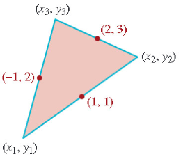
```


<!-- <center> {width=45%}</center> -->

Obtener las componentes $(x_1,y_1)=?$, $(x_2,y_2)=?$, y $(x_3,y_3)=?$

Aplicación de punto medio para un segmento.


Ejemplo: Hallar el punto medio para un segmento cuyos puntos extremos son $P(1,2)$ y $Q(3,5)$.

Entonces el punto medio entre dos puntos $P$ y $Q$ es:

$$
(\dfrac{1+3}{2},\dfrac{2+5}{2})
$$

**Planteo del problema**

Primero con $(x_1,y_1)$ y $(x_3,y_3)$


$$
(-1,2)=(\dfrac{x_1+x_3}{2},\dfrac{y_1+y_3}{2})
$$


$$
-1=\dfrac{x_1+x_3}{2}
$$

$$
(-1)(2)=x_1+x_3
$$
$$
-2=x_1+x_3 \ \ \text{Primera ecuación}
$$

$$
2=\dfrac{y_1+y_3}{2}
$$
$$
4=y_1+y_3 \ \ \text{Segunda ecuación}
$$


$$
2=\dfrac{x_3+x_2}{2}
$$

$$
4=x_3+x_2 \ \ \text{Tercera ecuación}
$$

$$
3=\dfrac{y_3+y_2}{2}
$$

$$
6=y_3+y_2 \ \ \text{Cuarta ecuación}
$$


$$
1=\dfrac{x_1+x_2}{2}
$$
$$
2=x_1+x_2  \ \ \text{Quinta ecuación}
$$

$$
1=\dfrac{y_1+y_2}{2}
$$

$$
2=y_1+y_2  \ \ \text{Sexta ecuación}
$$

Primer sistema de las $x$'

\begin{equation}
(1) \ -2  =  1x_1+0x_2+1x_3 \\
(2) \ \ 4  = 0x_1+1x_2 +1x_3\\
(3) \ \ 2  =1x_1+1x_2+0x_3
\end{equation}


Matriz de coeficientes en el sistema $3 \times 3$

$$
\begin{vmatrix}
1 & 0 & 1\\
0 & 1 & 1 \\
1 & 1 & 0
\end{vmatrix}=-2
$$


$$
x_1=\dfrac{\begin{vmatrix}
-2 & 0 & 1\\
4 & 1 & 1 \\
2 & 1 & 0
\end{vmatrix}}{-2}=\dfrac{4}{-2}=-2
$$


$$
x_2=\dfrac{\begin{vmatrix}
1 & -2 & 1\\
0 & 4 & 1 \\
1 & 2 & 0
\end{vmatrix}}{-2}=\dfrac{-8}{-2}=4
$$

$$
x_3=\dfrac{\begin{vmatrix}
1 & 0 & -2\\
0 & 1 & 4 \\
1 & 1 & 2
\end{vmatrix}}{-2}=\dfrac{0}{-2}=0
$$


Segundo sistema de las $y$'

\begin{equation}
(1) \ 4 = y_1+y_3 \\
(2) \ \ 6 = y_3+y_2 \\
(3) \ \ 2 = y_1+y_2
\end{equation}


Matriz de coeficientes en el sistema $3 \times 3$

$$
\begin{vmatrix}
1 & 0 & 1\\
0 & 1 & 1 \\
1 & 1 & 0
\end{vmatrix}=-2
$$


$$
y_1=\dfrac{\begin{vmatrix}
4 & 0 & 1\\
6 & 1 & 1 \\
2 & 1 & 0
\end{vmatrix}}{-2}=\dfrac{0}{-2}=0
$$


$$
y_2=\dfrac{\begin{vmatrix}
1 & 4 & 1\\
0 & 6 & 1 \\
1 & 2 & 0
\end{vmatrix}}{-2}=\dfrac{-4}{-2}=2
$$

$$
y_3=\dfrac{\begin{vmatrix}
1 & 0 & 4\\
0 & 1 & 6 \\
1 & 1 & 2
\end{vmatrix}}{-2}=\dfrac{-8}{-2}=4
$$


Respuesta: Los vértices del triángulo son. $(x_1=-2,y_1=0)$, $(x_2=4,y_2=2)$, y $(x_3=0,y_3=4)$


## Modelo4 (Problema de las dimensiones)

**Enunciado pág 123 texto guía**

Un campo rectángular $20m$ más largo que ancho está circundado por exactamente $100m$ de cerca. ¿ Cuáles son las dimensiones del campo?


```{r Dimensiones2, fig.cap="Problema de dimensiones [Imagen tomada de [@zill2012algebra] pág $123$]", fig.align='center' ,echo=FALSE, message=FALSE,  warning=FALSE}
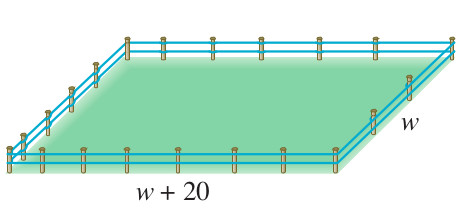
```


<!-- <center> {width=45%}</center> -->


**Planteo del problema**

Si asignamos $w$ al ancho del campo en metros, entonces

$$
w+20 = \text{largo del campo en metros}
$$

Como el perímetro del campo es de $100m$, tenemos

$$
100=w+w+(w+20)+(w+20)
$$

Simplificando en el lado derecho, se obtiene:


\begin{equation}
\begin{split}
100 & = & 2w+2(w+20)\\
100 & = & 2w+2w+40\\
100 -40 & = & 2w+2w\\
60 & = & 4w\\
\dfrac{60}{4} & = & w\\
15 \ \ \text{metros de ancho en el campo} & = & w\\
15 + 20 \ \ \text{metros de largo en el campo} & = & w+20\\
35 \ \ \text{metros de largo en el campo} & = & w+20\\
\end{split}
\end{equation}


## Modelo5 (Problema de las dimensiones)

**Enunciado pág 132 texto guía**

El área de un rectángulo es de $138cm^2$. El largo es $5cm$ más que $3$ veces el ancho. Halle las dimensiones del rectángulo.


```{r Dimensiones3, fig.cap="Problema de dimensiones [Imagen tomada de [@zill2012algebra] pág $132$]", fig.align='center' ,echo=FALSE, message=FALSE,  warning=FALSE}
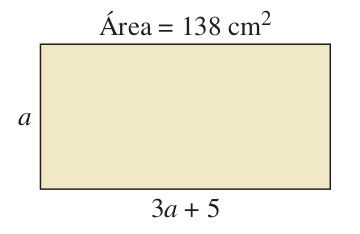
```


<!-- <center> {width=35%}</center> -->


**Planteo del problema**

Si asignamos $a$ al ancho del rectángulo en centímetros, entonces


$$
3a+5= \ \text{largo del rectángulo en centímetros}
$$

Por lo tanto

$$
a(3a+5)=138
$$
de donde

\begin{equation}
\begin{split}
a(3a+5) & = & 138\\
3a^2+5a & = & 138\\
3a^2+5a -138 & = & 0\\
\end{split}
\end{equation}


$A=3$

$B=5$

$C=-138$

$$
a=\dfrac{-(5)\pm \sqrt{(5)^2-4(3)(-138)}}{2(3)}
$$


$$
a=\dfrac{-(5)\pm \sqrt{25+(12)(138)}}{6}
$$
$$
a=6 \ \ \ \ \text{ó} \ \ \ \ a\approx -7.667
$$


## Modelo6 (Problema de las aceras)

**Enunciado pág 133 texto guía**

En un parque, dos aceras forman un ángulo recto con el patio $P$, el puesto de refrigerios $R$ y el estacionamiento $E$, como se muestra en la figura. La longitud total de las aceras es de $700m$. Al caminar diagonalmente a través del pasto (línea punteada roja) directamente del estacionamiento al patio, los niños acortan la distancia $200m$. ¿Cuál es la longitud de cada acera?


```{r Dimensiones4, fig.cap="Problema de dimensiones [Imagen tomada de [@zill2012algebra] pág $133$]", fig.align='center' ,echo=FALSE, message=FALSE,  warning=FALSE}
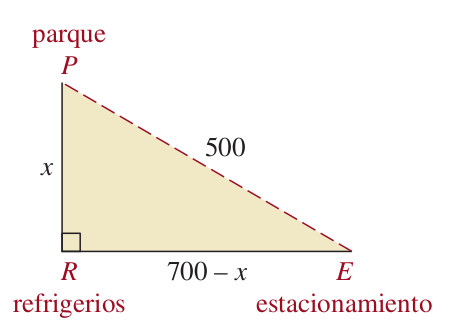
```


<!-- <center> {width=35%}</center> -->


**Planteo del problema**

Si designamos


$$
x=\text{longitud de la acera del punto} \ P \ \text{al} \ R
$$
Entonces

$$
700-x=\text{longitud de la acera del punto} \ R \ \text{al} \ E
$$

Por el teorema de Pitágoras obtenemos esta relación:

$$
x^2+(700-x)^2=(500)^2
$$
Resolviendo la ecuación se tiene:

\begin{equation}
\begin{split}
x^2+(700-x)^2 & = & (500)^2\\
x^2+(700)^2-2(700)x+ x^2 & = & (500)^2\\
x^2+x^2+(700)^2-2(700)x-(500)^2 & = & 0\\
2x^2-1400x+(700)^2-(500)^2 & = & 0\\
2x^2-1400x+490000-250000 & = & 0\\
2x^2-1400x+240000 & = & 0\\
x^2-700x+120000 & = & 0\\
(x-300)(x-400) & = & 0\\
\end{split}
\end{equation}

$$
\text{Si } \ x-300=0 \ \ \text{entonces} \ x=300
$$

$$
\text{Si } \ x-400=0 \ \ \text{entonces} \ x=400
$$
Ambos valores para $x$ cumplen ser solución en el problema.


## Modelo8 (Problema de velocidad)

Si un objeto se mueve a una velocidad constante $r$, entonces la distancia $d$ que recorre en $t$ unidades de tiempo se obtiene con la fórmula:

$$
d=rt \ \ \ \Leftrightarrow \ \ \text{distancia=velocidad} \times \text{tiempo}
$$
De esta fórmula puede obtenerse usando el despeje de variable las siguientes fórmulas

$$
r=\dfrac{d}{t} \ \ \ \ \ \ \text{y} \ \ \ \ \ \ t=\dfrac{d}{r}
$$

**Enunciado pág 120 y 121 texto guía**

Un motociclista tarda $1hora$ y $30minutos$ más en la noche que en el día viajar entre dos ciudades. En la noche recorre un promedio de $40 millas$ por hora en tanto que en el día puede recorrer un promedio de $55millas$ por hora. Encuentre la distancia entre las dos ciudades.


```{r velocidad1, fig.cap="Tabla de velocidad [Imagen tomada de [@zill2012algebra] pág $121$]", fig.align='center' ,echo=FALSE, message=FALSE,  warning=FALSE}
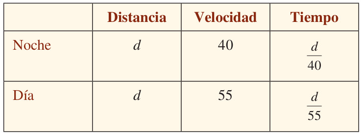
```


<!-- <center> {width=55%}</center> -->


**Planteo del problema**

Como se tarda $1.5$ horas más recorrer la distancia entre las dos ciudades en la noche, obtenemos


$$
\dfrac{d}{40}-\dfrac{d}{55}=1.5
$$


\begin{equation}
\begin{split}

\dfrac{d}{40}-\dfrac{d}{55} & = & 1.5 \\
\dfrac{55d-40d}{(40)(55)} & = & 1.5 \\
\dfrac{55d-40d}{2200} & = & 1.5 \\
\dfrac{15d}{2200} & = & 1.5 \\
15d & = & (1.5)(2200) \\
15d & = & 3300 \\
d & = & \dfrac{3300}{15} \\
d & = & 220 \\
\end{split}
\end{equation}

La distancia entre las dos ciudades es de $220 millas$


## Modelo9 (Problema de mezcla)

**Enunciado pág 121 texto guía**

Halle cuántos $litros$ de alcohol puro debe añadirse a $15 litros$ de solución que contiene $20\%$ de alcohol para que la mezcla resultante sea de $30\%$ de alcohol.

**Planteo del problema**

Si $x$ representa la cantidad de alcohol puro añadida, entonces

$$
15+x = \ \text{cantidad en litros en la nueva solución}
$$

En la tabla siguiente se resume la información dada:


```{r mezcla1a, fig.cap="Tabla de mezcla [Imagen tomada de [@zill2012algebra] pág $121$]", fig.align='center' ,echo=FALSE, message=FALSE,  warning=FALSE}
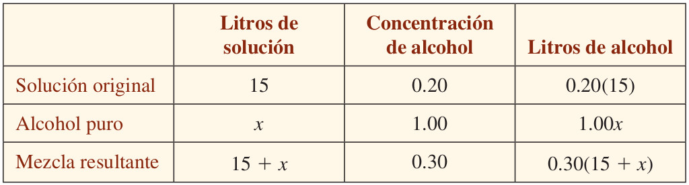
```


<!-- <center> {width=65%}</center> -->


Como la cantidad de alcohol en la solución original más la cantidad de alcohol puro añadida es igual a la cantidad de alcohol en la mezcla resultante, tenemos:


\begin{equation}
\begin{split}

0.20(15)+1.00x & = & 0.30(15+x)\\
3+x & = & 4.5+0.3x \\
x-0.3x & = & 4.5-3 \\
0.7x & = & 1.5 \\
x & = & \dfrac{1.5}{0.7} \\
x & = & \dfrac{15.(10^{-1})}{7.(10^{-1})} \\
x & = & \dfrac{15}{7} \\

\end{split}
\end{equation}


la cantidad de alcohol puro añadida es $\dfrac{15}{7}litros$


## Modelo10 (Problema de trabajo)

Varias personas (ò máquinas) que hacen el mismo trabajo, cada una a velecidad constante, completan la labor más rápido que si trabajan solas. Entonces, para resolver **problemas de trabajo** utilizaremos el principio básico siguiente:

`r colFmt('Si un individuo puede hacer todo el trabajo en $T$ unidades de tiempo, entonces en $x$ unidades de tiempo se termina una parte $\\dfrac{x}{T}$ del trabajo','red',outputFormat = 'html')`.


**Ejemplo**

Si una persona puede hacer un trabajo completo en $5 horas$, entonces en $3 horas$ termina $\dfrac{3}{5}$ del trabajo.

**Enunciado pág 122 texto guía**

Trabajando sola, la bomba $A$ llena un tanque en $2 horas$ y la bomba $B$ llena el mismo tanque en $3 horas$. Determine la rapidez con que las bombas llenarían el tanque trabajando juntas.

**Planteo del problema**


Si asignamos a $x$ el número de horas que ambas bombas requieren para llenar el tanque juntas, entonces

$$
\dfrac{x}{2}= \ \ \text{fracción del trabajo completo culminado en} \ \ x \ \ \text{horas por una bomba} \ \ A
$$

y

$$
\dfrac{x}{3}= \ \ \text{fracción de todo el trabajo culminado en} \ \ x \ \ \text{horas por una bomba} \ \ B
$$

Esta información se sintetiza en la tabla siguiente:


```{r trabajo2, fig.cap="Tabla de trabajo [Imagen tomada de [@zill2012algebra] pág $122$]", fig.align='center' ,echo=FALSE, message=FALSE,  warning=FALSE}
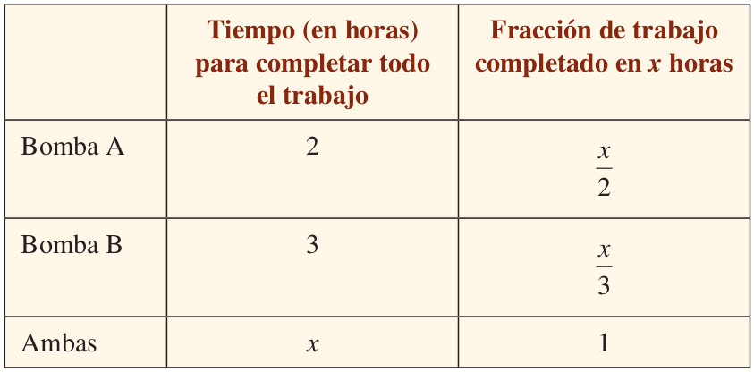
```


<!-- <center> {width=55%}</center> -->


La suma de las fracciones hechas por cada bomba en $x$ horas es $1$, pues las dos bombas, al trabajar juntas, terminan todo el trabajo en $x$ horas. Entonces tenemos:

$$
\dfrac{x}{2}+\dfrac{x}{3}=1
$$


\begin{equation}
\begin{split}

\dfrac{x}{2}+\dfrac{x}{3} & = & 1\\
(6).\left(\dfrac{x}{2}+\dfrac{x}{3}\right) & = & (6).(1)\\
3x+2x & = & 6 \\
5x & = & 6 \\
x & = & \dfrac{6}{5}
\end{split}
\end{equation}

**Respuesta**:

Las bombas juntas, tardan $\dfrac{6}{5} horas=1.2horas$ (ò una hora y doce minutos) en llenar el tanque.


## Variación directa

Una cantidad $y$ varía directamente, o es directamente proporcional a una cantidad $x$ si existe un número $k$ diferente de cero tal que

$$
y=kx
$$
Gráfica de la relación directa entre dos magnitudes


```{r proporcion1, fig.cap="Proporción directa [Imagen tomada de [@zill2012algebra] pág $190$]", fig.align='center' ,echo=FALSE, message=FALSE,  warning=FALSE}
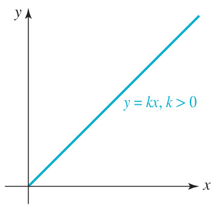
```


<!-- <center> {width=25%}</center> -->


## Variación inversa

Una cantidad $y$ varía inversamente, o es inversamente proporcional a una cantidad $x$ si existe un número $k$ diferente de cero tal que

$$
y=\dfrac{k}{x}
$$
Gráfica de la relación inversa entre dos magnitudes


```{r proporcion2, fig.cap="Proporción inversa [Imagen tomada de [@zill2012algebra] pág $192$]", fig.align='center' ,echo=FALSE, message=FALSE,  warning=FALSE}
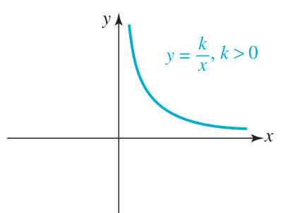
```


<!-- <center> {width=35%}</center> -->


## Regla de tres simple y directa

En la regla de tres simple y directa, se establece la relación de proporcionalidad entre dos valores conocidos M1 y M2, y conociendo un tercer valor M3, podemos calcular un cuarto valor M4. En general estas relaciones se pueden representar mediante el siguiente digrama (ó esquema):


\begin{equation}
Esquema: \ \ 
\begin{array}{ccc}
\text{Primera Magnitud}&  &\text{Segunda Magnitud}\\
M1 & \longrightarrow & M2 \\
M3 & \longrightarrow & M4=?
\end{array}
\end{equation}


Aplicando la variación directa o la proporcionalidad directa a las magnitudes M1,M2,M3, y M4 se tiene la ecuación:

$$
\dfrac{M2}{M1}=\dfrac{M4}{M3}=k \ \ \ \  \Longrightarrow \ \ \ \ \ \dfrac{M2}{M1}=\dfrac{M4}{M3} \Leftrightarrow M2.M3=M4.M1\ \ \ \  \Longrightarrow \ \ \ \ \dfrac{M2.M3}{M1}=M4
$$


Ejemplo con esquema:


\begin{equation}
Esquema: \ \ 
\begin{array}{ccc}
\text{Primera Magnitud}&  &\text{Segunda Magnitud}\\
a & \longrightarrow & c \\
b & \longrightarrow & x
\end{array} \ \ \ \  \Longrightarrow \ \ \ \ \ x=\dfrac{bc}{a}
\end{equation}


Colocaremos los datos como muestra el esquema, los 3 datos (a los que llamamos “a”, “b” y “c”) y la incógnita, es decir, el dato que queremos averiguar (que llamaremos “x”). 

Después, aplicaremos la fórmula como lo indica el esquema.


## Modelo11 (Problema Regla de tres simple y directa)

Con $10$ dólares compro $4$ libros. ¿Cuántos libros compraré con $25$ dólares?

\begin{equation}
Esquema: \ \ 
\begin{array}{ccc}
\text{Primera Magnitud}&  &\text{Segunda Magnitud}\\
10 \ \text{dólares} & \longrightarrow & 4 \ \text{libros} \\
25 \ \text{dólares} & \longrightarrow & x \ \text{libros}
\end{array} \ \ \ \  \Longrightarrow \ \ \ \ \ x=\dfrac{(25).(4)}{10}=\dfrac{(5).(2)}{1}=10
\end{equation}

**Repuesta**: Comprará $10$ libros con $25$ dólares.

## Regla de tres simple e inversa


\begin{equation}
Esquema: \ \ 
\begin{array}{ccc}
\text{Primera Magnitud}&  &\text{Segunda Magnitud}\\
M1 & \longrightarrow & M2 \\
M3 & \longrightarrow & M4=?
\end{array}
\end{equation}


Aplicando la variación inversa o la proporcionalidad inversa a las magnitudes M1,M2,M3, y M4 se tiene la ecuación:

$$
M1.M2=M3.M4=k \ \ \ \  \Longrightarrow  \ \ \ \ \ \  M1.M2=M3.M4 \ \ \ \ \ \   \Longrightarrow  \ \ \ \ \ \ \dfrac{M1.M2}{M3}=M4
$$


\begin{equation}
Esquema: \ \ 
\begin{array}{ccc}
\text{Primera Magnitud}&  &\text{Segunda Magnitud}\\
a & \longrightarrow & c \\
b & \longrightarrow & x
\end{array} \ \ \ \  \Longrightarrow \ \ \ \ \ ac=bx \ \ \ \  \Longrightarrow \ \ \ \ \ x=\dfrac{ac}{b}
\end{equation}


Dos valores son inversamente proporcionales cuando:

* Al aumentar un valor, el otro disminuye en la misma proporción


* Al disminuir un valor, el otro aumenta en la misma proporción


## Modelo12 (Problema Regla de tres simple inversa)


Diez obreros tardan dos meses en construir unas casas. ¿cuántos días tardarían 15 obreros?

A más obreros menos tiempo tardarán, luego hay que usar una regla de tres inversa.

**sugerencia**: 1mes tiene 30 dias.


\begin{equation}
Esquema: \ \ 
\begin{array}{ccc}
\text{Primera Magnitud}&  &\text{Segunda Magnitud}\\
10 \ \text{obreros} & \longrightarrow & 60 \ \text{días} \\
15 \ \text{obreros} & \longrightarrow & x \ \text{días}
\end{array} \ \ \ \  \Longrightarrow \ \ \ \ \ (10).(60)=(15).x \ \ \ \  \Longrightarrow \ \ \ \ \ x=\dfrac{(10).(60)}{15}=\dfrac{(2).(20)}{1}=40
\end{equation}

**Repuesta**: Los $15$ obreros tardarán $40$ días.


## Modelo13 (Problema Regla de tres simple inversa)

Un grifo con un determinado caudal tarda 30 minutos en llenar un depósito.
¿Cuántos minutos tardaría en llenarse el depósito con tres grifos con el mismo caudal?

**Obs**: A más grifos (o más caudal) menos tiempo, luego hay que usar una regla de tres inversa.


\begin{equation}
Esquema: \ \ 
\begin{array}{ccc}
\text{Primera Magnitud}&  &\text{Segunda Magnitud}\\
1 \ \text{grifo} & \longrightarrow & 30 \ \text{minutos} \\
3 \ \text{grifos} & \longrightarrow & x \ \text{minutos}
\end{array} \ \ \ \  \Longrightarrow \ \ \ \ \ (1).(30)=(3).x \ \ \ \  \Longrightarrow \ \ \ \ \ x=\dfrac{(1).(30)}{3}=\dfrac{(1).(10)}{1}=10
\end{equation}

**Repuesta**: Los $3$ grifos tardarán $10$ minutos.


## Regla de tres simple compuesta

\begin{equation}
Esquema: \ \ 
\begin{array}{cccc}
\text{Primera}&  &\text{Segunda}&  &\text{Tercera}\\
\text{Magnitud}&  &\text{Magnitud}&  &\text{Magnitud}\\

a & \longrightarrow & c & \longrightarrow & e\\
b & \longrightarrow & d & \longrightarrow & x
\end{array} 
\end{equation}


## Directamente proporcional


\begin{equation}
Esquema: \ \ 
\begin{array}{cccc}
\text{Primera}&  &\text{Segunda}&  &\text{Tercera}\\
\text{Magnitud}&  &\text{Magnitud}&  &\text{Magnitud}\\
DP & & DP &  & \\
a & \longrightarrow & c & \longrightarrow & e\\
b & \longrightarrow & d & \longrightarrow & x
\end{array} \ \ \ \  \Longrightarrow \ \ \ \ \  \ \ \ \ \ \dfrac{e}{x}=\dfrac{a}{b}.\dfrac{c}{d}
\end{equation}


## Inversamente proporcional

\begin{equation}
Esquema: \ \ 
\begin{array}{cccc}
\text{Primera}&  &\text{Segunda}&  &\text{Tercera}\\
\text{Magnitud}&  &\text{Magnitud}&  &\text{Magnitud}\\
IP & & IP &  & \\
a & \longrightarrow & c & \longrightarrow & e\\
b & \longrightarrow & d & \longrightarrow & x
\end{array} \ \ \ \  \Longrightarrow \ \ \ \ \  \ \ \ \ \ \dfrac{e}{x}=\dfrac{b}{a}.\dfrac{d}{c}
\end{equation}


## Directamente e Inversamente proporcional (Mixta)


\begin{equation}
Esquema: \ \ 
\begin{array}{cccc}
\text{Primera}&  &\text{Segunda}&  &\text{Tercera}\\
\text{Magnitud}&  &\text{Magnitud}&  &\text{Magnitud}\\
IP & & DP &  & \\
a & \longrightarrow & c & \longrightarrow & e\\
b & \longrightarrow & d & \longrightarrow & x
\end{array} \ \ \ \  \Longrightarrow \ \ \ \ \  \ \ \ \ \ \dfrac{e}{x}=\dfrac{b}{a}.\dfrac{c}{d} 
\end{equation}


## Modelo14 (Problema Regla de tres compuesta ó Mixta)


4 obreros trabajando 7 horas diarias construyen un muro en 3 días. ¿Cuántos días tardaran 2 obreros trabajando 6 horas diarias en contruir un muro igual?


\begin{equation}
Esquema: \ \ 
\begin{array}{cccc}
\text{Primera}&  &\text{Segunda}&  &\text{Tercera}\\
\text{Magnitud}&  &\text{Magnitud}&  &\text{Magnitud}\\
IP & & IP &  & \\
OBREROS & \longrightarrow & HORAS & \longrightarrow & DIAS\\
4 & \longrightarrow & 7 & \longrightarrow & 3\\
2 & \longrightarrow & 6 & \longrightarrow & x
\end{array} \ \ \ \  \Longrightarrow \ \ \ \ \  \ \ \ \ \ \dfrac{3}{x}=\dfrac{2}{4}.\dfrac{6}{7} \ \ \ \  \Longrightarrow \ \ \ \ x=\dfrac{21}{3}=7
\end{equation}


**Respuesta**: Los 2 obreros trabajando 6 horas se demoran 7 días para construir el muro.


$$
\dfrac{3}{x}=\dfrac{2}{4}.\dfrac{6}{7}
$$
$$
\dfrac{(3).(4).(7)}{1}=\dfrac{(2).(6).x}{1}
$$
$$
(1).(1).(7)=1.(1).x
$$
$$
7=x
$$


## Modelo15 (Problema Regla de tres compuesta ó Mixta)

9 grifos abiertos durante 40 horas han consumido 200 litros de agua. ¿Cuántos litros consumen 15 grifos iguales durante 9 horas?


\begin{equation}
Esquema: \ \ 
\begin{array}{cccc}
\text{Primera}&  &\text{Segunda}&  &\text{Tercera}\\
\text{Magnitud}&  &\text{Magnitud}&  &\text{Magnitud}\\
DP & & DP &  & \\
GRIFOS & \longrightarrow & HORAS & \longrightarrow & LITROS\\
9 & \longrightarrow & 40 & \longrightarrow & 200\\
15 & \longrightarrow & 9 & \longrightarrow & x
\end{array} \ \ \ \  \Longrightarrow \ \ \ \ \  \ \ \ \ \ \dfrac{200}{x}=\dfrac{9}{15}.\dfrac{40}{9} \ \ \ \  \Longrightarrow \ \ \ \ x=\dfrac{25.3}{1}=75
\end{equation}


Despeje de la variable $x$

$$
\dfrac{200}{x}=\dfrac{9}{15}.\dfrac{40}{9}
$$


$$
\dfrac{(200).(15).(9)}{1}=\dfrac{(9).(40).x}{1}
$$

$$
(200).(15).(9)=(9).(40).x
$$
$$
(5).(15)=x
$$

$$
75=x
$$


**Respuesta**:Los 15 grifos en 9 horas consumen 75 litros


## Modelo23 (Problema de la caja)

**Enunciado del taller $\# 39$**

Se hace un recipiente con una pequeña hoja de estaño cuadrada cortando un cuadrado de $3$ pulgadas de cada esquina y doblando los lados, ver la Figura. La caja va a tener un volumen de $48$ pulgadas cúbicas. Halle la longitud de uno de los lados de la hoja de estaño original.


```{r caja2, fig.cap="Problema de dimensiones [Imagen tomada de [@zill2012algebra] pág $137$]", fig.align='center' ,echo=FALSE, message=FALSE,  warning=FALSE}
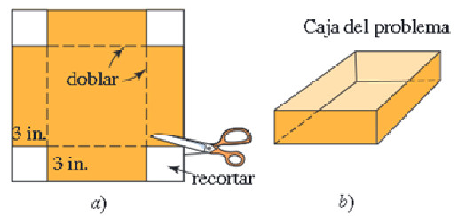
```


<!-- <center> {width=35%}</center> -->


**Proceso de solución**

Sea $x$ la longitud de uno de los lados de la hoja de estaño original.

Entonces 

$$
x-6=\text{representa la longitud de uno de los lados de la base cuadrada en la caja que se va ha construir}
$$
$$
3=\text{representa la altura de la caja que se va ha construir}
$$

Como el volumen de una caja es: área de la base por la altura es decir
$$
\text{Volumen}=\text{área de la base}\times \text{altura}
$$

Como $(x-6)^2$ respresenta el área de la base. Entonces

$$
V_{\text{caja}}=3.(x-6)^2
$$

Sabemos por el enunciado que el volumen de la caja debe ser igual a $48$ pulgadas cúbicas.

Por lo tanto


$$
48 = 3.(x-6)^2
$$
Despejando para la variable $x$ en la ecuación

\begin{equation}
\begin{split}
48 & = & 3.(x-6)^2\\
\dfrac{48}{3} & = & (x-6)^2\\
16 & = & (x-6)^2\\
\pm \sqrt{16} & = &\sqrt{(x-6)^2}\\
\pm 4 & = & x-6\\
\text{Si } \ \ 4 & = & x-6\\
4+6 & = & x\\
10 & = & x \\

\text{Si } \ \ -4 & = & x-6\\
-4+6 & = & x\\
2 & = & x \\
\end{split}
\end{equation}


**Respuesta**: la dimensiones de la hoja de estaño es **lado** igual a $10 pulgadas$


## Modelo25 (Problema del triángulo)

**Enunciado del taller $\# 23$**

Obtenga el área del triángulo rectángulo que se ilustra en la Figura .


```{r area1, fig.cap="Área de un rectángulo [Imagen tomada de [@zill2012algebra] pág $568$]", fig.align='center' ,echo=FALSE, message=FALSE,  warning=FALSE}
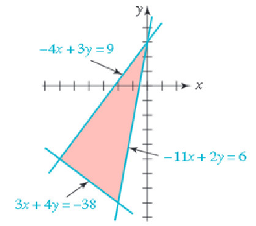
```

<!-- <center> {width=35%}</center> -->


**Proceso de solución**

Sabemos que el área de un triángulo en general es:

$$
A_{\text{triángulo}}=\frac{1}{2}(\text{base})\times (\text{altura})=\frac{bh}{2}
$$

Si el triángulo es rectángulo la fórmula se expresa en términos de catetos, así:

$$
A_{\text{triángulo rectángulo}}=\frac{1}{2}(\text{Cateto 1})\times (\text{Cateto 2})=\frac{c_1c_2}{2}
$$

**Cateto 1**

Primero resolver los sistemas $2\times 2$


$$
\left.
(1) -4x + 3y  = 9 \atop
(2) \ \ 3x + 4y = -38 
\right\} \ \ \ \
\left.
(3) -4x + 3y  = 9 \atop
(4) \ -11x + 2y = 6 
\right\}
$$

Ecuaciones (1) y (2) por Cramer

\begin{equation}
x=\dfrac{\begin{vmatrix}
9 & 3 \\
-38 & 4
\end{vmatrix}}{-25}=\dfrac{(9)(4)-(3)(-38)}{-25}=\dfrac{150}{-25}=-6;\ \ 

y=\dfrac{\begin{vmatrix}
-4 & 9 \\
3 & -38 
\end{vmatrix}}{-25}=\dfrac{(-4)(-38)-(3)(9)}{-25}=\dfrac{125}{-25}=-5\ 
\end{equation}

De donde el primer punto solución es $(-6,-5)$


Ecuaciones (3) y (4) por Cramer

\begin{equation}
x=\dfrac{\begin{vmatrix}
9 & 3 \\
6 & 2
\end{vmatrix}}{25}=\dfrac{(9)(2)-(6)(3)}{25}=\dfrac{0}{25}=0;\ \ 

y=\dfrac{\begin{vmatrix}
-4 & 9 \\
-11 & 6 
\end{vmatrix}}{25}=\dfrac{(-4)(6)-(-11)(9)}{25}=\dfrac{75}{25}=3\ 
\end{equation}

De donde el segundo punto solución es $(0,3)$

Por lo tanto la longitud del Cateto $1$ es la distancia entre los puntos $(-6,-5)$ y $(0,3)$

$$
\text{Cateto 1}= d=\sqrt{(-6-0)^2+(-5-3)^2}=\sqrt{36+64}=\sqrt{100}=10 UL
$$

**Cateto 2**

Segundo resolver los sistemas $2\times 2$

$$
\left.
(5) -11x + 2y  = 6 \atop
(6) \ \ 3x + 4y = -38 
\right\} \ \ \ \
\left.
(7) -4x + 3y  = 9 \atop
(8) \ -11x + 2y = 6 
\right\}
$$


Ecuaciones (5) y (6) por Cramer


\begin{equation}
x=\dfrac{\begin{vmatrix}
6 & 2 \\
-38 & 4
\end{vmatrix}}{-50}=\dfrac{(6)(4)-(-38)(2)}{-50}=\dfrac{100}{-50}=-2;\ \ 

y=\dfrac{\begin{vmatrix}
-11 & 6 \\
3 & -38 
\end{vmatrix}}{-50}=\dfrac{(-11)(-38)-(3)(6)}{-50}=\dfrac{400}{-50}=-8\ 
\end{equation}

De donde el tercer punto solución es $(-2,-8)$


Como las ecuaciones (7) y (8) son equivalentes a las ecuaciones (3) y (4). Entonces ambos sistemas poseen la misma solución.


Por lo tanto la longitud del Cateto $2$ es la distancia entre los puntos $(-2,-8)$ y $(-6,-5)$

$$
\text{Cateto 2}= d=\sqrt{(-2+6)^2+(-8+5)^2}=\sqrt{16+9}=\sqrt{25}=5 UL
$$

**Respuesta**: El área del triángulo es $\dfrac{(10)(5)}{2}=25 UA$


## Modelo26 (Problema de mezcla)

**Enunciado del taller $\# 16$**

El radiador de un automóvil contiene $10$ cuartos de galón de una mezcla de agua y $20 \%$ de anticongelante. ¿Qué cantidad de esta mezcla debe vaciarse y reemplazarse por anticongelante puro para obtener una mezcla de $50 \%$ en el radiador?

**Proceso de solución**

Sea $x$ la cantidad que debe vaciarse.

Ecuación de anticongelante:

$$
(10-x).(0.20)+(1.00).x=10.(0.50)
$$

$$
(10).(0.20)-x.(0.20))+x=5
$$

$$
2-(0.20).x+x=5
$$
$$
(0.8).x=5-2
$$
$$
x=\dfrac{3}{0.8} =3.75 galones
$$

**Respuesta**: Debe vaciarse $3.75 galones$ de la mezcla original.


## Modelo27 (Problema de mezcla)

**Enunciado del taller $\# 25$**

Un carnicero vende carne molida de res de cierta calidad a $\$ 3.95$ y de otra calidad a $\$ 4.20$ la libra. Quiere mezclar las dos calidades para obtener una mezcla que se venda a $\$ 4.15$ la libra. ¿Qué porcentaje de carne de cada calidad debe usar?.


**Proceso de solución**


<center> 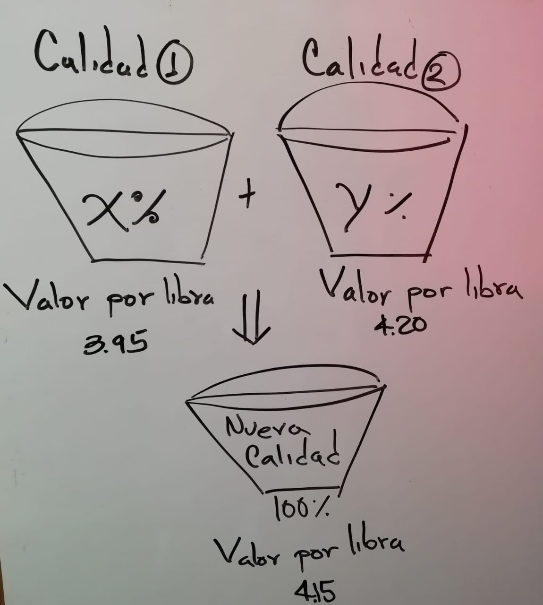{width=35%}</center>

Sea $x$ el valor del porcentaje que debe extraer de la calidad Uno

Sea $y$ el valor del porcentaje que debe extrae de la calidad Dos


Ecuación de porcentajes

$$
(1) \ \ \ \dfrac{x}{100}+\dfrac{y}{100}=1
$$
Ecuación de costo por libra

$$
(2) \ \ \ \dfrac{x}{100}(3.95)+\dfrac{y}{100}(4.20)=1(4.15)
$$


Multiplicando por $100$ cada una de las ecuaciones se obtiene:


$$
(1) \ \ \ \ x+y=100
$$
$$
(2) \ \ \ (3.95)x+(4.20)y=415
$$

Resolvemos el sistema $2\times 2$ por la regla de Cramer, así:
\begin{equation}
\begin{vmatrix}
1 & 1 \\
3.95 & 4.20
\end{vmatrix}=(1)(4.20)-(1)(3.95)=4.20-3.95=0.25
\end{equation}

\begin{equation}
x=\dfrac{\begin{vmatrix}
100 & 1 \\
415 & 4.20
\end{vmatrix}}{0.25}=\dfrac{(100)(4.20)-(415)(1)}{0.25}=\dfrac{5}{0.25}=20;\ \ 

y=\dfrac{\begin{vmatrix}
1 & 100 \\
3.95 & 415 
\end{vmatrix}}{0.25}=\dfrac{(1)(415)-(3.95)(100)}{0.25}=\dfrac{20}{0.25}=80\ 
\end{equation}


**Respuesta**: Se debe extraer de la calidad Uno $20 \%$, y de la calidad Dos $80 \%$.


## Modelo28 (Problema de velocidad1)

**Enunciado del taller $\# 34$**

Un jet voló de Nueva York a los Ángeles, una distancia de $4200$ kilómetros. La rapidez del viaje de regreso fue de $100$ kilómetros por hora mayor que la ida. Si el total del viaje tomó $13$ horas, cuál fue la rapidez de Nueva York a los Ángeles?


**Proceso de solución**

Sea $V_1$ la rapidez de Nueva York a los Ángeles.

Sea $t_1$ el tiempo empleado para Nueva York a los Ángeles.

Sea $V_2$ la rapidez de regreso.

Sea $t_2$ el tiempo empleado para el regreso.

Entonces

$V_2=V_1+100$ : Rapidez del regreso

$t_1+t_2=13$, entonces $t_2=13-t_1$

Como la distancia recorrida es la misma y $d=Vt$, se tiene:


\begin{equation}
\begin{split}
4200 & = & V_2t_2\\
4200 & = & (V_1+100).(13-t_1)\\
4200 & = & 13V_1+(13)(100)-V_1t_1-100t_1\\
4200 & = & 13V_1+(13)(100)-4200-100t_1\\
0 & = & 13V_1+(13)(100)-2(4200)-100t_1\\
0 & = & 13V_1+(13)(100)-8400-100t_1\\
0 & = & 13V_1+1300-8400-100t_1\\
0 & = & 13V_1-7100-100t_1\\
V_1(0) & = & V_1\left(13V_1-7100-100t_1\right)\\
0 & = & 13V^2_1-7100V_1-100V_1t_1\\
0 & = & 13V^2_1-7100V_1-100(4200)\\
0 & = & 13V^2_1-7100V_1-420000\\
\end{split}
\end{equation}


Por fórmula del estudiante

$A=13$, $B=-7100$, y $C=-420000$

$D=72250000$, $\sqrt{D}=8500$, $V_1=600$ ó $V_1 \approx-53.84615$


**Respuesta** La rapidez de ida es de 600 kilometros por hora.

## Modelo29 (Problema de la recta)


Halle una ecuación de la recta $L$ que es secante a la curva $y=x^2+1$ como se muestra en la Figura.


```{r EcRecta1, fig.cap="Ecuación de la recta secante [Imagen tomada de [@zill2012algebra] pág $189$]", fig.align='center' ,echo=FALSE, message=FALSE,  warning=FALSE}
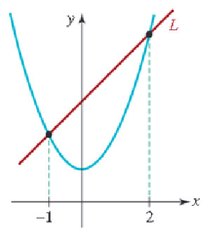
```


<!-- <center> {width=25%}</center> -->


**Proceso de solución**

Sabemos que la ecuación de una recta tiene la forma:

$$
y=mx+b
$$
Si conocemos $m$ y $b$ se tiene la recta deseada.

De la gráfica se puede deducir que.

Los puntos comunes entre la recta y la parábola son:

Si $x=-1$, entonces $y=(-1)^2+1=1+1=2$; es decir el punto correspondiente a $x=-1$ es $A(-1,2)$

de igual manera para $x=2$.

Si $x=2$, entonces $y=(2)^2+1=4+1=5$; es decir el punto correspondiente a $x=2$ es $B(2,5)$


Como $A$ y $B$ también son puntos de la recta entonces cumplen la ecuación de la recta $y=mx+b$, así:

Para el punto $A(-1,2)$

$$
(1) \ \ 2=(-1)m+b
$$

Para el punto $B(2,5)$

$$
(2) \ \ 5=(2)m+b
$$
Resolviendo el sistema por eliminación tiene:

$$
5-2=2m+m+0
$$
$$
3=3m
$$

Por lo tanto $m=1$.

Si $m=1$, entonces sustituimos en la ecuación (1) para obtener a $b$, así:

$$
(1) \ \ 2=(-1)(1)+b=-1+b
$$
de donde

$$
2+1=b=3
$$

**Respuesta**: La recta deseada es $y=1x+3$.

## Modelo30 (Problema de la región sombreada)

**Enunciado del taller $\# 54$**

Considere los cuatro círculos que se ilustran en la Figura. Exprese el área de la región sombreada entre ellos como función de $h$.


```{r Area2, fig.cap="Área sombreada [Imagen tomada de [@zill2012algebra] pág $264$]", fig.align='center' ,echo=FALSE, message=FALSE,  warning=FALSE}
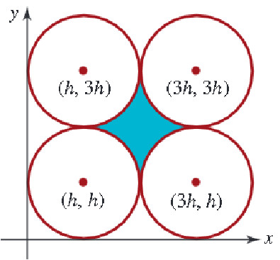
```


<!-- <center> {width=25%}</center> -->


**Proceso de solución**


El área de un circulo con radio conocido $r>0$ es $A=\pi r^2$

Y el área de un cuadrado conocido uno de sus lados $l>0$ es $A=l^2$.

Entonces desde la gráfica se puede deducir que la distancia entre los centro de cada círculo mide $2h$, por lo tanto el área del cuadrado formado por los centros de cada circula es:

$$
A_{\text{centros}}=(2h)^2=4h^2 UA
$$
De la gráfica también se puede deducir que el cuadrado formado por los centros de cada circulo
contiene cuatro cuartos de circulo de radio conocido $r=h$, cuya área para un cuarto de circulo es $\dfrac{\pi h^2}{4}$.

Respuesta: Si al cuadrado formado por los cuatro centros de circulo le restamos el área de una circunferencia completa de radio $r=h$, se obtiene el área sombreada.

$$
A_{\text{sombrada}}=4h^2-\pi h^2 UA
$$


## Modelo31 (Problema de la recta tangente)

La tangente de un círculo en el punto $P$ del círculo es la que pasa por $P$ y es perpendicular a la recta que pasa por $P$ y el centro del círculo. Halle la ecuación de la recta tangente $L$ que se indica en la Figura..


```{r EcRecta2, fig.cap="Ecuación de la recta tangente [Imagen tomada de [@zill2012algebra] pág $197$]", fig.align='center' ,echo=FALSE, message=FALSE,  warning=FALSE}
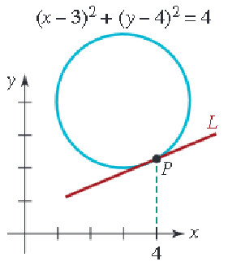
```


<!-- <center> {width=25%}</center> -->


**Proceso de solución**


Como el punto $P$ es parte del circulo cuya ecuación se conoce, entonces al remplazar $x=4$ se puede conocer $y$, así:

$$
(4-3)^2+(y-4)^2=4
$$

$$
1+(y-4)^2=4 \ \ \ \Rightarrow  \ \ \ \ (y-4)^2=4-1  \ \ \ \ \Rightarrow (y-4)^2=3   \ \ \ \ \Rightarrow   \ \ \ \ y-4=\pm \sqrt{3}
$$

$$
y=4\pm \sqrt{3}
$$
Por lo tanto existen dos puntos generados por $x=4$ en la circunferencia $(x-3)^2+(y-4)^2=4$, ellos son:

$$
Q(4,4+\sqrt{3}), \ \ \ \ \ P(4,4-\sqrt{3})
$$

Como el centro esta en C(3,4), entonces el punto $P$ debe tener componente $y$ menor a $4$. Es decir el punto $P$ es $P(4,4-\sqrt{3})$.

Además la recta que pasa por el centro del cŕrculo y el punto $P$, es perpendicular a la recta $L$, por lo tanto el producto de sus pendientes debe ser igual a $-1$, es decir $m_{L}\times m_{N}=-1$.

Para hallar $m_{N}$ usaremos los puntos $C(3,4)$ y $P(4,4-\sqrt{3})$, así:

$$
m_{N}=\dfrac{4-(4-\sqrt{3})}{3-4}=\dfrac{4-4+\sqrt{3}}{-1}=-\sqrt{3}
$$

Entonces $m_{T}$ se puede despejar de la siguiente forma:

$$
m_{L}=\dfrac{-1}{m_{N}}=\dfrac{-1}{-\sqrt{3}}=\dfrac{1}{\sqrt{3}}
$$

Como ya se conoce la pendiente $m_{T}$ y un punto $P(4,4-\sqrt{3})$ de la recta tangente $L$, se puede determinar su ecuación como sigue:

$$
y=mx+b \ \ \ \Rightarrow  \ \ \ \ y=\dfrac{1}{\sqrt{3}}x+b
$$
Para obtener el valor de $b$ usaremos el punto $P(4,4-\sqrt{3})$, así:

$$
y=\dfrac{1}{\sqrt{3}}x+b \ \ \ \Rightarrow  \ \ \ \ 4-\sqrt{3}=\dfrac{1}{\sqrt{3}}(4)+b  \ \ \ \Rightarrow  \ \ \ \ \ \sqrt{3}(4-\sqrt{3})=4+b(\sqrt{3})
$$
$$
 \sqrt{3}(4-\sqrt{3})=4+b(\sqrt{3})  \ \ \ \Rightarrow  \ \ \ \ \ 4\sqrt{3}-\sqrt{3}.\sqrt{3}-4=b(\sqrt{3}) 
$$
$$
4\sqrt{3}-3-4=b(\sqrt{3})  \ \ \ \Rightarrow  \ \ \ \ \ 4\sqrt{3}-7=b(\sqrt{3})
$$

$$
\dfrac{4\sqrt{3}-7}{\sqrt{3}}=b\\
4-\dfrac{7}{\sqrt{3}}=b
$$

**Respuesta**:  La recta tangente al circulo $(x-3)^2+(y-4)^2=4$ en el punto $P(4,4-\sqrt{3})$ es $y=\dfrac{1}{\sqrt{3}}x+4-\dfrac{7}{\sqrt{3}}$


$$
\boxed{y=\dfrac{1}{\sqrt{3}}(x-7)+4}
$$

## Modelo39 (Problema de trabajo)

**Enunciado del taller $\# 32$**

Margot limpia su habitación en 50 minutos ella sola. Si Jeremy la ayuda, tarda 30 minutos.¿Cuánto tiempo tardará Jeremy en limpiar la habitación él sólo?


**Proceso de solución**

Sea $t$ el tiempo que usa Jermy para realizar el trabajo sólo.


```{r,echo=F}
Personas <- c("Margot","Jeremy","Ambos")
Tiempo_Usado <-c(50,"t",30)
Fraccion_Trabajo <- c("$\\dfrac{30}{50}$","$\\dfrac{30}{t}$",1)
Ejemplo <- data.frame(Personas,Tiempo_Usado,Fraccion_Trabajo)
library(exams)
library(kableExtra)
        kable(Ejemplo, 'markdown',align = 'c')
```


\begin{equation}
\begin{split}

\dfrac{30}{50}+\dfrac{30}{t} & = & 1\\
(t).\left(\dfrac{30}{50}+\dfrac{30}{t}\right) & = & (t).(1)\\
\dfrac{30t}{50}+30 & = & t \\
\dfrac{30t}{50}-t & = & -30 \\

t.\left(\dfrac{30}{50}-1\right) & = & -30\\
t & = & \dfrac{-30}{\dfrac{30}{50}-1}\\
t & = & \dfrac{-30}{\dfrac{30-50}{50}}\\
t & = & \dfrac{-30}{\dfrac{-20}{50}}\\
t & = & \dfrac{-30}{\dfrac{-2}{5}}\\
t & = & 75 minutos
\end{split}
\end{equation}


## Modelo 40 (Problema de velocidad2)

**Enunciado del taller $\# 21$**

Un jet vuela con el viento a favor entre Los Ángeles y Chicago en $3.5 h$, y contra el viento de Chicago a Los Ángeles en $4 h$. La velocidad del avión sin viento es de $600 mi/h$. Calcule la velocidad del viento. ¿Qué distancia hay entre Los Ángeles y Chicago?


**Proceso de solución**

Sea $V_v$ la velocidad del viento

Sea $V_a$ la velocidad del avión

Sea $d$ la distancia entre los Ángeles y Chicago.


Primero la Velocidad con viento a favor (de los Ángeles a Chicago) es:

$$
(1) \ \ \ V_a+V_v=\dfrac{d}{3.5}
$$
Más aún

$$
(1) \ \ \ 3.5V_a+3.5V_v=d
$$


Segundo la velocidad con el viento en contra (de Chicago a los Ángeles) es:

$$
(2) \ \ \ V_a-V_v=\dfrac{d}{4}
$$
pasando el $4$ a múltiplicar en el lado izquierdo se tiene:

$$
(2) \ \ \ 4V_a-4V_v=d
$$


Eliminando la variable distancia. Es decir  a la ec(1) le restamos la ec(2), se tiene 

$$
(3.5-4)V_a+(3.5+4)V_v=0 \ \ \ \ \ \Rightarrow  \ \ \ \ \ V_v =\dfrac{(4-3.5)V_a}{(4+3.5)}=\dfrac{0.5V_a}{7.5} \ \ \ \ \ \Rightarrow  \ \ \ \ \
$$
Como $V_a=600mi/h$, entonces 

$$
V_v=\dfrac{(0.5)600}{7.5}=40 mi/h
$$
Por lo tanto la distancia es $d=Vt$ entre los Ángeles y Chicago:

Viento a favor
$$
d=(V_a+V_v).(3.5)=(40+600).(3.5)=(640).(3.5)=2240 millas
$$
Viento en contra
$$
d=(V_a-V_v).(4)=(600-40).(4)=(560).(4)=2240 millas
$$

**Respeusta**: La distancia entre los Ángeles y Chicago es $2240 millas$ y la velocidad del viento es $V_v= 40 mi/h$


## Regla de tres simple e inversa


## Modelo7 (Problema de interés simple)

Muchos problemas de inversión utilizan la fórmula de interés simple

$$
I=Crt
$$

donde $I$ es la cantidad de interés ganado por una suma de dinero $C$ (llamada capital) invertida a una tasa (ó razón) de interés simple de porcentaje $r$ durante $t$ años. Se sugiere organizar los datos en una tabla como se mostrará en el siguiente modelo de problema.


**Enunciado pág 119 y 120 texto guía**

Una empresaría planea invertir un total de 30000 dólares. Parte de esta suma se invertirá en un certificado de depósito que paga $3 \%$ de interés simple y el resto en un fondo de inversión que produce $5.5 \%$ de interés simple. ¿ Cuánto debe invertir en cada uno para obtener un rendimiento de $4 \%$ sobre su dinero después de un año?


**Planteo del problema**

Si designamos

$$
x= \ \text{representa la cantidad en dólares invertida en el depósito}
$$


$$
30000-x= \ \text{representa la cantidad en dólares invertida en el fondo de inversión}
$$


```{r Regla3simple1, fig.cap="Tabla Interés simple [Imagen tomada de [@zill2012algebra] pág $120$]", fig.align='center' ,echo=FALSE, message=FALSE,  warning=FALSE}
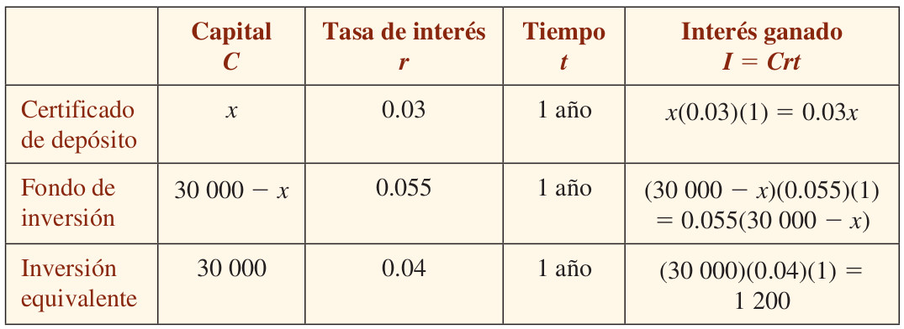
```


<!-- <center> {width=65%}</center> -->


Como el interés combinado prededente del certificado de depósito y el fonde de inversión va a igualar el de una inversión total equivalente hecha a $4\%$ de interés simple, tenemos la siguiente ecuación:


$$
0.03x+(0.055)(30000-x)=1200
$$

Empezamos a resolver la ecuación multiplicando por $100$ para facilitar el despeje, así:

$$
100.\left(0.03x+(0.055)(30000-x)=(100).(1200)\right)
$$
$$
3x+(5.5)(30000-x)=120000
$$

\begin{equation}
\begin{split}
3x+(5.5)(30000-x) & = & 120000\\
3x+(5.5)30000-5.5x & = & 120000\\
3x-5.5x+165000 & = & 120000\\
3x-5.5x & = & 120000-165000\\
-2.5x & = & -45000\\
x & = & \dfrac{-45000}{-2.5}\\
x & = & 18000
\end{split}
\end{equation}


**Respuesta**

Se debe de invertir $18000$ dólares en el certificado de depósito y $30000 - 18000=12000$ en el fondo de inversión.


## Modelo16 (Problema Regla de tres compuesta ó Mixta)


Tres secretarias escriben 10 cartas en 3 horas.¿Cuántas cartas escribirán 9 secretarias en 6 horas?

\begin{equation}
Esquema: \ \ 
\begin{array}{cccc}
\text{Primera}&  &\text{Segunda}&  &\text{Tercera}\\
\text{Magnitud}&  &\text{Magnitud}&  &\text{Magnitud}\\
DP & & DP &  & \\
SECRETARIAS & \longrightarrow & HORAS & \longrightarrow & CARTAS\\
3 & \longrightarrow & 3 & \longrightarrow & 10\\
9 & \longrightarrow & 6 & \longrightarrow & x
\end{array} \ \ \ \  \Longrightarrow \ \ \ \ \  \ \ \ \ \ \dfrac{10}{x}=\dfrac{3}{9}.\dfrac{3}{6} \ \ \ \  \Longrightarrow \ \ \ \ \ \dfrac{10}{x}=\dfrac{9}{(9).(6)} \ \ \ \ \Longrightarrow  \ \ \ \ \ x=60
\end{equation}


## Modelo17 (Problema Regla de tres compuesta ó Mixta)

Si 6 hombres realizan un muro de 30 metros trabajando 6 horas diarias durante 9 días. ¿Cuántos días necesitan 10 hombres trabajando 9 horas diarias para realizar los 50 metros del muro que faltan?


\begin{equation}
Esquema: \ \ 
\begin{array}{ccccc}
\text{Primera}&  &\text{Segunda}&  &\text{Tercera}&  &\text{Cuarta}\\
\text{Magnitud}&  &\text{Magnitud}&  &\text{Magnitud}&  &\text{Magnitud}\\
IP & & DP & & IP  & \\
HOMBRES & \longrightarrow & METROS & \longrightarrow & HORAS & \longrightarrow & DIAS\\
6 & \longrightarrow & 30 & \longrightarrow & 6 & \longrightarrow & 9\\
10 & \longrightarrow & 50 & \longrightarrow & 9 & \longrightarrow & x
\end{array} \\

\ \ \ \  \Longrightarrow \ \ \ \ \  \ \ \ \ \ \dfrac{9}{x}=\dfrac{10}{6}.\dfrac{30}{50}.\dfrac{9}{6} \ \ \ \  \Longrightarrow \ \ \ \ \ x=\dfrac{(9).(6).(50).(6)}{(10).(30).(9)} \ \ \ \ \Longrightarrow  \ \ \ \ \ x=6
\end{equation}

**Respuesta**: Se demoran 6 dias


## Modelo18 (Problema Regla de tres simple y directa)

A un adulto de $65kg$ de peso se le coloca una dosis de cierto medicamento equivalente a $650 mg$ por día, ¿cuánto deberá aplicarsele a un niño cuyo peso es de $20kg$?

\begin{equation}
Esquema: \ \ 
\begin{array}{ccc}
\text{Primera}&  &\text{Segunda}\\
\text{Magnitud}&  &\text{Magnitud}\\
\text{PESO} & \longrightarrow & \text{DOSIS} \\
65 \ \text{kg} & \longrightarrow & 650 \ \text{mg} \\
20 \ \text{kg} & \longrightarrow & x \ \text{mg}
\end{array} \ \ \ \  \Longrightarrow \ \ \ \ \ x=\dfrac{(650).(20)}{65}=\dfrac{(10).(20)}{1}=200
\end{equation}

**Repuesta**: Deberá aplicarsele 200mg a un niño cuyo peso es de $20kg$.


## Modelo19 (Problema Regla de tres simple y directa)

Si un poste proyecta una sombra de $190,5 cm$ de largo y al mismo tiempo un hombre de $154 cm$ de estatura proyecta una sombra de $106 cm$ de largo. Qué altura tiene la torre?

\begin{equation}
Esquema: \ \ 
\begin{array}{ccc}
\text{Primera}&  &\text{Segunda}\\
\text{Magnitud}&  &\text{Magnitud}\\
\text{SOMBRA} & \longrightarrow & \text{ALTURA} \\
154 \ \text{cm} & \longrightarrow & 106 \ \text{cm} \\
190,5 \ \text{cm} & \longrightarrow & x \ \text{cm}
\end{array} \ \ \ \  \Longrightarrow \ \ \ \ \ x =  \dfrac{(190,5).(106)}{154}\simeq 131,1234
\end{equation}

**Repuesta**: La altura de la torre es apróximadmente $131,123 cm$.


## Modelo20 (Problema Regla de tres compuesta)

Un atleta marchando a $12 km$ por hora recorre en varias etapas un camino, empleando $9$ días a razón de $7$ horas por día. A qué velocidad tendrá que ir si desea emplear sólo 6 días a razón de 9 horas?


\begin{equation}
Esquema: \ \ 
\begin{array}{cccc}
\text{Primera}&  &\text{Segunda}&  &\text{Tercera}\\
\text{Magnitud}&  &\text{Magnitud}&  &\text{Magnitud}\\
 & & IP &  & IP\\
VELOCIDAD & \longrightarrow & DIAS & \longrightarrow & HORAS\\
12 & \longrightarrow & 9 & \longrightarrow & 7\\
x & \longrightarrow & 6 & \longrightarrow & 9
\end{array} \ \ \ \  \Longrightarrow \ \ \ \ \  \ \ \ \ \ \dfrac{12}{x}=\dfrac{6}{9}.\dfrac{9}{7} \ \ \ \  \Longrightarrow \ \ \ \ \ x=\dfrac{(12).(9)(7)}{(6).(9)} \ \ \ \ \Longrightarrow  \ \ \ \ \ x=14
\end{equation}


**Repuesta**: La VELOCIDAD a la que deberá ir, si desea emplear sólo 6 días a razón de 9 horas, es de $14 km$ por hora.


